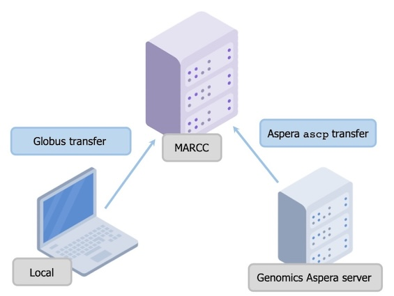

- [1 Introduction](#1-introduction)
  - [1.1 Raw Data File Naming -
    Sublibraries](#11-raw-data-file-naming---sublibraries)
  - [1.2 A Note on File Transfers](#12-a-note-on-file-transfers)
- [2 Preprocessing](#2-preprocessing)
  - [2.1 Transfer Files](#21-transfer-files)
  - [2.2 Concatenate Files and Install
    Stacks](#22-concatenate-files-and-install-stacks)
    - [2.2.1 Concatenate Files for each
      Sublibrary](#221-concatenate-files-for-each-sublibrary)
    - [2.2.2 Download and Install
      Stacks](#222-download-and-install-stacks)
  - [2.3 Remove PCR Clones](#23-remove-pcr-clones)
    - [2.3.1 Run PCR Clone Removal
      Script](#231-run-pcr-clone-removal-script)
    - [2.3.2 Parse PCR Clone Removal
      Results](#232-parse-pcr-clone-removal-results)
  - [2.4 Step 4 - Demultiplexing and Sample
    Filtering](#step-4---demultiplexing-and-sample-filtering)
    - [2.4.1 Step 4a - Demultiplex and
      Filter](#step-4a---demultiplex-and-filter)
    - [2.4.2 Step 4b - Organize files](#step-4b---organize-files)
    - [2.4.3 Step 4c - Assess the raw, processed, and cleaned
      data](#step-4c---assess-the-raw-processed-and-cleaned-data)
    - [2.4.4 Step 4d - Identify low-coverage and low-quality samples
      from](#step-4d---identify-low-coverage-and-low-quality-samples-from)
- [3 Generating Stacks Catalogs and Calling
  SNPs](#generating-stacks-catalogs-and-calling-snps-mag)
  - [3.1 Step 5 - Metapopulation Catalog Building and Parameter
    Search](#step-5---metapopulation-catalog-building-and-parameter-search)
    - [3.1.1 Step 5a - Run
      `denovo_map.sh`](#step-5a---run-denovo_map.sh)
    - [3.1.2 Step 5b - Run `ustacks`](#step-5b---run-ustacks)
    - [3.1.3 Step 5c - Correct File
      Names](#step-5c---correct-file-names)
    - [3.1.4 Step 5d - Choose catalog
      samples/files](#step-5d---choose-catalog-samplesfiles)
  - [3.2 Step 6 - Metapopulation catalog with
    `cstacks`](#step-6---metapopulation-catalog-with-cstacks)
  - [3.3 Step 7 - Metapopulation locus matching with
    `sstacks`](#step-7---metapopulation-locus-matching-with-sstacks)
  - [3.4 Step 8 - Genotype probabilities with
    `polyRAD`](#step-8---polyrad)
    - [3.4.1 Make `RADdata` object](#make-raddata-object)
    - [3.4.2 Calculate overdispersion](#calculate-overdispersion)
    - [3.4.3 Estimate genotypes](#estimate-genotypes)
    - [3.4.4 Final filter and file
      cleanup](#final-filter-and-file-cleanup)
  - [3.5 Step 9 - Populations with
    `Structure`](#step-9---populations-with-structure)
    - [3.5.1 Running Structure](#running-structure)
- [4 Analysis](#analysis)
  - [4.1 NLCD Data](#nlcd-data)
  - [4.2 Make maps of sampling
    locations](#make-maps-of-sampling-locations)
  - [4.3 Continental population structure: population statistics by
    species](#continental-population-structure-population-statistics-by-species)
  - [4.4 Continental population structure: Structure software
    results](#continental-population-structure-structure-software-results)
  - [4.5 Continental population structure: Structure
    plots](#continental-population-structure-structure-plots)
  - [4.6 Validation of Structure results with
    sNMF](#validation-of-structure-results-with-snmf)
  - [4.7 AMOVA](#amova)
  - [4.8 Local: $F_{IS}$ - Homozygosity within
    population](#local-f_is---homozygosity-within-population)
  - [4.9 Local: $\rho$ - Pairwise
    comparison](#local-rho---pairwise-comparison)
  - [4.10 Local: $\bar{r}_d$ - Linkage
    disequilibrium](#local-barr_d---linkage-disequilibrium)
  - [4.11 Isolation by distance](#isolation-by-distance)
  - [4.12 Isolation by environment](#isolation-by-environment)
    - [4.12.1 Environmental data](#environmental-data)
    - [4.12.2 IBE analysis](#ibe-analysis)
  - [4.13 Correlation between Urbanness and
    Admixture](#correlation-between-urbanness-and-admixture)
- [5 Appendix](#appendix-books)
  - [5.1 `SessionInfo()`](#sessioninfo)
  - [5.2 File Organization](#file-organization-bookmark_tabs)
  - [5.3 Aspera Transfer File Names](#aspera-transfer-file-names)
  - [5.4 `clone_filter` File Names](#clone_filter-file-names)

<!-- To nicely format this markdown doc, I recommend using
Sublime Text editor. Highlight the text in question and select Edit >
Wrap > Wrap paragraph at 72 characters. --> 
<!-- Allow "S" labeling on Figs and Tables  -->
<!-- End -->

# 1 Introduction

In this experiment, we used quaddRAD library prep to prepare the sample
DNA. This means that there were both two unique outer barcodes (typical
Illumina barcodes) *AND* two unique inner barcodes (random barcode bases
inside the adapters) for each sample - over 1700 to be exact!

The sequencing facility demultiplexes samples based on the outer
barcodes (typically called 5nn and i7nn). Once this is done, each file
still contains a mix of the inner barcodes. We will refer to these as
“sublibraries” because they are sort of halfway demultiplexed. We
separate them out bioinformatically later.

## 1.1 Raw Data File Naming - Sublibraries

Here’s a bit of information on the file name convention. The typical raw
file looks like this:

`AMH_macro_1_1_12px_S1_L001_R1_001.fastq.gz`

- These are author initials and “macro” stands for “Macrosystems”. These
  are on every file.

  `AMH_macro`

- The first number is the *i5nn* barcode for the given sublibrary. We
  know all these samples have a i5nn barcode “1”, so that narrows down
  what they can be. The second number is the *i7nn* barcode for the
  given sublibrary. We know all these samples have a i7nn barcode “1”,
  so that further narrows down what they can be.

  `1_1`

- This refers to how many samples are in the sublibrary. “12px” means
  12-plexed, or 12 samples. In other words, we will use the inner
  barcodes to further distinguish 12 unique samples in this sublibrary.

  `12px`

- This is a unique sublibrary name. S1 = 1 i5nn and 1 i7nn.

  `S1`

- This means this particular file came from lane 1 of the NovaSeq. There
  are four lanes. All samples should appear across all four lanes.

  `L001`

- This is the first (R1) of two paired-end reads (R1 and R2).

  `R1`

- The last part doesn’t mean anything - it was just added automatically
  before the file suffix (`fastq.gz`)

  `001.fastq.gz`

## 1.2 A Note on File Transfers

There are three main systems at play for file transfer: the local
machine, the sequencing facility’s (GRCF) Aspera server, and
[MARCC](https://www.marcc.jhu.edu/). The Aspera server is where the data
were/are stored immediately after sequencing. MARCC is where we plan to
do preprocessing and analysis. Scripts and text files are easy for me to
edit on my local machine. We used [Globus](https://app.globus.org) to
transfer these small files from my local machine to MARCC.

Midway through this analyses, we transitioned to another cluster, JHU’s
Rockfish. Scripts below, with the exception of file transfer from the
Aspera server, should reflect the new filesystem, though you will have
to adjust the file paths accordingly.

  

# 2 Preprocessing

## 2.1 Transfer Files

Referred to through files as “Step 1”. Files can be found in the
`01_transfer_files/` directory.

This directory contains files named in this convention:
`01-aspera_transfer_n.txt`. These are text files containing the *names*
of `fastq.gz` files that we wanted to transfer from the sequencing
facility’s Aspera server to the computing cluster
([MARCC](https://www.marcc.jhu.edu/)). This was to maximize ease of
transferring only certain files over at once, since transferring could
take a long time. We definitely did this piecemeal. Possible file names
shown in [Aspera Transfer File Names](#aspera-transfer-file-names).
There are multiple of these files so that we could parallelize (replace
n with the correct number in the command used below). This text file
will need to be uploaded to your scratch directory in MARCC.

Files were then transferred using the following commands. Before
starting, make sure you are in a data transfer node. Then, load the
aspera module. Alternatively, you can install the Aspera transfer
software and use that.

    module load aspera

Initiate the transfer from within your scratch directory:

    ascp -T -l8G -i /software/apps/aspera/3.9.1/etc/asperaweb_id_dsa.openssh
    --file-list=01-aspera_transfer_n.txt
    --mode=recv --user=<aspera-user> --host=<aspera-IP> /scratch/users/<me>@jhu.edu

## 2.2 Concatenate Files and Install Stacks

Referred to through files as “Step 2”. Files can be found in the
`02_concatenate_and_check/` directory.

### 2.2.1 Concatenate Files for each Sublibrary

**Step 2a**. We ran my samples across the whole flow cell of the
NovaSeq, so results came in 8 files for each demultiplexed sublibrary (4
lanes \* paired reads). For example, for sublibrary 1_1, we’d see the
following 8 files:

    AMH_macro_1_1_12px_S1_L001_R1_001.fastq.gz
    AMH_macro_1_1_12px_S1_L001_R2_001.fastq.gz
    AMH_macro_1_1_12px_S1_L002_R1_001.fastq.gz
    AMH_macro_1_1_12px_S1_L002_R2_001.fastq.gz    
    AMH_macro_1_1_12px_S1_L003_R1_001.fastq.gz
    AMH_macro_1_1_12px_S1_L003_R2_001.fastq.gz
    AMH_macro_1_1_12px_S1_L004_R1_001.fastq.gz
    AMH_macro_1_1_12px_S1_L004_R2_001.fastq.gz

The `02_concatendate_and_check/02-concat_files_across4lanes.sh` script
finds all files in the working directory with the name pattern
`*_L001_*.fastq.gz` and then concatenates across lanes 001, 002, 003,
and 004 so they can be managed further. The “L001” part of the filename
is then eliminated. For example the 8 files above would become:

    AMH_macro_1_1_12px_S1_R1.fastq.gz
    AMH_macro_1_1_12px_S1_R2.fastq.gz

Rockfish uses [slurm](https://slurm.schedmd.com/overview.html) to manage
jobs. To run the script, use the `sbatch` command. For example:

    sbatch ~/code/02-concat_files_across4lanes.sh

This command will run the script from within the current directory, but
will look for and pull the script from the code directory. This will
concatenate all files within the current directory that match the loop
pattern.

### 2.2.2 Download and Install Stacks

**Step 2b**. On Rockfish,
[Stacks](https://catchenlab.life.illinois.edu/stacks/) will need to be
downloaded to each user’s code directory. Stacks, and software in
general, should be compiled in an interactive mode or loaded via module.
For more information on interactive mode, see `interact --usage`.

    interact -p debug -g 1 -n 1 -c 1
    module load gcc

Now download Stacks. We used version 2.60.

    wget http://catchenlab.life.illinois.edu/stacks/source/stacks-2.60.tar.gz
    tar xfvz stacks-2.60.tar.gz

Next, go into the stacks-2.60 directory and run the following commands:

    ./configure --prefix=/home/<your_username>/code4-<PI_username>
    make
    make install
    export PATH=$PATH:/home/<your_username>/code4-<PI_username>/stacks-2.60

The filesystem patterns on your cluster might be different, and you
should change these file paths accordingly.

## 2.3 Remove PCR Clones

Referred to through files as “Step 3”. Files can be found in the
`03_clone_filter/` directory.

### 2.3.1 Run PCR Clone Removal Script

**Step 3a**. The `03-clone_filter.sh` script runs `clone_filter` from
[Stacks](https://catchenlab.life.illinois.edu/stacks/). The program was
run with options `--inline_inline --oligo_len_1 4 --oligo_len_2 4`. The
`--oligo_len_x 4` options indicate the 4-base pair degenerate sequence
was included on the outside of the barcodes for detecting PCR
duplicates. The script uses the file name prefixes listed for each
single sub-pooled library in `03-clone_filter_file_names.txt` and loops
to run `clone_filter` on all of them. Possible file names shown in
[`clone_filter` File Names](#clone_filter-file-names).

### 2.3.2 Parse PCR Clone Removal Results

**Step 3b**. If you want to extract descriptive statistics from the
`clone_filter` output, you can use the `03.5-parse_clone_filter.py`
script to do so. It can be run on your local terminal after transferring
the `clone_filter.out` logs to your local computer.

``` r
source("03_clone_filter/examine_clones.R") 
make_cloneplot() 
```

<figure>

<figcaption aria-hidden="true">PCR clone removal statistics</figcaption>
</figure>

## 2.4 Step 4 - Demultiplexing and Sample Filtering

Files can be found in the `04_demux_filter/` directory.

### 2.4.1 Step 4a - Demultiplex and Filter

The `04-process_radtags.sh` script runs `process_radtags` from
[Stacks](https://catchenlab.life.illinois.edu/stacks/). The program was
run with options
`-c -q --inline_inline --renz_1 pstI --renz_2 mspI --rescue --disable_rad_check`.
The script uses the same file prefixes as [Step 3 -
`03-clone_filter.sh`](#step-3---remove-pcr-clones). Each sub-pooled
library has a forward and reverse read file that was filtered in the
previous step. Like the [above section](#step-3---03-clone_filtersh),
the script uses the file name prefixes listed for each single sub-pooled
library in `04-process_radtags_file_names.txt` and loops to run
`process_radtags` on all of them. Possible file names shown in
[`clone_filter` File Names](#clone_filter-file-names).

Each sub-pooled library also has a demultiplexing file (`04-demux/`
directory) that contains the sample names and inner(i5 and i7) barcodes.
For example, the sublibrary 1_1, we’d see the following barcode file:

    ATCACG  AGTCAA  DS.BA.PIK.U.1
    CGATGT  AGTTCC  DS.BA.PIK.U.2
    TTAGGC  ATGTCA  DS.BA.PIK.U.3
    TGACCA  CCGTCC  DS.BA.PIK.U.4
    ACAGTG  GTCCGC  DS.BA.PIK.U.5
    GCCAAT  GTGAAA  DS.BA.DHI.U.1
    CAGATC  GTGGCC  DS.BA.DHI.U.2
    ACTTGA  GTTTCG  DS.BA.DHI.U.3
    GATCAG  CGTACG  DS.BA.DHI.U.4
    TAGCTT  GAGTGG  DS.BA.DHI.U.5
    GGCTAC  ACTGAT  DS.BA.GA.U.1
    CTTGTA  ATTCCT  DS.BA.GA.U.2

The ‘process_radtags’ command will demultiplex the data by separating
out each sublibrary into the individual samples. It will then clean the
data, and will remove low quality reads and discard reads where a
barcode was not found.

### 2.4.2 Step 4b - Organize files

In a new directory, make sure the files are organized by species. In the
`process_radtags` script, we specified that files be sent to
`~/scratch/demux/*sublibrary_name*` (reasoning for this is in [Step
4c](#step-4c---assess-the-raw-processed-and-cleaned-data)), but files
should manually be organized into species folders (i.e.,
`~/scratch/demux/*SPP*`) after `process_radtags` is performed. For
example, the file “DS.MN.L01-DS.M.1.1.fq.gz” should be sent to the
`~/scratch/demux/DS` directory.

Note: this is not automated at this point but it would be nice to
automate the file moving process so it’s not forgotten at this point.

### 2.4.3 Step 4c - Assess the raw, processed, and cleaned data

In the script for [Step 4](#step-4---demultiplex-and-filter), we have
specified that a new output folder be created for each sublibrary. The
output folder is where all sample files and the log file will be dumped
for each sublibrary. It is important to specify a different output
folder if you have multiple sublibraries because we will be assessing
the output log for each sublibrary individually (and otherwise, the log
is overwritten when the script loops to a new sublibrary).

The utility `stacks-dist-extract` can be used to extract data from the
log file. First, we examined the library-wide statistics to identify
sublibraries where barcodes may have been misentered or where sequencing
error may have occurred. We used:

     stacks-dist-extract process_radtags.log total_raw_read_counts
     

to pull out data on the total number of sequences, the number of
low-quality reads, whether barcodes were found or not, and the total
number of retained reads per sublibary. Look over these to make sure
there are no outliers or sublibraries that need to be checked and rerun.

Next, we used:

     stacks-dist-extract process_radtags.log per_barcode_raw_read_counts
     

to analyze how well each sample performed. There are three important
statistics to consider for each sample.

1.  *The proportion of reads per sample for each sublibrary* indicates
    the proportion that each individual was processed and sequenced
    within the overall library. This is important to consider as cases
    where a single sample dominates the sublibrary may indicate
    contamination.

2.  *The number of reads retained for each sample* can be an indicator
    of coverage. It is most likely a good idea to remove samples with a
    very low number of reads. Where you decide to place the cutoff for
    low coverage samples is dependent on your dataset. For example, a
    threshold of 1 million reads is often used but this is not
    universal.

3.  *The proportion of reads retained for each sample* can also indicate
    low-quality samples and will give an idea of the variation in
    coverage across samples.

Output for sublibraries for this step are summarized in
[`process_radtags-library_output.csv`](output/process_radtags-sample_output.csv).

Output for individual samples for this step are summarized in
[`process_radtags-sample_output.csv`](output/process_radtags-sample_output.csv).

The script `04c-process_radtags_stats.R` was used to create many plots
for easily assessing each statistic. Output from this step can be found
in `figures/process_radtags/` where figures are organized by species.

``` r
source("04_demux_filter/04c-radtags_filter_summary.R") 
make_filterplot() 
```

<figure>

<figcaption aria-hidden="true">RAD tag processing
statistics</figcaption>
</figure>

### 2.4.4 Step 4d - Identify low-coverage and low-quality samples from

    downstream analysis

Using the same output log and the above statistics, we removed
low-coverage and low-quality samples that may skew downstream analyses.

Samples were identified and removed via the following procedure:

1.  First, samples that represented less than **1% of the sequenced
    sublibrary** were identified and removed. These samples correlate to
    low-read and low-coverage samples.

2.  Next, a threshold of **1 million retained reads per sample** was
    used to remove any remaining low-read samples. Low-read samples
    correlate to low coverage and will lack enough raw reads to
    contribute to downstream analyses.

Good/kept samples are summarized in
[`process_radtags-kept_samples.csv`](output/process_radtags-kept_samples.csv).

Discarded samples are summarized in
[`process_radtags-discarded_samples.csv`](output/process_radtags-discarded_samples.csv).

``` r
source("04_demux_filter/04c-radtags_filter_summary.R") 
make_manual_discard_plot() 
```

<figure>

<figcaption aria-hidden="true">RAD tag manual filtering
summary</figcaption>
</figure>

Note: At this point, we started using Stacks 2.62 for its
multi-threading capabilities. Functionality of the previous steps should
be the same, however.

# 3 Generating Stacks Catalogs and Calling SNPs

## 3.1 Step 5 - Metapopulation Catalog Building and Parameter Search

Files can be found in the `05_ustacks_and_params/` directory.

Going forward, when we use the term **metapopulation**, we are referring
to the collection of all samples within species among all cities where
the species was present.

It is important to conduct preliminary analyses that will identify an
optimal set of parameters for the dataset (see [Step
5a](#step-5a---denovo_mapsh)). Following the parameter optimization, the
program `ustacks` can be run to generate a catalog of loci.

### 3.1.1 Step 5a - Run `denovo_map.sh`

Stack assembly will differ based on several different aspects of the
dataset(such as the study species, the RAD-seq method used, and/or the
quality and quantity of DNA used). So it is important to use parameters
that will maximize the amount of biological data obtained from stacks.

There are three main parameters to consider when doing this:

1.  *m* = controls the minimum number of raw reads required to form a
    stack(implemented in `ustacks`)

2.  *M* = controls the number of mismatches between stacks to to merge
    them into a putative locus (implemented in `ustacks`)

3.  *n* = controls the number of mismatches allowed between stacks to
    merge into the catalog (implemented in `cstacks`)

There are two main ways to optimize parameterization:

1.  an iterative method were you sequentially change each parameter
    while keeping the other parameters fixed (described in *Paris et al.
    2017*), or

2.  an iterative method were you sequentially change the values of *M*
    and *n*(keeping *M* = *n*) while fixing *m* = 3, and then test *m* =
    2, 4 once the optimal *M* = *n* is determined(described in *Rochette
    and Catchen 2017*, *Catchen 2020*).

We performed the second method and used the `denovo_map.sh` script to
run the `denovo_map.pl` command to perform iterations. This script
requires that we first choose a subset of samples to run the iterations
on. The samples should be representative of the overall dataset; meaning
they should include all populations and have similar read coverage
numbers. Read coverage numbers can be assessed by looking at the
descriptive statistics produced from [Step
4c](#step-4c---assess-the-raw-processed-and-cleaned-data).

Place these samples in a text file (`popmap_test_samples.txt`) with the
name of the sample and specify that all samples belong to the same
population. For example, `popmap_test_samples.txt` should look like…

    DS.BA.GA.U.1    A
    DS.PX.BUF.M.5   A
    DS.B0.HC4.M.1   A
    ...

It is important to have all representative samples treated as one
population because you will assess outputs found across 80% of the
individuals. The script will read this text file from the `--popmap`
argument.

The script also requires that you specify an output directory after
`-o`. This should be unique to the parameter you are testing… for
example, if you are testing *M* = 3, then you could make a subdirectory
labeled `stacks.M3` where all outputs from `denovo_map.sh` will be
placed. Otherwise, for each iteration, the outputs will be overwritten
and you will lose the log from the previous iteration. The
`denovo_map.sh` script also requires that you direct it toward where
your samples are stored, which is your directory built in [Step
4b](#step-4b---organize-files). Make sure to run the
`--min-samples-per-pop 0.80` argument.

To decide which parameters to use, examine the following from each
iteration:

1.  the average sample coverage: This is obtained from the summary log
    in the `ustacks` section of `denovo_map.log`. If samples have a
    coverage \<10x, you will have to rethink the parameters you use
    here.

2.  the number of assembled loci shared by 80% of samples: This can be
    found in the `haplotypes.tsv` by counting the number of loci:
    `cat populations.haplotypes.tsv | grep -v ^"#" | wc -l`

3.  the number of polymorphic loci shared by 80% of samples: This can be
    found in `populations.sumstats.tsv` or by counting
    `populations.hapstats.tsv`:
    `cat populations.hapstats.tsv | grep -v "^#" | wc -l`

4.  the number of SNPs per locus shared by 80% of samples: found in
    `denovo_map.log` or by counting the number of SNPs in
    `populations.sumstats.tsv`:
    `populations.sumstats.tsv | grep -v ^"#" | wc -l`

The script `05a-param_opt-figures_script.R` was used to create plots for
assessing the change in shared loci across parameter iterations.

Based on this optimization step, we used the following parameters:

| Species | M (locus mismatches) | n (catalog mismatches) | m (minimum reads) |
|:--------|---------------------:|-----------------------:|------------------:|
| CD      |                    8 |                      8 |                 3 |
| DS      |                   10 |                     10 |                 3 |
| EC      |                    8 |                      8 |                 3 |
| LS      |                    7 |                      7 |                 3 |
| PA      |                    5 |                      5 |                 3 |
| TO      |                    6 |                      6 |                 3 |

Final parameter optimization values for the Stacks pipeline.

### 3.1.2 Step 5b - Run `ustacks`

`ustacks` builds *de novo* loci in each individual sample. We have
designed the `ustacks` script so that the process requires three files:

- `05-ustacks_n.sh` : the shell script that executes `ustacks`
- `05-ustacks_id_n.txt` : the sample ID number
- `05-ustacks_samples_n.txt` : the sample names that correspond to the
  sample IDs

The sample ID should be derived from the `order_id` column(first column)
on the master spreadsheet. It is unique (1-1736) across all of the
samples.

The sample name is the corresponding name for each sample ID in the
spreadsheet. E.g., sample ID “9” corresponds to sample name
“DS.BA.DHI.U.4”. Sample naming convention is
species.city.site.management_type.replicate_plant.

`05-ustacks_n.sh` should have an out_directory (`-o` option) that will
be used for all samples (e.g., `stacks/ustacks`). Files can be processed
piecemeal into this directory. There should be three files for every
sample in the output directory:

- `<samplename>.alleles.tsv.gz`
- `<samplename>.snps.tsv.gz`
- `<samplename>.tags.tsv.gz`

Multiple versions of the `05-ustacks_n.sh` script can be run in parallel
(simply replace n in the three files above with the correct number).

A small number of samples (13) were discarded at this stage as the
`ustacks` tool was unable to form any primary stacks corresponding to
loci. See
[output/ustacks-discarded_samples.csv](output/ustacks-discarded_samples.csv).

### 3.1.3 Step 5c - Correct File Names

This step contains a script `05b-fix_filenames.sh` which uses some
simple regex to fix filenames that are output in previous steps. Stacks
adds an extra “1” at some point at the end of the sample name which is
not meaningful. The following files:

- DS.MN.L02-DS.M.3.1.alleles.tsv.gz
- DS.MN.L03-DS.U.2.1.tags.tsv.gz
- DS.MN.L09-DS.U.1.1.snps.tsv.gz

become:

- DS.MN.L02-DS.M.3.alleles.tsv.gz
- DS.MN.L03-DS.U.2.tags.tsv.gz
- DS.MN.L09-DS.U.1.snps.tsv.gz

The script currently gives some strange log output, so it can probably
be optimized/improved. The script should be run from the directory where
the changes need to be made. Files that have already been fixed will not
be changed.

### 3.1.4 Step 5d - Choose catalog samples/files

In the next step, we will choose the files we want to go into the
catalog. This involves a few steps:

1.  Create a meaningful directory name. This could be the date (e.g.,
    `stacks_22_01_25`).

2.  Copy the `ustacks` output for all of the files you want to use in
    the reference from Step 5b. Remember this includes three files per
    sample. So if you have 20 samples you want to include in the
    reference catalog, you will transfer 3 x 20 = 60 files into the
    meaningful directory name. The three files per sample should follow
    this convention:

- `<samplename>.alleles.tsv.gz`
- `<samplename>.snps.tsv.gz`
- `<samplename>.tags.tsv.gz`

3.  Remember the meaningful directory name. You will need it in Step 6.

## 3.2 Step 6 - Metapopulation catalog with `cstacks`

Files can be found in the `06_cstacks/` directory.

`cstacks` builds the locus catalog from all the samples specified. The
accompanying script, `cstacks_SPECIES.sh` is relatively simple since it
points to the directory containing all the sample files. It follows this
format to point to that directory:

    cstacks -P ~/directory ...

Make sure that you use the meaningful directory from Step 5c and that
you have copied all the relevant files over. Otherwise this causes
[problems
downstream](https://groups.google.com/g/stacks-users/c/q3YYPprmYnU/m/cH5RB5KwBQAJ).
For example, you might edit the code to point to
`~/scratch/stacks/stacks_22_01_25`.

    cstacks -P ~/scratch/stacks/stacks_22_01_25 ...

The tricky thing is ensuring enough compute memory to run the entire
process successfully. There is probably space to optimize this process.

The `cstacks` method uses a “population map” file, which in this project
is `cstacks_popmap_SPECIES.txt`. This file specifies which samples to
build the catalog from and categorizes them into your ‘populations’, or
in this case, cities using two tab-delimited columns, e.g.:

    DS.BA.GA.U.1    Baltimore
    DS.BA.GA.U.2    Baltimore
    DS.BA.GA.U.3    Baltimore
    DS.BA.GA.U.4    Baltimore
    DS.BA.GA.U.5    Baltimore
    ...

Make sure the samples in this file correspond to the input files located
in e.g., `~/scratch/stacks/stacks_22_01_25`.

`cstacks` builds three files for use in all your samples (in this
pipeline run), mirroring the sample files output
by[`ustacks`](#step-5---ustacks):

- `catalog.alleles.tsv.gz`
- `catalog.snps.tsv.gz`
- `catalog.tags.tsv.gz`

| Sample           | Species | City |
|:-----------------|:--------|:-----|
| DS.BA.PIK.U.1    | DS      | BA   |
| DS.BA.GA.U.4     | DS      | BA   |
| DS.BA.LH-1.M.4   | DS      | BA   |
| DS.BA.LH-3.M.1   | DS      | BA   |
| DS.BA.WB.U.2     | DS      | BA   |
| DS.BA.LL-4.M.5   | DS      | BA   |
| DS.BA.LH-2.M.5   | DS      | BA   |
| DS.BA.TRC.U.3    | DS      | BA   |
| DS.BA.W3.M.2     | DS      | BA   |
| DS.BA.RG-1.M.1   | DS      | BA   |
| DS.BA.LL-3.M.3   | DS      | BA   |
| DS.BA.RG-2.M.4   | DS      | BA   |
| DS.BO.HC1.M.3    | DS      | BO   |
| DS.BO.HC4.M.5    | DS      | BO   |
| DS.BO.LC1.M.3    | DS      | BO   |
| DS.BO.LC2.M.2    | DS      | BO   |
| DS.BO.LC3.M.5    | DS      | BO   |
| DS.BO.WL1.M.2    | DS      | BO   |
| DS.BO.WL2.M.1    | DS      | BO   |
| DS.BO.WL3.M.5    | DS      | BO   |
| DS.BO.I4.U.1     | DS      | BO   |
| DS.BO.R1.U.4     | DS      | BO   |
| DS.BO.R2.U.2     | DS      | BO   |
| DS.BO.R4.U.4     | DS      | BO   |
| DS.MN.L05-DS.M.3 | DS      | MN   |
| DS.MN.L09-DS.M.3 | DS      | MN   |
| DS.MN.L11-DS.M.1 | DS      | MN   |
| DS.MN.L02-DS.U.1 | DS      | MN   |
| DS.MN.L02-DS.M.4 | DS      | MN   |
| DS.MN.L03-DS.U.3 | DS      | MN   |
| DS.MN.L04-DS.U.5 | DS      | MN   |
| DS.MN.L06-DS.U.3 | DS      | MN   |
| DS.MN.L07-DS.U.3 | DS      | MN   |
| DS.MN.L09-DS.U.3 | DS      | MN   |
| DS.MN.L11-DS.U.1 | DS      | MN   |
| DS.MN.L11-DS.U.5 | DS      | MN   |
| DS.PX.BUF.M.1    | DS      | PX   |
| DS.PX.PIE.M.2    | DS      | PX   |
| DS.PX.ALA.M.1    | DS      | PX   |
| DS.PX.MTN.M.6    | DS      | PX   |
| DS.PX.LAP.M.3    | DS      | PX   |
| DS.PX.NUE.M.4    | DS      | PX   |
| DS.PX.WES.M.2    | DS      | PX   |
| DS.PX.DF1.M.1    | DS      | PX   |
| DS.PX.ENC.M.1    | DS      | PX   |
| DS.PX.DOW.M.1    | DS      | PX   |
| DS.PX.DOW.M.4    | DS      | PX   |
| DS.PX.DF2.M.3    | DS      | PX   |
| CD.BA.LA.U.2     | CD      | BA   |
| CD.BA.TRC.U.3    | CD      | BA   |
| CD.BA.WGP.M.2    | CD      | BA   |
| CD.BA.LH-2.M.2   | CD      | BA   |
| CD.BA.LL-4.M.1   | CD      | BA   |
| CD.BA.PIK.U.2    | CD      | BA   |
| CD.BA.WB.U.2     | CD      | BA   |
| CD.BA.CP.U.4     | CD      | BA   |
| CD.BA.FH.U.1     | CD      | BA   |
| CD.BA.PSP.M.4    | CD      | BA   |
| CD.BA.AA.U.4     | CD      | BA   |
| CD.BA.RG-1.M.2   | CD      | BA   |
| CD.BA.W3.M.3     | CD      | BA   |
| CD.BA.GA.U.3     | CD      | BA   |
| CD.BA.WBO.U.5    | CD      | BA   |
| CD.LA.WHI.M.3    | CD      | LA   |
| CD.LA.SEP.M.3    | CD      | LA   |
| CD.LA.SEP.M.4    | CD      | LA   |
| CD.LA.ROS.M.5    | CD      | LA   |
| CD.LA.MR2.M.2    | CD      | LA   |
| CD.LA.ALL.M.2    | CD      | LA   |
| CD.LA.ALL.M.5    | CD      | LA   |
| CD.LA.VAL.M.5    | CD      | LA   |
| CD.LA.HAR.M.4    | CD      | LA   |
| CD.LA.LUB.M.3    | CD      | LA   |
| CD.LA.GLO.M.4    | CD      | LA   |
| CD.LA.ZOO.M.3    | CD      | LA   |
| CD.LA.NWH.M.5    | CD      | LA   |
| CD.LA.KIN.M.3    | CD      | LA   |
| CD.LA.KIN.M.5    | CD      | LA   |
| CD.PX.CAM.U.5    | CD      | PX   |
| CD.PX.MON.U.5    | CD      | PX   |
| CD.PX.PKW.U.5    | CD      | PX   |
| CD.PX.LAP.M.4    | CD      | PX   |
| CD.PX.NES.U.4    | CD      | PX   |
| CD.PX.PAL.M.3    | CD      | PX   |
| CD.PX.ASU.M.1    | CD      | PX   |
| CD.PX.NUE.M.5    | CD      | PX   |
| CD.PX.WES.M.3    | CD      | PX   |
| CD.PX.MAN.M.4    | CD      | PX   |
| CD.PX.CLA.M.3    | CD      | PX   |
| CD.PX.DF1.M.5    | CD      | PX   |
| CD.PX.COY.M.5    | CD      | PX   |
| CD.PX.RPC.M.3    | CD      | PX   |
| CD.PX.ENC.M.2    | CD      | PX   |
| EC.BA.LH-2.M.2   | EC      | BA   |
| EC.BA.WBO.U.4    | EC      | BA   |
| EC.BA.WB.U.5     | EC      | BA   |
| EC.BA.FH.U.3     | EC      | BA   |
| EC.BA.CP.U.2     | EC      | BA   |
| EC.BA.TRC.U.3    | EC      | BA   |
| EC.BA.LL-4.M.4   | EC      | BA   |
| EC.BA.WB.U.1     | EC      | BA   |
| EC.BA.PIK.U.5    | EC      | BA   |
| EC.BA.PSP.M.4    | EC      | BA   |
| EC.BA.GA.U.2     | EC      | BA   |
| EC.BA.LL-3.M.3   | EC      | BA   |
| EC.BA.ML.U.1     | EC      | BA   |
| EC.BA.TRC.U.5    | EC      | BA   |
| EC.BA.ML.U.3     | EC      | BA   |
| EC.LA.SGB.U.2    | EC      | LA   |
| EC.LA.SGB.U.5    | EC      | LA   |
| EC.LA.DUR.U.2    | EC      | LA   |
| EC.LA.HOW.U.2    | EC      | LA   |
| EC.LA.SAN.U.2    | EC      | LA   |
| EC.LA.VER.U.1    | EC      | LA   |
| EC.LA.VER.U.4    | EC      | LA   |
| EC.LA.VB2.U.4    | EC      | LA   |
| EC.LA.AC2.U.2    | EC      | LA   |
| EC.LA.AC1.U.1    | EC      | LA   |
| EC.LA.VB1.U.1    | EC      | LA   |
| EC.LA.VB1.U.3    | EC      | LA   |
| EC.LA.SGR.U.4    | EC      | LA   |
| EC.LA.SGR.U.5    | EC      | LA   |
| EC.LA.HOW.U.3    | EC      | LA   |
| EC.PX.BUF.M.1    | EC      | PX   |
| EC.PX.BUF.M.3    | EC      | PX   |
| EC.PX.ALA.M.3    | EC      | PX   |
| EC.PX.MTN.M.2    | EC      | PX   |
| EC.PX.WES.M.1    | EC      | PX   |
| EC.PX.WES.M.2    | EC      | PX   |
| EC.PX.MAN.M.1    | EC      | PX   |
| EC.PX.CLA.M.1    | EC      | PX   |
| EC.PX.PSC.M.1    | EC      | PX   |
| EC.PX.DF1.M.1    | EC      | PX   |
| EC.PX.DOW.M.1    | EC      | PX   |
| EC.PX.DOW.M.2    | EC      | PX   |
| EC.PX.COY.M.2    | EC      | PX   |
| EC.PX.COY.M.3    | EC      | PX   |
| EC.PX.ALA.M.5    | EC      | PX   |
| LS.BA.WB.U.1     | LS      | BA   |
| LS.BA.WB.U.2     | LS      | BA   |
| LS.BA.DHI.U.2    | LS      | BA   |
| LS.BA.GA.U.1     | LS      | BA   |
| LS.BA.PIK.U.3    | LS      | BA   |
| LS.BA.PIK.U.5    | LS      | BA   |
| LS.BA.CP.U.2     | LS      | BA   |
| LS.BA.ML.U.2     | LS      | BA   |
| LS.BA.WBO.U.3    | LS      | BA   |
| LS.BO.WL3.M.4    | LS      | BO   |
| LS.BO.I1.U.1     | LS      | BO   |
| LS.BO.I2.U.1     | LS      | BO   |
| LS.BO.WL2.M.2    | LS      | BO   |
| LS.BO.R1.U.2     | LS      | BO   |
| LS.BO.R2.U.4     | LS      | BO   |
| LS.BO.R3.U.3     | LS      | BO   |
| LS.BO.HC4.M.3    | LS      | BO   |
| LS.BO.LC4.M.2    | LS      | BO   |
| LS.LA.VET.M.4    | LS      | LA   |
| LS.LA.SSV.M.1    | LS      | LA   |
| LS.LA.NAV.M.4    | LS      | LA   |
| LS.LA.SHO.M.2    | LS      | LA   |
| LS.LA.WES.M.3    | LS      | LA   |
| LS.LA.GLO.M.3    | LS      | LA   |
| LS.LA.HOW.U.5    | LS      | LA   |
| LS.LA.SAN.U.2    | LS      | LA   |
| LS.LA.ARR.U.2    | LS      | LA   |
| LS.MN.L06-LS.U.2 | LS      | MN   |
| LS.MN.L06-LS.U.5 | LS      | MN   |
| LS.MN.L07-LS.U.4 | LS      | MN   |
| LS.MN.L08-LS.U.5 | LS      | MN   |
| LS.MN.L09-LS.U.3 | LS      | MN   |
| LS.MN.L01-LS.M.4 | LS      | MN   |
| LS.MN.L01-LS.U.3 | LS      | MN   |
| LS.MN.L02-LS.U.1 | LS      | MN   |
| LS.MN.L05-LS.U.2 | LS      | MN   |
| LS.PX.MON.U.2    | LS      | PX   |
| LS.PX.PKW.U.5    | LS      | PX   |
| LS.PX.PIE.M.4    | LS      | PX   |
| LS.PX.ALA.M.3    | LS      | PX   |
| LS.PX.PAL.M.3    | LS      | PX   |
| LS.PX.MAN.M.2    | LS      | PX   |
| LS.PX.NUE.M.1    | LS      | PX   |
| LS.PX.ENC.M.4    | LS      | PX   |
| LS.PX.COY.M.3    | LS      | PX   |
| PA.BA.PIK.U.1    | PA      | BA   |
| PA.BA.LH-3.M.2   | PA      | BA   |
| PA.BA.LH-3.M.3   | PA      | BA   |
| PA.BA.WB.U.1     | PA      | BA   |
| PA.BA.AA.U.1     | PA      | BA   |
| PA.BA.WGP.M.3    | PA      | BA   |
| PA.BA.LL-4.M.3   | PA      | BA   |
| PA.BA.LA.U.2     | PA      | BA   |
| PA.BA.LH-2.M.2   | PA      | BA   |
| PA.BA.W3.M.3     | PA      | BA   |
| PA.BA.RG-1.M.2   | PA      | BA   |
| PA.BA.LL-3.M.5   | PA      | BA   |
| PA.BO.I2.U.3     | PA      | BO   |
| PA.BO.HC1.M.4    | PA      | BO   |
| PA.BO.R3.U.2     | PA      | BO   |
| PA.BO.HC4.M.5    | PA      | BO   |
| PA.BO.R4.U.2     | PA      | BO   |
| PA.BO.WL2.M.5    | PA      | BO   |
| PA.BO.WL4.M.4    | PA      | BO   |
| PA.BO.LC4.M.4    | PA      | BO   |
| PA.BO.HC2.M.1    | PA      | BO   |
| PA.BO.R1.U.2     | PA      | BO   |
| PA.BO.WL1.M.1    | PA      | BO   |
| PA.BO.I1.U.5     | PA      | BO   |
| PA.LA.ALL.M.5    | PA      | LA   |
| PA.LA.SEP.M.1    | PA      | LA   |
| PA.LA.SEP.M.5    | PA      | LA   |
| PA.LA.WHI.M.2    | PA      | LA   |
| PA.LA.ROS.M.5    | PA      | LA   |
| PA.LA.LUB.M.2    | PA      | LA   |
| PA.LA.GLO.M.2    | PA      | LA   |
| PA.LA.ZOO.M.4    | PA      | LA   |
| PA.LA.ZOO.M.5    | PA      | LA   |
| PA.LA.NWH.M.2    | PA      | LA   |
| PA.LA.KIN.M.4    | PA      | LA   |
| PA.LA.POP.M.4    | PA      | LA   |
| PA.PX.BUF.M.3    | PA      | PX   |
| PA.PX.PIE.M.4    | PA      | PX   |
| PA.PX.LAP.M.5    | PA      | PX   |
| PA.PX.ALA.M.1    | PA      | PX   |
| PA.PX.PAP.M.2    | PA      | PX   |
| PA.PX.PAP.M.5    | PA      | PX   |
| PA.PX.DF1.M.2    | PA      | PX   |
| PA.PX.RPP.U.3    | PA      | PX   |
| PA.PX.ENC.M.4    | PA      | PX   |
| PA.PX.ENC.M.5    | PA      | PX   |
| PA.PX.COY.M.1    | PA      | PX   |
| PA.PX.BUF.M.2    | PA      | PX   |
| TO.BA.WBO.U.4    | TO      | BA   |
| TO.BA.CP.U.1     | TO      | BA   |
| TO.BA.FH.U.1     | TO      | BA   |
| TO.BA.LH-3.M.4   | TO      | BA   |
| TO.BA.WGP.M.3    | TO      | BA   |
| TO.BA.GA.U.4     | TO      | BA   |
| TO.BA.PIK.U.4    | TO      | BA   |
| TO.BA.PSP.M.1    | TO      | BA   |
| TO.BA.RG-2.M.2   | TO      | BA   |
| TO.BO.HC1.M.4    | TO      | BO   |
| TO.BO.HC2.M.5    | TO      | BO   |
| TO.BO.HC3.M.1    | TO      | BO   |
| TO.BO.HC4.M.5    | TO      | BO   |
| TO.BO.LC1.M.1    | TO      | BO   |
| TO.BO.LC2.M.5    | TO      | BO   |
| TO.BO.LC3.M.1    | TO      | BO   |
| TO.BO.WL2.M.1    | TO      | BO   |
| TO.BO.I2.U.3     | TO      | BO   |
| TO.LA.WHI.M.5    | TO      | LA   |
| TO.LA.HAR.M.4    | TO      | LA   |
| TO.LA.MR1.M.1    | TO      | LA   |
| TO.LA.GLO.M.5    | TO      | LA   |
| TO.LA.ZOO.M.1    | TO      | LA   |
| TO.LA.NWH.M.4    | TO      | LA   |
| TO.LA.VNS.M.2    | TO      | LA   |
| TO.LA.PEP.M.5    | TO      | LA   |
| TO.LA.COM.M.4    | TO      | LA   |
| TO.MN.L11-TO.M.3 | TO      | MN   |
| TO.MN.L02-TO.U.1 | TO      | MN   |
| TO.MN.L04-TO.U.1 | TO      | MN   |
| TO.MN.L06-TO.U.2 | TO      | MN   |
| TO.MN.L08-TO.U.5 | TO      | MN   |
| TO.MN.L09-TO.U.2 | TO      | MN   |
| TO.MN.L11-TO.U.3 | TO      | MN   |
| TO.MN.L05-TO.M.5 | TO      | MN   |
| TO.MN.L08-TO.M.5 | TO      | MN   |
| TO.PX.BUF.M.1    | TO      | PX   |
| TO.PX.ALA.M.2    | TO      | PX   |
| TO.PX.LAP.M.4    | TO      | PX   |
| TO.PX.WES.M.1    | TO      | PX   |
| TO.PX.CLA.M.1    | TO      | PX   |
| TO.PX.DF1.M.1    | TO      | PX   |
| TO.PX.DF2.M.1    | TO      | PX   |
| TO.PX.COY.M.1    | TO      | PX   |
| TO.PX.COY.M.6    | TO      | PX   |

Subset of samples used in SNP catalog creation.

## 3.3 Step 7 - Metapopulation locus matching with `sstacks`

Files can be found in the `07_sstacks/` directory.

All samples in the population (or all samples you want to include in the
analysis) are matched against the catalog produced in
[`cstacks`](#step-6---cstacks) with `sstacks`, run in script
`stacks_SPECIES.sh` and `stacks_SPECIES_additional.sh`. It runs off of
the samples based in the output directory *and* the listed samples in
`sstacks_samples_SPECIES.txt` and
`sstacks_samples_SPECIES_additional.txt` (respectively), so make sure
all your files (sample and catalog, etc.) are there and match.
`sstacks_samples_SPECIES.txt` takes the form:

    DS.BA.GA.U.1
    DS.BA.GA.U.2
    DS.BA.GA.U.3
    DS.BA.GA.U.4
    DS.BA.GA.U.5
    ...

There should be a new file produced at this step for every sample in the
output directory:

- `<samplename>.matches.tsv.gz`

A small number of samples generated very few matches to the catalog
(such as only 4 loci matching, obviously not enough to draw any
conclusions) and therefore aren’t used in the next step. See
[output/sstacks-discarded_samples.csv](output/sstacks-discarded_samples.csv).

## 3.4 Step 8 - Genotype probabilities with `polyRAD`

Files can be found in the `08_polyRAD/` directory.

### 3.4.1 Make `RADdata` object

We used the [polyRAD package](https://github.com/lvclark/polyRAD) to
call genotypes because many of our species are polyploid or have
historical genome duplication. PolyRAD takes the catalog output
(`catalog.alleles.tsv.gz`) and accompanying matches to the catalog
(e.g., `CD.BA.AA.U.1.matches.tsv.gz`) to create genotype likelihoods for
species with diploidy and/or polyploidy. We used the catalog and match
files to create a RADdata object class in R for each species. We ran
this on the Rockfish compute cluster, with the `make_polyRAD_<spp>.R`
script doing the brunt of the work. The R script was wrapped by
`polyrad_make_<spp>.sh` to submit the script to the SLURM scheduler.

*Relevant Parameters:*

- `min.ind.with.reads` was set to 20% of samples. This means we
  discarded any loci not found in at least 20% of samples for each
  species.
- `min.ind.with.minor.allele` was set to `2`. This means a locus must
  have at least this many samples with reads for the minor allele in
  order to be retained.

*Requires:*

- `popmap_<spp>_polyrad.txt`, a list of samples and population
- output from sstacks

*Outputs:*

- `<spp>_polyRADdata.rds`, RDS object (the RADdata object)

### 3.4.2 Calculate overdispersion

Next, we calculated overdispersion using the
`polyRAD_overdispersion_<spp>.R` script, wrapped by
`polyrad_overd_<spp>.sh` to submit the script to the SLURM scheduler.

Requires:

- `popmap_<spp>_polyrad.txt`, a list of samples and population
- `<spp>_polyRADdata.rds`, RDS object (the RADdata object) output from
  the previous step

Outputs:

- `<spp>_overdispersion.rds`, RDS object (the overdispersion test
  output)

### 3.4.3 Estimate genotypes

Next, we calculated filtered loci based on the expected Hind/He
statistic and estimated population structure/genotypes using the
`polyRAD_filter_<spp>.R` script, wrapped by `polyrad_filt_<spp>.sh` to
submit the script to the SLURM scheduler.

We used the table in [this
tutorial](https://lvclark.r-universe.dev/articles/polyRAD/polyRADtutorial.html),
which estimated an inbreeding based on the ploidy, optimal
overdispersion value, and mean Hind/He. These values are hardcoded in
`polyRAD_filter_<spp>.R`.

Requires:

- `popmap_<spp>_polyrad.txt`, a list of samples and population
- `<spp>_polyRADdata.rds`, RDS object (the RADdata object) output from
  the previous step
- `<spp>_overdispersion.rds`, RDS object (the overdispersion test
  output) output from the previous step

Outputs:

- `<spp>_filtered_RADdata.rds`, RDS object (RADdata object filtered for
  appropriate Hind/He)
- `<spp>_IteratePopStructPCA.csv`, data output from the genotype
  estimate PCA, suitable for plotting
- `<spp>_estimatedgeno_RADdata.rds`, RDS object (RADdata object with
  genotype estimates)

### 3.4.4 Final filter and file cleanup

The output `<spp>_estimatedgeno_RADdata.rds` needs to be converted to
genind and structure format for further analysis and steps. There is a
little cleanup involved so the population information is retained. For
example, Structure needs the population identity to be an integer, not a
string. This set of functions can be run on a laptop.

At this stage, we also visually assessed the $H_{ind}/H_e$ statistic
versus the locus depth (see `check_coverage` inside the
`convert_genomics.R` script). We removed the following samples from
further analysis:

| Sample         |
|:---------------|
| CD.BA.PSP.M.1  |
| CD.BA.DHI.U.2  |
| CD.BA.DHI.U.3  |
| CD.BA.RG-1.M.5 |
| CD.BA.RG-1.M.4 |
| DS.BO.WL1.M.4  |
| DS.BO.I1.U.3   |
| EC.BO.R4.U.1   |
| LS.BO.HC2.M.5  |
| LS.BO.LC4.M.3  |
| LS.BO.R2.U.4   |
| LS.BO.R2.U.1   |
| PA.BA.LH-3.M.4 |
| PA.BA.AA.U.3   |
| PA.BA.AA.U.4   |
| PA.PX.RPP.U.2  |
| PA.BO.HC2.M.4  |
| PA.PX.RPP.U.1  |
| TO.BA.TRC.U.1  |
| TO.BA.TRC.U.3  |
| TO.BO.R4.U.1   |
| TO.BA.TRC.U.2  |
| TO.BO.R4.U.2   |
| TO.BO.R2.U.2   |

Subset of samples discarded after genotype estimation using polyRAD.

``` r
source("08_polyRAD/convert_genomics.R")
```

``` r
convert_all()
```

## 3.5 Step 9 - Populations with `Structure`

Files, inlcuding model parameters, can be found in the `09_structure/`
directory.

Structure documentation can be found
[here](https://web.stanford.edu/group/pritchardlab/structure_software/release_versions/v2.3.4/structure_doc.pdf).

### 3.5.1 Running Structure

`polyRAD` outputs genotype probabilites in a format suitable for
Structure. These files were named as:

    CD_estimatedgeno.structure
    DS_estimatedgeno.structure
    EC_estimatedgeno.structure
    LS_estimatedgeno.structure
    PA_estimatedgeno.structure
    TO_estimatedgeno.structure

We ran all species using a naive approach (not using prior information)
with $K={1,2,3,4,5}$ (`MAXPOPS` argument). To search for the most
appropriate K, We ran Structure through 5 replicate runs for each
combination of species and K, with 10000 iterations discarded as burn-in
and retained 20000 iterations. These runs created files that look like:

    structure_out_CD1_naive_f         // K = 1, rep 1
    structure_out_CD1_naive_rep2_f    // K = 1, rep 2
    structure_out_CD1_naive_rep3_f    // K = 1, rep 3
    structure_out_CD1_naive_rep4_f    // K = 1, rep 4
    structure_out_CD1_naive_rep5_f    // K = 1, rep 5
    structure_out_CD2_naive_f         // K = 2, rep 1
    structure_out_CD2_naive_rep2_f    // K = 2, rep 2
    structure_out_CD2_naive_rep3_f    // K = 2, rep 3
    ...

Within each species, we compressed the result files for all K and reps
and submitted to [Structure
Harvester](https://taylor0.biology.ucla.edu/structureHarvester/) to
choose the optimal K using the Delta-K method (see
<https://link.springer.com/article/10.1007/s12686-011-9548-7>). Once the
optimal K was selected per species, we re-ran Structure using a greater
number of iterations (100000) for final output and plotting.

# 4 Analysis

## 4.1 NLCD Data

From the USGS:

> The U.S. Geological Survey (USGS), in partnership with several federal
> agencies, has developed and released four National Land Cover Database
> (NLCD) products over the past two decades: NLCD 1992, 2001, 2006, and
> 2011. This one is for data from 2016 and describes urban
> imperviousness.

> <https://www.mrlc.gov/data/type/urban-imperviousness>

> NLCD imperviousness products represent urban impervious surfaces as a
> percentage of developed surface over every 30-meter pixel in the
> United States. NLCD 2016 updates all previously released versions of
> impervious products for CONUS (NLCD 2001, NLCD 2006, NLCD 2011) along
> with a new date of impervious surface for 2016. New for NLCD 2016 is
> an impervious surface descriptor layer. This descriptor layer
> identifies types of roads, core urban areas, and energy production
> sites for each impervious pixel to allow deeper analysis of developed
> features.

First, we trimmed the large data. This makes a smaller `.rds` file for
each city.

``` r
source("R/trim_NLCD_spatial_data.R")
```

``` r
create_spatial_rds_files()
```

## 4.2 Make maps of sampling locations

Next, we made plots for each city’s sampling locations. Note that these
only include sites that had viable SNPs.

``` r
source("R/plot_map_of_samples.R")
```

``` r
make_all_urban_site_plots()
```

## 4.3 Continental population structure: population statistics by species

We used `polyrad::calcPopDiff()` to calculate continental population
statistics for each species.

``` r
source("R/calc_continental_stats.R")
```

``` r
do_all_continental_stats()
```

``` r
# CD as an example
read.csv("output/population_stats/CD_continental_stats.csv")
```

    ##   X statistic      value
    ## 1 1     JostD 0.30579677
    ## 2 2       Gst 0.02735719
    ## 3 3       Fst 0.02812163

## 4.4 Continental population structure: Structure software results

Within each species, we compressed the result files for all K and reps
and submitted to [Structure
Harvester](https://taylor0.biology.ucla.edu/structureHarvester/) to
choose the optimal K using the Delta-K method (see
<https://link.springer.com/article/10.1007/s12686-011-9548-7>).

The results were:

CD: K=3  
DS: K=3  
EC: K=2  
LS: K=3  
PA: K=4  
TO: K=3

``` r
# This file contains output from various K from Structure..
read_csv("output/structure/structure_k_Pr.csv")
```

## 4.5 Continental population structure: Structure plots

The code below generates plots for Structure results.

``` r
source("R/plot_structure.R")
```

``` r
make_structure_multi_plot()
```

## 4.6 Validation of Structure results with sNMF

We ran sNMF as an alternative to Structure to validate the results. We
coerced all polyploid data to diploid data to make the file types
compatible with the sNMF function in R. The snmf() function computes an
entropy criterion that evaluates the quality of fit of the statistical
model to the data by using a cross-validation technique. We plotted the
cross-entropy criterion for K=\[2:10\] for all species. Using the best
K, we then selected the best of 10 runs in each K using the
`which.min()` function.

``` r
source("R/sNMF.R")
```

The following runs sNMF and generates the figure. Note that in the pdf
version of this document, the figure might appear on the next page.

``` r
do_all_sNMF()
```

<figure>

<figcaption aria-hidden="true">Ancestry coefficients obtained using
<code>snmf()</code>. As with the Structure analysis, horseweed and
prickly lettuce appear to have the most population structure. Phoenix
crabgrass, horseweed, and prickly lettuce appear unique. In general,
sNMF produced larger K for most species, which will create more
sensitivity to admixture.</figcaption>
</figure>

## 4.7 AMOVA

We performed hierarchical analysis of molecular variance (AMOVA; using
GenoDive 3.06) based on the Rho-statistics, which is based on a Ploidy
independent Infinite Allele Model. AMOVA is under the “Analysis” menu.

## 4.8 Local: $F_{IS}$ - Homozygosity within population

We used [GenoDive v. 3.0.6](https://doi.org/10.1111/1755-0998.13145) to
calculate $F_{IS}$. This gives a good estimate of whether there are more
homozygotes than expected (positive number) or more heterozygotes than
expected (negative number). Notably, GenoDive accommodates polyploids
and reduces the bias on $F_{IS}$ by performing a permutation test. By
default, there are 999 permutations.

This can be run in GenoDive by selecting Analysis \> Hardy-Weinberg \>
Heterozygosity-based (Nei) method.

``` r
head(read.csv("output/population_stats/genodive_output_Fis.csv"))
```

    ##   Species Population  n   Fis
    ## 1      CD         BA 55 0.166
    ## 2      CD         LA 48 0.186
    ## 3      CD         PX 82 0.200
    ## 4      CD    Overall NA 0.187
    ## 5      DS         BA 55 0.208
    ## 6      DS         BO 52 0.252

## 4.9 Local: $\rho$ - Pairwise comparison

We used [GenoDive v. 3.0.6](https://doi.org/10.1111/1755-0998.13145) to
calculate pairise $\rho$ (rho) among cities within species. Note that
there is a p-value correction for testing multiple cities (species are
treated as independent, however).

This can be run in GenoDive by selecting Pairwise Differentiation from
the Analysis menu and selecting the “rho” statistic from the dropdown.

We used the following script to clean up the results.

``` r
source("R/rho.R")
compile_rho_table()
```

| Species | City1 | City2 |    rho | p-value | adjusted p-value |
|:--------|:------|:------|-------:|--------:|-----------------:|
| CD      | PX    | BA    |  0.050 |   0.001 |           0.0010 |
| CD      | LA    | BA    |  0.046 |   0.001 |           0.0010 |
| CD      | PX    | LA    |  0.015 |   0.001 |           0.0010 |
| DS      | MN    | BA    |  0.031 |   0.001 |           0.0015 |
| DS      | BO    | BA    |  0.018 |   0.001 |           0.0015 |
| DS      | PX    | BA    |  0.012 |   0.001 |           0.0015 |
| DS      | MN    | BO    |  0.007 |   0.001 |           0.0015 |
| DS      | PX    | BO    | -0.002 |   0.875 |           0.9550 |
| DS      | PX    | MN    | -0.002 |   0.955 |           0.9550 |
| EC      | PX    | BA    |  0.098 |   0.001 |           0.0010 |
| EC      | PX    | LA    |  0.087 |   0.001 |           0.0010 |
| EC      | LA    | BA    |  0.038 |   0.001 |           0.0010 |
| LS      | PX    | BA    |  0.077 |   0.001 |           0.0011 |
| LS      | PX    | MN    |  0.069 |   0.001 |           0.0011 |
| LS      | PX    | LA    |  0.061 |   0.001 |           0.0011 |
| LS      | PX    | BO    |  0.056 |   0.001 |           0.0011 |
| LS      | MN    | LA    |  0.039 |   0.001 |           0.0011 |
| LS      | LA    | BA    |  0.038 |   0.001 |           0.0011 |
| LS      | BO    | BA    |  0.032 |   0.001 |           0.0011 |
| LS      | MN    | BO    |  0.021 |   0.001 |           0.0011 |
| LS      | LA    | BO    |  0.010 |   0.001 |           0.0011 |
| LS      | MN    | BA    |  0.009 |   0.002 |           0.0020 |
| PA      | PX    | BO    |  0.028 |   0.001 |           0.0015 |
| PA      | LA    | BO    |  0.024 |   0.001 |           0.0015 |
| PA      | PX    | BA    |  0.015 |   0.001 |           0.0015 |
| PA      | LA    | BA    |  0.011 |   0.001 |           0.0015 |
| PA      | BO    | BA    |  0.008 |   0.002 |           0.0024 |
| PA      | PX    | LA    | -0.002 |   0.972 |           0.9720 |
| TO      | PX    | BA    |  0.023 |   0.001 |           0.0014 |
| TO      | PX    | MN    |  0.015 |   0.001 |           0.0014 |
| TO      | PX    | BO    |  0.013 |   0.002 |           0.0025 |
| TO      | LA    | BA    |  0.011 |   0.001 |           0.0014 |
| TO      | LA    | BO    |  0.009 |   0.001 |           0.0014 |
| TO      | MN    | LA    |  0.009 |   0.001 |           0.0014 |
| TO      | PX    | LA    |  0.009 |   0.027 |           0.0300 |
| TO      | BO    | BA    |  0.008 |   0.001 |           0.0014 |
| TO      | MN    | BO    |  0.008 |   0.001 |           0.0014 |
| TO      | MN    | BA    |  0.001 |   0.098 |           0.0980 |

Rho statistics for pairwise comparison between cities.

## 4.10 Local: $\bar{r}_d$ - Linkage disequilibrium

We used `poppr::ia()` to calculate the standardized index of association
of loci in the dataset ($\bar{r}_d$ or `rbarD`). We use the standardized
index of association to avoid the influence of different sample sizes,
as described by [Agapow and Burt
2001](https://doi.org/10.1046/j.1471-8278.2000.00014.x).

When `p.rD` is small (\<0.05) and rbarD is (relatively) higher, that is
a sign that the population could be in linkage disequilibrium.

An interesting note from the documentation:

> It has been widely used as a tool to detect clonal reproduction within
> populations. Populations whose members are undergoing sexual
> reproduction, whether it be selfing or out-crossing, will produce
> gametes via meiosis, and thus have a chance to shuffle alleles in the
> next generation. Populations whose members are undergoing clonal
> reproduction, however, generally do so via mitosis. This means that
> the most likely mechanism for a change in genotype is via mutation.
> The rate of mutation varies from species to species, but it is rarely
> sufficiently high to approximate a random shuffling of alleles. The
> index of association is a calculation based on the ratio of the
> variance of the raw number of differences between individuals and the
> sum of those variances over each locus. You can also think of it as
> the observed variance over the expected variance.

There is a nice description
[here](https://grunwaldlab.github.io/Population_Genetics_in_R/Linkage_disequilibrium.html).

``` r
source("R/rbarD.R")
calc_rbarD()
```

``` r
head(read.csv("output/population_stats/rbarD.csv"))
```

    ##   spp city  n       Ia  p.Ia     rbarD  p.rD
    ## 1  CD   BA 55 664.7655 0.001 0.2950534 0.001
    ## 2  CD   LA 48 470.5913 0.001 0.2070064 0.001
    ## 3  CD   PX 82 634.5787 0.001 0.2792566 0.001
    ## 4  DS   BA 55 557.7334 0.001 0.2123881 0.001
    ## 5  DS   BO 52 896.0906 0.001 0.3398873 0.001
    ## 6  DS   MN 81 578.2494 0.001 0.2192197 0.001

## 4.11 Isolation by distance

We assessed isolation by distance by comparing genetic distance to
geographic distance. Specifically, we took the traditional approach of
comparing a geographic dissimilarity matrix (based on latitude and
longitude) to a genetic dissimilarity matrix. We calculated the genetic
dissimilarity matrix with the `dist.genpop` function int the adegenet
package. We use the [Cavalli-Sforza](https://doi.org/10.2307/2406616)
distance metric, or `method = 2` argument for the `dist.genpop`
function.

Note that for this analysis, we treated each *sampling site* as a
distinct location. There would not be enough power to do a distance
matrix among 3-5 cities. Code for generating stats and figures from the
Mantel test can be found in the source code below.

``` r
source("R/isolation_by_distance.R")
```

``` r
extract_ibd_stats_and_plots()
```

Below are the results of the mantel test. Note that there is a p-value
correction for testing multiple cities (species are treated as
independent, however).

| Species              | Observation |   Std.Obs | Expectation |  Variance | p-value |
|:---------------------|------------:|----------:|------------:|----------:|--------:|
| Bermuda grass (CD)   |   0.4476430 | 11.782345 |   0.0004658 | 0.0014404 |   1e-04 |
| crabgrass (DS)       |   0.3299992 |  8.210204 |   0.0009116 | 0.0016066 |   1e-04 |
| horseweed (EC)       |   0.4028339 |  9.240682 |  -0.0000991 | 0.0019013 |   1e-04 |
| prickly lettuce (LS) |   0.1939607 |  7.794608 |  -0.0000002 | 0.0006192 |   1e-04 |
| bluegrass (PA)       |   0.2821562 |  8.264578 |  -0.0006003 | 0.0011705 |   1e-04 |
| dandelion (TO)       |   0.3101457 |  7.250584 |  -0.0000930 | 0.0018308 |   1e-04 |

Statistics from running 9999 permutations (‘Reps’) via mantel test,
limited to genomic versus distance comparisons. Hypothesis for all tests
is ‘greater’.

We also repeated this within city. Note that there is a p-value
correction for testing multiple environmental variables and cities
(species are treated as independent, however).

| Species              | Observation |    Std.Obs | Expectation |  Variance | p-value | Adjusted p-value | City |
|:---------------------|------------:|-----------:|------------:|----------:|--------:|-----------------:|:-----|
| Bermuda grass (CD)   |   0.2945315 |  1.9546056 |  -0.0029856 | 0.0231689 |  0.0436 |        0.0654000 | BA   |
| Bermuda grass (CD)   |  -0.1400172 | -0.8703840 |  -0.0020079 | 0.0251417 |  0.7907 |        0.7907000 | LA   |
| Bermuda grass (CD)   |   0.3063556 |  2.5384776 |   0.0026243 | 0.0143164 |  0.0128 |        0.0384000 | PX   |
| crabgrass (DS)       |   0.1864927 |  1.3126728 |   0.0012624 | 0.0199118 |  0.1142 |        0.4568000 | BA   |
| crabgrass (DS)       |  -0.1472240 | -0.9380806 |   0.0012481 | 0.0250501 |  0.8230 |        0.9188000 | BO   |
| crabgrass (DS)       |   0.0756460 |  0.5534710 |  -0.0004163 | 0.0188864 |  0.2807 |        0.5614000 | MN   |
| crabgrass (DS)       |  -0.2825720 | -1.2882736 |  -0.0015179 | 0.0475953 |  0.9188 |        0.9188000 | PX   |
| horseweed (EC)       |   0.1702378 |  0.9531766 |   0.0005356 | 0.0316977 |  0.1752 |        0.5256000 | BA   |
| horseweed (EC)       |  -0.1334229 | -0.8704015 |  -0.0005180 | 0.0233154 |  0.8025 |        0.8025000 | LA   |
| horseweed (EC)       |   0.0106386 |  0.0858594 |  -0.0031786 | 0.0258977 |  0.4472 |        0.6708000 | PX   |
| prickly lettuce (LS) |   0.1456205 |  0.5659122 |   0.0018806 | 0.0645144 |  0.2994 |        0.5571667 | BA   |
| prickly lettuce (LS) |  -0.0725099 | -0.4629508 |  -0.0004308 | 0.0242409 |  0.6496 |        0.7684000 | BO   |
| prickly lettuce (LS) |   0.4413406 |  2.2995233 |   0.0001766 | 0.0368065 |  0.0530 |        0.2650000 | LA   |
| prickly lettuce (LS) |   0.0845050 |  0.4603606 |  -0.0014208 | 0.0348378 |  0.3343 |        0.5571667 | MN   |
| prickly lettuce (LS) |  -0.1679338 | -0.8275834 |   0.0000745 | 0.0412133 |  0.7684 |        0.7684000 | PX   |
| bluegrass (PA)       |  -0.0149195 | -0.1337558 |   0.0007146 | 0.0136622 |  0.5099 |        0.6981333 | BA   |
| bluegrass (PA)       |  -0.2168452 | -1.6352688 |   0.0023646 | 0.0179697 |  0.9988 |        0.9988000 | BO   |
| bluegrass (PA)       |  -0.0431048 | -0.2310866 |   0.0020106 | 0.0381153 |  0.5236 |        0.6981333 | LA   |
| bluegrass (PA)       |   0.3830110 |  1.7229224 |  -0.0029655 | 0.0501869 |  0.0286 |        0.1144000 | PX   |
| dandelion (TO)       |  -0.0020598 | -0.0233426 |   0.0016880 | 0.0257782 |  0.4539 |        0.7635000 | BA   |
| dandelion (TO)       |  -0.1937755 | -1.2563379 |  -0.0007760 | 0.0235993 |  0.9342 |        0.9342000 | BO   |
| dandelion (TO)       |   0.1682753 |  1.2689800 |   0.0003895 | 0.0175032 |  0.1023 |        0.5115000 | LA   |
| dandelion (TO)       |   0.0036501 |  0.0644593 |  -0.0009095 | 0.0050035 |  0.4581 |        0.7635000 | MN   |
| dandelion (TO)       |  -0.1823350 | -0.7473653 |   0.0000244 | 0.0595375 |  0.7378 |        0.9222500 | PX   |

Statistics from running 9999 permutations (‘Reps’) via mantel test,
limited to within city for genomic versus distance comparisons.
Hypothesis for all tests is ‘greater’.

## 4.12 Isolation by environment

### 4.12.1 Environmental data

Environmental variables include the monthly averages in the middle of
the day for:

- air temperature at 5cm above ground
- air temperature at 1.2m above ground
- soil temperature at 2.5cm below ground
- RH (relative humidity) at 5cm above ground
- RH at 1.2m above ground

Variables were extracted from historic datasets and modeled using a
microclimate model. More information can be found on the [NicheMapR
website](https://mrke.github.io/) (how the model works, what variables
can be manipulated and what you can model, vignettes for running models
in R).

This method was chosen because it takes data from global datasets (you
can use both historic and current or pick specific years) but then
accounts for site-specific variables (we can change the % shade, the
slope or aspect of the landscape, and it considers elevation, average
cloud cover, etc.). [Here’s the
list](https://mrke.github.io/models/MicroClimate-Models) of all the
different models/datasets we’re able to can pull from. It’s meant for
mechanistic niche modeling.

Variables in the file `site_data_DUC_environvars.csv` are all for the
monthly averages at noon (12pm - hottest part of the day!) and are
extreme. In other words, they are maximums.

Note that [this Stack Overflow
post](https://stackoverflow.com/questions/69639782/installing-gfortran-on-macbook-with-apple-m1-chip-for-use-in-r)
is helpful with installing `NicheMapR`.

``` r
# devtools::install_github('mrke/NicheMapR')
# library(NicheMapR)
# 
# test_site_coords <- c(sites[1,]$lat, sites[1,]$long)
# test_distance_to_city_center_km <- sites[1,]$distance_to_city_center_km
# micros_ <- micro_usa(loc = test_site_coords)
# 
# loc <- c(-89.40, 43.07)
# micro <- micro_global(loc = loc)
```

### 4.12.2 IBE analysis

We assessed isolation by environment by comparing genetic distance to
environmental distance, or the difference among sites. Genetic distance
was generated the same way as isolation by distance (IBD) above. Code
for generating stats from the Mantel test can be found in the source
code below.

``` r
source("R/isolation_by_environment.R")
```

The following functions are used to generate statistics for all
environmental variables. Default of the function runs for
“nlcd_urban_pct” which is the percent urban cover of a site within city.
These are the four environmental variables mentioned in the main
manuscript, although more environmental variables are present in the raw
data.

``` r
extract_ibe_stats_and_plots()
extract_ibe_stats_and_plots(env_var_to_use = "distance_to_city_center_km")
extract_ibe_stats_and_plots(env_var_to_use = "soiltemp_2.5cm_Jul_12pm")
extract_ibe_stats_and_plots(env_var_to_use = "soiltemp_2.5cm_Apr_12pm")
```

Below are the results of the mantel test. Note that there is a p-value
correction for testing multiple environmental variables (species are
treated as independent, however).

| Species              | Observation |    Std.Obs | Expectation |  Variance | p-value | Adjusted p-value | Env.Var                    |
|:---------------------|------------:|-----------:|------------:|----------:|--------:|-----------------:|:---------------------------|
| Bermuda grass (CD)   |   0.0063593 |  0.1835877 |  -0.0005072 | 0.0013989 |  0.3941 |        0.3941000 | nlcd_urban_pct             |
| Bermuda grass (CD)   |   0.1376533 |  3.0448142 |   0.0002070 | 0.0020377 |  0.0040 |        0.0053333 | distance_to_city_center_km |
| Bermuda grass (CD)   |   0.4752489 | 13.8424955 |   0.0006095 | 0.0011757 |  0.0001 |        0.0002000 | soiltemp_2.5cm_Apr_12pm    |
| Bermuda grass (CD)   |   0.4323268 | 14.6854153 |   0.0004020 | 0.0008651 |  0.0001 |        0.0002000 | soiltemp_2.5cm_Jul_12pm    |
| bluegrass (PA)       |   0.0002138 |  0.0011500 |   0.0001657 | 0.0017543 |  0.4588 |        0.4737000 | nlcd_urban_pct             |
| bluegrass (PA)       |  -0.0069195 | -0.0996185 |   0.0000543 | 0.0049007 |  0.4737 |        0.4737000 | distance_to_city_center_km |
| bluegrass (PA)       |   0.2551951 |  6.3497889 |  -0.0000994 | 0.0016165 |  0.0001 |        0.0004000 | soiltemp_2.5cm_Apr_12pm    |
| bluegrass (PA)       |   0.2065044 |  3.9951073 |   0.0002376 | 0.0026656 |  0.0008 |        0.0016000 | soiltemp_2.5cm_Jul_12pm    |
| crabgrass (DS)       |   0.0084529 |  0.2008775 |  -0.0000271 | 0.0017821 |  0.3993 |        0.5324000 | nlcd_urban_pct             |
| crabgrass (DS)       |  -0.1048469 | -1.5781202 |   0.0001499 | 0.0044266 |  0.9724 |        0.9724000 | distance_to_city_center_km |
| crabgrass (DS)       |   0.3342972 |  6.0271540 |   0.0011639 | 0.0030550 |  0.0001 |        0.0002000 | soiltemp_2.5cm_Apr_12pm    |
| crabgrass (DS)       |   0.3007634 |  5.2868618 |   0.0011398 | 0.0032119 |  0.0001 |        0.0002000 | soiltemp_2.5cm_Jul_12pm    |
| dandelion (TO)       |  -0.0799521 | -1.5694516 |  -0.0002883 | 0.0025765 |  0.9486 |        0.9486000 | nlcd_urban_pct             |
| dandelion (TO)       |   0.0153535 |  0.1977167 |  -0.0012246 | 0.0070304 |  0.3992 |        0.5322667 | distance_to_city_center_km |
| dandelion (TO)       |   0.4279786 |  7.0596781 |   0.0001653 | 0.0036723 |  0.0001 |        0.0002000 | soiltemp_2.5cm_Apr_12pm    |
| dandelion (TO)       |   0.4638919 |  6.4145637 |   0.0006164 | 0.0052161 |  0.0001 |        0.0002000 | soiltemp_2.5cm_Jul_12pm    |
| horseweed (EC)       |   0.0159108 |  0.3024347 |   0.0008836 | 0.0024688 |  0.3163 |        0.3163000 | nlcd_urban_pct             |
| horseweed (EC)       |   0.0946052 |  1.7061014 |   0.0003245 | 0.0030538 |  0.0619 |        0.0825333 | distance_to_city_center_km |
| horseweed (EC)       |   0.7172402 | 17.0412662 |   0.0002351 | 0.0017703 |  0.0001 |        0.0002000 | soiltemp_2.5cm_Apr_12pm    |
| horseweed (EC)       |   0.8921599 | 19.8503117 |   0.0003372 | 0.0020185 |  0.0001 |        0.0002000 | soiltemp_2.5cm_Jul_12pm    |
| prickly lettuce (LS) |   0.0430785 |  1.0699199 |  -0.0004009 | 0.0016515 |  0.1371 |        0.1828000 | nlcd_urban_pct             |
| prickly lettuce (LS) |  -0.0891865 | -1.1853224 |  -0.0007151 | 0.0055710 |  0.8831 |        0.8831000 | distance_to_city_center_km |
| prickly lettuce (LS) |   0.4268723 | 14.7446772 |   0.0000286 | 0.0008380 |  0.0001 |        0.0002000 | soiltemp_2.5cm_Apr_12pm    |
| prickly lettuce (LS) |   0.5214303 | 10.8973662 |  -0.0000095 | 0.0022896 |  0.0001 |        0.0002000 | soiltemp_2.5cm_Jul_12pm    |

Statistics from running 9999 permutations (‘Reps’) via mantel test, for
genomic versus environmental comparisons. Hypothesis for all tests is
‘greater’.

We also repeated the mantel tests within city. Note that there is a
p-value correction for testing multiple environmental variables and
cities (species are treated as independent, however).

| Species              | Observation |    Std.Obs | Expectation |  Variance | p-value | Adjusted p-value | Env.Var                    | City |
|:---------------------|------------:|-----------:|------------:|----------:|--------:|-----------------:|:---------------------------|:-----|
| Bermuda grass (CD)   |   0.3372190 |  2.8474161 |  -0.0012071 | 0.0141262 |  0.0091 |        0.0546000 | nlcd_urban_pct             | BA   |
| Bermuda grass (CD)   |   0.1188409 |  0.9270429 |  -0.0023793 | 0.0170982 |  0.1821 |        0.4370400 | distance_to_city_center_km | BA   |
| Bermuda grass (CD)   |  -0.2441035 | -1.4754900 |  -0.0008758 | 0.0271740 |  0.9656 |        0.9656000 | soiltemp_2.5cm_Jul_12pm    | BA   |
| Bermuda grass (CD)   |  -0.1570643 | -1.0130521 |   0.0002126 | 0.0241027 |  0.8431 |        0.9197455 | soiltemp_2.5cm_Apr_12pm    | BA   |
| Bermuda grass (CD)   |   0.0802221 |  0.4793677 |   0.0009244 | 0.0273643 |  0.3174 |        0.4761000 | nlcd_urban_pct             | LA   |
| Bermuda grass (CD)   |   0.1995251 |  1.4117523 |  -0.0014271 | 0.0202613 |  0.0952 |        0.3808000 | distance_to_city_center_km | LA   |
| Bermuda grass (CD)   |  -0.0061106 | -0.0151598 |  -0.0031778 | 0.0374262 |  0.4586 |        0.6114667 | soiltemp_2.5cm_Jul_12pm    | LA   |
| Bermuda grass (CD)   |  -0.0805969 | -0.6239987 |  -0.0007061 | 0.0163918 |  0.7126 |        0.8551200 | soiltemp_2.5cm_Apr_12pm    | LA   |
| Bermuda grass (CD)   |   0.0906880 |  0.9167417 |   0.0007042 | 0.0096346 |  0.1746 |        0.4370400 | nlcd_urban_pct             | PX   |
| Bermuda grass (CD)   |   0.3757125 |  3.0579121 |   0.0019998 | 0.0149357 |  0.0049 |        0.0546000 | distance_to_city_center_km | PX   |
| Bermuda grass (CD)   |   0.0395164 |  0.3334686 |   0.0005637 | 0.0136448 |  0.3078 |        0.4761000 | soiltemp_2.5cm_Jul_12pm    | PX   |
| Bermuda grass (CD)   |   0.0417285 |  0.3405412 |   0.0005393 | 0.0146294 |  0.2844 |        0.4761000 | soiltemp_2.5cm_Apr_12pm    | PX   |
| crabgrass (DS)       |   0.1601026 |  1.2452588 |   0.0013308 | 0.0162565 |  0.1173 |        0.6256000 | nlcd_urban_pct             | BA   |
| crabgrass (DS)       |  -0.1187959 | -0.6719382 |   0.0028106 | 0.0327533 |  0.7248 |        0.9411000 | distance_to_city_center_km | BA   |
| crabgrass (DS)       |  -0.1582690 | -0.8561975 |   0.0027774 | 0.0353797 |  0.7854 |        0.9411000 | soiltemp_2.5cm_Jul_12pm    | BA   |
| crabgrass (DS)       |  -0.2451437 | -1.3695752 |   0.0005281 | 0.0321765 |  0.9337 |        0.9411000 | soiltemp_2.5cm_Apr_12pm    | BA   |
| crabgrass (DS)       |   0.0241445 |  0.2053813 |  -0.0009766 | 0.0149608 |  0.3947 |        0.9411000 | nlcd_urban_pct             | BO   |
| crabgrass (DS)       |  -0.1112305 | -0.6469967 |   0.0018740 | 0.0305602 |  0.7065 |        0.9411000 | distance_to_city_center_km | BO   |
| crabgrass (DS)       |  -0.0427338 | -0.2772193 |  -0.0011589 | 0.0224914 |  0.5703 |        0.9411000 | soiltemp_2.5cm_Jul_12pm    | BO   |
| crabgrass (DS)       |  -0.0600640 | -0.4084107 |  -0.0003231 | 0.0213968 |  0.6217 |        0.9411000 | soiltemp_2.5cm_Apr_12pm    | BO   |
| crabgrass (DS)       |   0.0480884 |  0.4750376 |  -0.0007043 | 0.0105500 |  0.3085 |        0.9411000 | nlcd_urban_pct             | MN   |
| crabgrass (DS)       |   0.0823907 |  0.5522340 |  -0.0009400 | 0.0227701 |  0.2734 |        0.9411000 | distance_to_city_center_km | MN   |
| crabgrass (DS)       |   0.3191330 |  2.1117687 |   0.0028693 | 0.0224288 |  0.0229 |        0.3664000 | soiltemp_2.5cm_Jul_12pm    | MN   |
| crabgrass (DS)       |   0.2069916 |  1.2882169 |   0.0053125 | 0.0245100 |  0.1127 |        0.6256000 | soiltemp_2.5cm_Apr_12pm    | MN   |
| crabgrass (DS)       |  -0.0614409 | -0.2643071 |  -0.0013096 | 0.0517588 |  0.4933 |        0.9411000 | nlcd_urban_pct             | PX   |
| crabgrass (DS)       |  -0.2758803 | -1.3193515 |  -0.0028122 | 0.0428372 |  0.9230 |        0.9411000 | distance_to_city_center_km | PX   |
| crabgrass (DS)       |  -0.2275997 | -1.0754253 |  -0.0032313 | 0.0435274 |  0.8600 |        0.9411000 | soiltemp_2.5cm_Jul_12pm    | PX   |
| crabgrass (DS)       |  -0.2533099 | -1.2102037 |  -0.0027972 | 0.0428492 |  0.9411 |        0.9411000 | soiltemp_2.5cm_Apr_12pm    | PX   |
| horseweed (EC)       |  -0.1903379 | -1.1707289 |   0.0019864 | 0.0269871 |  0.8784 |        0.9861000 | nlcd_urban_pct             | BA   |
| horseweed (EC)       |   0.1148969 |  0.6372828 |   0.0008399 | 0.0320316 |  0.2403 |        0.9861000 | distance_to_city_center_km | BA   |
| horseweed (EC)       |  -0.2773508 | -1.7132248 |  -0.0010091 | 0.0260174 |  0.9805 |        0.9861000 | soiltemp_2.5cm_Jul_12pm    | BA   |
| horseweed (EC)       |  -0.3260510 | -1.7866924 |  -0.0014809 | 0.0330003 |  0.9861 |        0.9861000 | soiltemp_2.5cm_Apr_12pm    | BA   |
| horseweed (EC)       |  -0.0694567 | -0.5193465 |   0.0002874 | 0.0180344 |  0.6319 |        0.9861000 | nlcd_urban_pct             | LA   |
| horseweed (EC)       |  -0.1854615 | -1.2016425 |   0.0001369 | 0.0238560 |  0.9058 |        0.9861000 | distance_to_city_center_km | LA   |
| horseweed (EC)       |  -0.3092654 | -1.5703327 |   0.0019847 | 0.0392858 |  0.9581 |        0.9861000 | soiltemp_2.5cm_Jul_12pm    | LA   |
| horseweed (EC)       |   0.0814879 |  0.4078862 |   0.0014242 | 0.0385294 |  0.2957 |        0.9861000 | soiltemp_2.5cm_Apr_12pm    | LA   |
| horseweed (EC)       |   0.0533446 |  0.3463454 |  -0.0014662 | 0.0250445 |  0.3303 |        0.9861000 | nlcd_urban_pct             | PX   |
| horseweed (EC)       |   0.2460485 |  1.4670912 |  -0.0023983 | 0.0286783 |  0.0795 |        0.9540000 | distance_to_city_center_km | PX   |
| horseweed (EC)       |  -0.0941541 | -0.4764958 |  -0.0008660 | 0.0383296 |  0.6275 |        0.9861000 | soiltemp_2.5cm_Jul_12pm    | PX   |
| horseweed (EC)       |  -0.1007252 | -0.5128665 |  -0.0014423 | 0.0374749 |  0.6366 |        0.9861000 | soiltemp_2.5cm_Apr_12pm    | PX   |
| prickly lettuce (LS) |   0.2275756 |  0.8970634 |  -0.0005680 | 0.0646801 |  0.2049 |        0.8528421 | nlcd_urban_pct             | BA   |
| prickly lettuce (LS) |  -0.0007177 | -0.0050873 |   0.0004469 | 0.0524045 |  0.5032 |        0.8528421 | distance_to_city_center_km | BA   |
| prickly lettuce (LS) |  -0.0230189 | -0.1469705 |  -0.0002974 | 0.0239010 |  0.5440 |        0.8528421 | soiltemp_2.5cm_Jul_12pm    | BA   |
| prickly lettuce (LS) |  -0.2125019 | -0.8382982 |  -0.0005803 | 0.0639077 |  0.7748 |        0.8528421 | soiltemp_2.5cm_Apr_12pm    | BA   |
| prickly lettuce (LS) |  -0.1076683 | -0.8169817 |   0.0019126 | 0.0179906 |  0.7839 |        0.8528421 | nlcd_urban_pct             | BO   |
| prickly lettuce (LS) |  -0.0764992 | -0.4279106 |  -0.0003930 | 0.0316325 |  0.6318 |        0.8528421 | distance_to_city_center_km | BO   |
| prickly lettuce (LS) |   0.0019421 |  0.0116429 |  -0.0000526 | 0.0293529 |  0.4734 |        0.8528421 | soiltemp_2.5cm_Jul_12pm    | BO   |
| prickly lettuce (LS) |  -0.1207036 | -0.7310420 |   0.0008312 | 0.0276386 |  0.7451 |        0.8528421 | soiltemp_2.5cm_Apr_12pm    | BO   |
| prickly lettuce (LS) |  -0.0772755 | -0.5237519 |  -0.0025257 | 0.0203690 |  0.6499 |        0.8528421 | nlcd_urban_pct             | LA   |
| prickly lettuce (LS) |   0.2393495 |  1.4098461 |   0.0000782 | 0.0288030 |  0.1068 |        0.8100000 | distance_to_city_center_km | LA   |
| prickly lettuce (LS) |   0.5090590 |  3.0381437 |  -0.0005762 | 0.0281386 |  0.0042 |        0.0840000 | soiltemp_2.5cm_Jul_12pm    | LA   |
| prickly lettuce (LS) |   0.0502661 |  0.3156152 |  -0.0040791 | 0.0296488 |  0.3191 |        0.8528421 | soiltemp_2.5cm_Apr_12pm    | LA   |
| prickly lettuce (LS) |   0.0596842 |  0.3218968 |   0.0017251 | 0.0324198 |  0.3751 |        0.8528421 | nlcd_urban_pct             | MN   |
| prickly lettuce (LS) |   0.2307428 |  1.2084445 |  -0.0013445 | 0.0368850 |  0.1215 |        0.8100000 | distance_to_city_center_km | MN   |
| prickly lettuce (LS) |  -0.1463485 | -0.9646066 |  -0.0015993 | 0.0225181 |  0.8102 |        0.8528421 | soiltemp_2.5cm_Jul_12pm    | MN   |
| prickly lettuce (LS) |  -0.1569714 | -0.9013417 |  -0.0006673 | 0.0300720 |  0.7874 |        0.8528421 | soiltemp_2.5cm_Apr_12pm    | MN   |
| prickly lettuce (LS) |   0.0048140 |  0.0371630 |  -0.0000159 | 0.0168916 |  0.4261 |        0.8528421 | nlcd_urban_pct             | PX   |
| prickly lettuce (LS) |  -0.2384487 | -1.5636104 |   0.0012078 | 0.0234921 |  0.9841 |        0.9841000 | distance_to_city_center_km | PX   |
| prickly lettuce (LS) |  -0.0884762 | -0.4310103 |  -0.0017385 | 0.0404986 |  0.5993 |        0.8528421 | soiltemp_2.5cm_Jul_12pm    | PX   |
| prickly lettuce (LS) |  -0.1131637 | -0.5322267 |  -0.0015588 | 0.0439717 |  0.6554 |        0.8528421 | soiltemp_2.5cm_Apr_12pm    | PX   |
| bluegrass (PA)       |   0.2590523 |  1.7915057 |  -0.0003314 | 0.0209628 |  0.0504 |        0.6586667 | nlcd_urban_pct             | BA   |
| bluegrass (PA)       |   0.0837403 |  0.4954254 |  -0.0006743 | 0.0290321 |  0.3140 |        0.7319273 | distance_to_city_center_km | BA   |
| bluegrass (PA)       |   0.0474162 |  0.2515628 |   0.0006727 | 0.0345263 |  0.3951 |        0.7319273 | soiltemp_2.5cm_Jul_12pm    | BA   |
| bluegrass (PA)       |  -0.0469166 | -0.3069994 |   0.0000839 | 0.0234385 |  0.5914 |        0.7885333 | soiltemp_2.5cm_Apr_12pm    | BA   |
| bluegrass (PA)       |  -0.0211154 | -0.1686075 |  -0.0016706 | 0.0133001 |  0.5032 |        0.7319273 | nlcd_urban_pct             | BO   |
| bluegrass (PA)       |  -0.1839908 | -1.2359879 |   0.0020825 | 0.0226641 |  0.9591 |        0.9591000 | distance_to_city_center_km | BO   |
| bluegrass (PA)       |   0.0497172 |  0.3308238 |   0.0014752 | 0.0212646 |  0.3519 |        0.7319273 | soiltemp_2.5cm_Jul_12pm    | BO   |
| bluegrass (PA)       |   0.1285994 |  0.8795620 |   0.0008966 | 0.0210799 |  0.1880 |        0.7319273 | soiltemp_2.5cm_Apr_12pm    | BO   |
| bluegrass (PA)       |  -0.1798066 | -1.1444740 |  -0.0016225 | 0.0242396 |  0.8360 |        0.8917333 | nlcd_urban_pct             | LA   |
| bluegrass (PA)       |   0.0298291 |  0.1604297 |   0.0022274 | 0.0296008 |  0.4126 |        0.7319273 | distance_to_city_center_km | LA   |
| bluegrass (PA)       |  -0.0614415 | -0.2935904 |   0.0015465 | 0.0460291 |  0.4510 |        0.7319273 | soiltemp_2.5cm_Jul_12pm    | LA   |
| bluegrass (PA)       |  -0.1578118 | -0.8920280 |   0.0013053 | 0.0318183 |  0.7664 |        0.8917333 | soiltemp_2.5cm_Apr_12pm    | LA   |
| bluegrass (PA)       |  -0.1804107 | -0.7813029 |  -0.0041644 | 0.0508863 |  0.8055 |        0.8917333 | nlcd_urban_pct             | PX   |
| bluegrass (PA)       |  -0.0252203 | -0.1243909 |   0.0012535 | 0.0452954 |  0.4579 |        0.7319273 | distance_to_city_center_km | PX   |
| bluegrass (PA)       |   0.4310886 |  1.5503133 |  -0.0027320 | 0.0783035 |  0.1186 |        0.6586667 | soiltemp_2.5cm_Jul_12pm    | PX   |
| bluegrass (PA)       |   0.4553606 |  1.5631826 |  -0.0006383 | 0.0850958 |  0.1235 |        0.6586667 | soiltemp_2.5cm_Apr_12pm    | PX   |
| dandelion (TO)       |  -0.2054537 | -1.6876982 |  -0.0019329 | 0.0145421 |  0.9770 |        0.9841000 | nlcd_urban_pct             | BA   |
| dandelion (TO)       |  -0.1162303 | -0.6877884 |   0.0009578 | 0.0290307 |  0.7455 |        0.9841000 | distance_to_city_center_km | BA   |
| dandelion (TO)       |  -0.2552180 | -1.7044053 |  -0.0004910 | 0.0223359 |  0.9841 |        0.9841000 | soiltemp_2.5cm_Jul_12pm    | BA   |
| dandelion (TO)       |  -0.1781216 | -1.2260365 |  -0.0000668 | 0.0210912 |  0.9035 |        0.9841000 | soiltemp_2.5cm_Apr_12pm    | BA   |
| dandelion (TO)       |   0.0264439 |  0.2249632 |   0.0005884 | 0.0132094 |  0.3798 |        0.7596000 | nlcd_urban_pct             | BO   |
| dandelion (TO)       |  -0.1317608 | -0.7825541 |  -0.0007820 | 0.0280139 |  0.7562 |        0.9841000 | distance_to_city_center_km | BO   |
| dandelion (TO)       |   0.0495102 |  0.3167951 |  -0.0017255 | 0.0261570 |  0.3347 |        0.7596000 | soiltemp_2.5cm_Jul_12pm    | BO   |
| dandelion (TO)       |   0.0566830 |  0.3766265 |  -0.0016718 | 0.0240066 |  0.3146 |        0.7596000 | soiltemp_2.5cm_Apr_12pm    | BO   |
| dandelion (TO)       |   0.0429612 |  0.3098228 |   0.0005572 | 0.0187321 |  0.3507 |        0.7596000 | nlcd_urban_pct             | LA   |
| dandelion (TO)       |   0.1619736 |  1.2080728 |   0.0005408 | 0.0178565 |  0.1118 |        0.7596000 | distance_to_city_center_km | LA   |
| dandelion (TO)       |   0.0498208 |  0.3481755 |  -0.0008254 | 0.0211592 |  0.3337 |        0.7596000 | soiltemp_2.5cm_Jul_12pm    | LA   |
| dandelion (TO)       |   0.0396090 |  0.2603843 |   0.0008168 | 0.0221953 |  0.3376 |        0.7596000 | soiltemp_2.5cm_Apr_12pm    | LA   |
| dandelion (TO)       |  -0.0259176 | -0.1965684 |  -0.0002874 | 0.0170011 |  0.5574 |        0.9841000 | nlcd_urban_pct             | MN   |
| dandelion (TO)       |  -0.0689391 | -0.7453822 |  -0.0003591 | 0.0084652 |  0.7590 |        0.9841000 | distance_to_city_center_km | MN   |
| dandelion (TO)       |  -0.1163927 | -0.9129396 |   0.0016218 | 0.0167104 |  0.8052 |        0.9841000 | soiltemp_2.5cm_Jul_12pm    | MN   |
| dandelion (TO)       |   0.1077444 |  0.8015352 |   0.0004217 | 0.0179283 |  0.2205 |        0.7596000 | soiltemp_2.5cm_Apr_12pm    | MN   |
| dandelion (TO)       |  -0.2898283 | -1.4806284 |   0.0001428 | 0.0383546 |  0.9451 |        0.9841000 | nlcd_urban_pct             | PX   |
| dandelion (TO)       |  -0.2290678 | -1.2581586 |   0.0012770 | 0.0335186 |  0.9379 |        0.9841000 | distance_to_city_center_km | PX   |
| dandelion (TO)       |   0.0834362 |  0.2591188 |   0.0014711 | 0.1000599 |  0.3051 |        0.7596000 | soiltemp_2.5cm_Jul_12pm    | PX   |
| dandelion (TO)       |   0.1422441 |  0.4269951 |   0.0004292 | 0.1103057 |  0.2530 |        0.7596000 | soiltemp_2.5cm_Apr_12pm    | PX   |

Statistics from running 9999 permutations (‘Reps’) via mantel test,
limited to within city for genomic environmental comparisons. Hypothesis
for all tests is ‘greater’.

The following function makes the main text figure.

``` r
ibe_mega_plot()
```

<!-- #### -->
<!-- #### -->
<!-- #### -->
<!-- #### -->
<!-- #### -->
<!-- #### -->
<!-- #### -->
<!-- #### -->
<!-- #### -->
<!-- #### -->
<!-- #### -->
<!-- #### -->

## 4.13 Correlation between Urbanness and Admixture

We tested the relationship between urbanness and the extent of admixture
by running a correlation test between percent impervious surface and
$1 - sd(K_i)$, where $sd(K_i)$ represents the standard deviation of the
cluster assignment values for any given individual. We used the
`cor.test()` function.

``` r
source("R/plot_structure.R")
```

``` r
run_make_urban_admix_corr()
```

|   estimate |  statistic |   p.value | parameter |   conf.low | conf.high | alternative |
|-----------:|-----------:|----------:|----------:|-----------:|----------:|:------------|
| -0.1107532 | -1.5279720 | 0.1282002 |       188 | -0.2491780 | 0.0321063 | two.sided   |
| -0.0460642 | -0.6901589 | 0.4908087 |       224 | -0.1755096 | 0.0849468 | two.sided   |
| -0.1165779 | -1.2084826 | 0.2295507 |       106 | -0.2989656 | 0.0740269 | two.sided   |
| -0.0569564 | -0.7780453 | 0.4375309 |       186 | -0.1984491 | 0.0868618 | two.sided   |
| -0.0498366 | -0.6731691 | 0.5016936 |       182 | -0.1931055 | 0.0955130 | two.sided   |
|  0.0285504 |  0.4443212 | 0.6572074 |       242 | -0.0973846 | 0.1535855 | two.sided   |

Pearson’s product-moment correlation test results comparing percent
impervious surface and extent of admixture.

# 5 Appendix

## 5.1 `SessionInfo()`

``` r
sessionInfo()
```

    ## R version 4.4.0 (2024-04-24)
    ## Platform: aarch64-apple-darwin20
    ## Running under: macOS Sonoma 14.4.1
    ## 
    ## Matrix products: default
    ## BLAS:   /Library/Frameworks/R.framework/Versions/4.4-arm64/Resources/lib/libRblas.0.dylib 
    ## LAPACK: /Library/Frameworks/R.framework/Versions/4.4-arm64/Resources/lib/libRlapack.dylib;  LAPACK version 3.12.0
    ## 
    ## locale:
    ## [1] en_US.UTF-8/en_US.UTF-8/en_US.UTF-8/C/en_US.UTF-8/en_US.UTF-8
    ## 
    ## time zone: America/New_York
    ## tzcode source: internal
    ## 
    ## attached base packages:
    ## [1] stats     graphics  grDevices utils     datasets  methods   base     
    ## 
    ## other attached packages:
    ##  [1] adegenet_2.1.10   ade4_1.7-22       LEA_3.16.0        ggh4x_0.2.8      
    ##  [5] here_1.0.1        lubridate_1.9.3   forcats_1.0.0     purrr_1.0.2      
    ##  [9] tibble_3.2.1      tidyverse_2.0.0   polysat_1.7-7     cowplot_1.1.3    
    ## [13] viridis_0.6.5     viridisLite_0.4.2 raster_3.6-26     sp_2.1-4         
    ## [17] stringr_1.5.1     readr_2.1.5       polyRAD_2.0.0     dplyr_1.1.4      
    ## [21] magrittr_2.0.3    tidyr_1.3.1       ggplot2_3.5.1    
    ## 
    ## loaded via a namespace (and not attached):
    ##  [1] tidyselect_1.2.1  farver_2.1.2      fastmap_1.2.0     promises_1.3.0   
    ##  [5] digest_0.6.35     timechange_0.3.0  mime_0.12         lifecycle_1.0.4  
    ##  [9] cluster_2.1.6     terra_1.7-78      compiler_4.4.0    rlang_1.1.4      
    ## [13] tools_4.4.0       igraph_2.0.3      utf8_1.2.4        yaml_2.3.8       
    ## [17] knitr_1.47        labeling_0.4.3    bit_4.0.5         plyr_1.8.9       
    ## [21] withr_3.0.0       grid_4.4.0        fansi_1.0.6       xtable_1.8-4     
    ## [25] colorspace_2.1-0  scales_1.3.0      MASS_7.3-60.2     cli_3.6.2        
    ## [29] rmarkdown_2.27    vegan_2.6-6.1     crayon_1.5.2      ragg_1.3.2       
    ## [33] generics_0.1.3    rstudioapi_0.16.0 reshape2_1.4.4    tzdb_0.4.0       
    ## [37] ape_5.8           splines_4.4.0     parallel_4.4.0    vctrs_0.6.5      
    ## [41] Matrix_1.7-0      hms_1.1.3         bit64_4.0.5       seqinr_4.2-36    
    ## [45] systemfonts_1.1.0 glue_1.7.0        codetools_0.2-20  stringi_1.8.4    
    ## [49] gtable_0.3.5      later_1.3.2       munsell_0.5.1     pillar_1.9.0     
    ## [53] htmltools_0.5.8.1 R6_2.5.1          textshaping_0.4.0 rprojroot_2.0.4  
    ## [57] vroom_1.6.5       evaluate_0.24.0   shiny_1.8.1.1     lattice_0.22-6   
    ## [61] highr_0.11        httpuv_1.6.15     Rcpp_1.0.12       fastmatch_1.1-4  
    ## [65] permute_0.9-7     gridExtra_2.3     nlme_3.1-165      mgcv_1.9-1       
    ## [69] xfun_0.44         pkgconfig_2.0.3

## 5.2 File Organization

All data files for the Macrosystems project are permanently stored under
Meghan Avolio’s group resources in the Johns Hopkins University Rockfish
computing cluster. Files are stored under the ‘data’ directory under the
following subdirectories:

- **`01-raw_data`**: This folder contains the raw, unprocessed data
  files that were obtained directly from the sequencing server. There
  are eight `fastq.gz` files per sublibrary that correspond to the four
  sequencing lanes for each read direction.

- **`02-concatenated_data`**: This folder contains the concatenated,
  unprocessed files for each sublibrary (i.e., the files containing the
  sequences for each lane were combined to create one file per read
  direction).

- **`03-pcr_filtered_data`**: Here, you will find the resulting data
  files from the `clone_filter` program, where pcr replicates/clones
  have been removed from the raw sequences. There are two `fq.gz` files
  per sublibrary.

- **`04-process_radtags`**: This folder contains various subdirectories
  that correspond to the `process_radtags` program that demultiplexes
  and cleans the data. The `demux_txt_files` folder contains the .txt
  files used to identify barcodes and separate out the individual
  samples from each sublibrary. The resulting data files from the
  `process-radtags` program are separated by individual and can be found
  in the relevant species folder(i.e., CD, DS, EC, LS, PA, TE, TO). Each
  individual sample has four data files; `sampleID.1.fq.gz` and
  `sampleID.2.fq.gz` correspond to the forward and reverse reads for
  each sample and `sampleID.rem,1/2.fq.gz` contain the remainder reads
  that were cleaned and removed from the data sequence.

- **`05-ustacks-denovo_data`**: This folder contains species
  subdirectories that store the resulting data files from the `ustacks`
  program for each individual. There are three files per individual;
  `sampleID.allelles.tsv.gz`, `sampleID.snps.tsv.gz`, and,
  `sampleID.tags.tsv.gz`. These files should be permanently stored here
  and copied to a new directory for any new catalogs and/or when a group
  of samples are being aligned to a new catalog.

- **`catalogs_by_city`**: For any given species within city, there is
  likely to be a slightly different set of SNPs compared to the whole
  metapopulation of five cities. We examined 24 sets of species-city
  combinations. These catalogs are permanently stored here.

- **`catalogs_by_species`**: Metapopulation catalogs are stored within
  this folder for each species. The metapopulation catalog was created
  using samples from all populations to create a national catalog.

  Some notes about catalog directories:

  - Catalogs contain three files; `catalog.alleles.tsv.gz`,
    `catalog.snps.tsv.gz`, and `catalog.tafs.tsv.gz`. If you would like
    to use the catalog on a new project, you will need to copy all three
    files to a new project folder.
  - You can determine which individuals were used to create the catalog
    by looking at the `cstacks_popmap.txt` found within each folder.
    Specifically for the metapopulation catalogs, this information is
    also found in the
    [cstacks-metapop-catalog_samples-included.csv](/output/cstacks-metapop-catalog_samples-included.csv)
  - You can determine which individuals were subsequently aligned to the
    catalog and used in the subsequent stacks analysis by looking at the
    `popmap*.txt` found within each folder.
  - Each folder also contains the relevant ustacks and stacks pipeline
    scripts and output files (i.e., from `cstacks`, `gstacks`, `stacks`,
    `tsv2bam`, and `populations`),

## 5.3 Aspera Transfer File Names

See
[data/aspera_transfer_file_names.csv](data/aspera_transfer_file_names.csv).
Preview:

``` r
readLines("data/aspera_transfer_file_names.csv", 10)
```

    ##  [1] "/Hoffman_macrosystems/AMH_macro_1_1_12px_S1_L001_R1_001.fastq.gz" 
    ##  [2] "/Hoffman_macrosystems/AMH_macro_1_1_12px_S1_L001_R2_001.fastq.gz" 
    ##  [3] "/Hoffman_macrosystems/AMH_macro_1_1_12px_S1_L002_R1_001.fastq.gz" 
    ##  [4] "/Hoffman_macrosystems/AMH_macro_1_1_12px_S1_L002_R2_001.fastq.gz" 
    ##  [5] "/Hoffman_macrosystems/AMH_macro_1_1_12px_S1_L003_R1_001.fastq.gz" 
    ##  [6] "/Hoffman_macrosystems/AMH_macro_1_1_12px_S1_L003_R2_001.fastq.gz" 
    ##  [7] "/Hoffman_macrosystems/AMH_macro_1_1_12px_S1_L004_R1_001.fastq.gz" 
    ##  [8] "/Hoffman_macrosystems/AMH_macro_1_1_12px_S1_L004_R2_001.fastq.gz" 
    ##  [9] "/Hoffman_macrosystems/AMH_macro_1_10_8px_S10_L001_R1_001.fastq.gz"
    ## [10] "/Hoffman_macrosystems/AMH_macro_1_10_8px_S10_L001_R2_001.fastq.gz"

## 5.4 `clone_filter` File Names

See
[data/clone_filter_file_names.csv](data/clone_filter_file_names.csv).
Preview:

``` r
readLines("data/clone_filter_file_names.csv", 10)
```

    ##  [1] "AMH_macro_1_1_12px_S1"  "AMH_macro_1_10_8px_S10" "AMH_macro_1_11_8px_S11"
    ##  [4] "AMH_macro_1_12_8px_S12" "AMH_macro_1_13_8px_S13" "AMH_macro_1_14_8px_S14"
    ##  [7] "AMH_macro_1_2_12px_S2"  "AMH_macro_1_3_12px_S3"  "AMH_macro_1_4_12px_S4" 
    ## [10] "AMH_macro_1_5_8px_S5"
