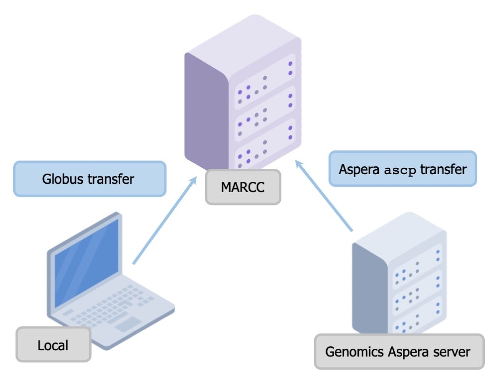

This document is intended to help understand the function of the files
contained in here.

# *First*: A Note on File Naming :sparkles:

In this experiment, I used quaddRAD library prep to prepare the sample
DNA. This means that there were both two unique outer barcodes (typical
Illumina barcodes) *AND* two unique inner barcodes (random barcode bases
inside the adapters) for each sample - over 1700 to be exact!

The sequencing facility demultiplexes samples based on the outer
barcodes (typically called 5nn and i7nn). Once this is done, each file
still contains a mix of the inner barcodes. I will refer to these as
“sublibraries” because they are sort of halfway demultiplexed. I
separate them out bioinformatically later.

The typical file looks like this:

    AMH_macro_1_1_12px_S1_L001_R1_001.fastq.gz

Here’s a bit of information on the file name convention.

    AMH_macro_1_1_12px_S1_L001_R1_001.fastq.gz
    ^^^^^^^^^

These are my initials and “macro” stands for “Macrosystems”. These are
on every file.

    AMH_macro_1_1_12px_S1_L001_R1_001.fastq.gz
              ^

This is the *i5nn* barcode for the given sublibrary. I know all these
samples have a i5nn barcode “1”, so that narrows down what they can be.

    AMH_macro_1_1_12px_S1_L001_R1_001.fastq.gz
                ^

This is the *i7nn* barcode for the given sublibrary. I know all these
samples have a i7nn barcode “1”, so that further narrows down what they
can be.

    AMH_macro_1_1_12px_S1_L001_R1_001.fastq.gz
                  ^^^^

This refers to how many samples are in the sublibrary. “12px” means
12-plexed, or 12 samples. In other words, I will use the inner barcodes
to further distinguish 12 unique samples in this sublibrary.

    AMH_macro_1_1_12px_S1_L001_R1_001.fastq.gz
                       ^^

This is a unique sublibrary name. S1 = 1 i5nn and 1 i7nn.

    AMH_macro_1_1_12px_S1_L001_R1_001.fastq.gz
                          ^^^^

This means this particular file came from lane 1 of the NovaSeq. There
are four lanes. All samples should appear across all four lanes.

    AMH_macro_1_1_12px_S1_L001_R1_001.fastq.gz
                               ^^

This is the first (R1) of two paired-end reads (R1 and R2).

    AMH_macro_1_1_12px_S1_L001_R1_001.fastq.gz
                                  ^^^

Doesn’t mean anything - it was just added automatically :)

# A Note on File Transfers :arrows\_clockwise:

There are three main systems at play for file transfer: my local
machine, the sequencing facility’s (GRCF) Aspera server, and
[MARCC](https://www.marcc.jhu.edu/). The Aspera server is where the data
were/are stored immediately after sequencing. MARCC is where I plan to
do preprocessing and analysis. Scripts and text files are easy for me to
edit on my local machine. I used [Globus](https://app.globus.org) to
transfer these small files from my local machine to MARCC.

# Preprocessing :wrench:

## Step 1 - `01-aspera_transfer_n.txt`

These are text files containing the *names* of `fastq.gz` files that I
wanted to transfer from the sequencing facility’s Aspera server to the
computing cluster ([MARCC](https://www.marcc.jhu.edu/)). This was to
maximize ease of transferring only certain files over at once, since
transferring could take a long time. I definitely did this piecemeal.
Possible file names shown in [Aspera Transfer File
Names](#aspera-transfer-file-names). There are multiple of these files
so that I could parallelize (replace n with the correct number in the
command used below).

Files were transferred using the following commands. First, load the
aspera module. Alternatively, you can install the Aspera transfer
software and use that. More info here

    module load aspera

Initiate the transfer:

    ascp -T -l8G -i /software/apps/aspera/3.9.1/etc/asperaweb_id_dsa.openssh --file-list=01-aspera_transfer_n.txt --mode=recv --user=<aspera-user> --host=<aspera-IP> /scratch/users/<me>@jhu.edu

## Step 2 - `02-concat_files_across4lanes.sh`

I ran my samples across the whole flow cell of the NovaSeq, so results
came in 8 files for each demultiplexed sublibrary (4 lanes \* paired
reads). For example, for sublibrary 1\_1, we’d see the following files:

    AMH_macro_1_1_12px_S1_L001_R1_001.fastq.gz
    AMH_macro_1_1_12px_S1_L001_R2_001.fastq.gz
    AMH_macro_1_1_12px_S1_L002_R1_001.fastq.gz
    AMH_macro_1_1_12px_S1_L002_R2_001.fastq.gz
    AMH_macro_1_1_12px_S1_L003_R1_001.fastq.gz
    AMH_macro_1_1_12px_S1_L003_R2_001.fastq.gz
    AMH_macro_1_1_12px_S1_L004_R1_001.fastq.gz
    AMH_macro_1_1_12px_S1_L004_R2_001.fastq.gz

This script finds all files in the working directory with the name
pattern `*_L001_*.fastq.gz` and concatenates across lanes so they can be
managed further. For example the 8 files above would become:

    AMH_macro_1_1_12px_S1_R1.fastq.gz
    AMH_macro_1_1_12px_S1_R2.fastq.gz

## Step 3 - `03-clone_filter.sh`

This script runs `clone_filter` from
[Stacks](https://catchenlab.life.illinois.edu/stacks/). The program was
run with options `--inline_inline --oligo_len_1 4 --oligo_len_2 4`. The
script uses the file name prefixes listed for each single sub-pooled
library in `03-clone_filter_file_names.txt` and loops to run
`clone_filter` on all of them. Possible file names shown in
[`clone_filter` File Names](#clone_filter-file-names).

## Step 4 - `04-process_radtags.sh`

This script runs `process_radtags` from
[Stacks](https://catchenlab.life.illinois.edu/stacks/). The program was
run with options
`-c -q --inline_inline --renz_1 pstI --renz_2 mspI --rescue --disable_rad_check`.
The script uses the same file prefixes as [Step 3 -
`03-clone_filter.sh`](#step-3---03-clone_filtersh). Each sub-pooled
library has a forward and reverse read file that was filtered in the
previous step. Like the [above section](#step-3---03-clone_filtersh),
the script uses the file name prefixes listed for each single sub-pooled
library in `04-process_radtags_file_names.txt` and loops to run
`process_radtags` on all of them. Possible file names shown in
[`clone_filter` File Names](#clone_filter-file-names).

Each sub-pooled library also has a demultiplexing file (`04-demux/`
directory) that contains the sample names and inner (i5 and i7)
barcodes. For example, the sublibrary 1\_1, we’d see the following
barcode file:

    ATCACG  AGTCAA  DS.BA.PIK.U.1
    CGATGT  AGTTCC  DS.BA.PIK.U.2
    TTAGGC  ATGTCA  DS.BA.PIK.U.3
    TGACCA  CCGTCC  DS.BA.PIK.U.4
    ACAGTG  GTCCGC  DS.BA.PIK.U.5
    GCCAAT  GTGAAA  DS.BA.DHI.U.1
    CAGATC  GTGGCC  DS.BA.DHI.U.2
    ACTTGA  GTTTCG  DS.BA.DHI.U.3
    GATCAG  CGTACG  DS.BA.DHI.U.4
    TAGCTT  GAGTGG  DS.BA.DHI.U.5
    GGCTAC  ACTGAT  DS.BA.GA.U.1
    CTTGTA  ATTCCT  DS.BA.GA.U.2

### Step 4b - Organize files

In the out directory, make sure the files are organized by species. By
default, files are sent to `~/scratch/demux`, but each file needs to be
sent to `~/scratch/demux/<SPP>`. For example, the file
“DS.MN.L01-DS.M.1.1.fq.gz” should be sent to the `~/scratch/demux/DS`
directory.

Note: this is not automated at this point but it would be nice to
automate the file moving process so it’s not forgotten at this point.

## Step 5 - `ustacks`

`ustacks` builds *de novo* loci in each individual sample. We have
designed it so that the process requires three files:

-   `05-ustacks_n.sh` : the shell script that executes `ustacks`
-   `05-ustacks_id_n.txt` : the sample ID number
-   `05-ustacks_samples_n.txt` : the sample names that correspond to the
    sample IDs

The sample ID should be derived from the `order_id` column (first
column) on the master spreadsheet. It is unique (1-1736) across all of
the samples.

The sample name is the corresponding name for each sample ID in the
spreadsheet. E.g., sample ID “9” corresponds to sample name
“DS.BA.DHI.U.4”. Sample naming convention is
species.city.site.management\_type.replicate\_plant.

`05-ustacks_n.sh` should have an out\_directory (`-o` option)
corresponding to the date or other relevant output directory name that
changes with each run. Otherwise this causes [problems
downstream](https://groups.google.com/g/stacks-users/c/q3YYPprmYnU/m/cH5RB5KwBQAJ).
There should be three files for every sample in the output directory:

-   `<samplename>.alleles.tsv.gz`
-   `<samplename>.snps.tsv.gz`
-   `<samplename>.tags.tsv.gz`

There are multiple of these files so that I could parallelize (replace n
with the correct number).

### Step 5b - Correct File Names

This step contains a script `05b-fix_filenames.sh` which uses some
simple regex to fix filenames that are output in previous steps. Stacks
adds an extra “1” at some point at the end of the sample name which is
not meaningful. The following files:

-   DS.MN.L02-DS.M.3.1.alleles.tsv.gz
-   DS.MN.L03-DS.U.2.1.tags.tsv.gz
-   DS.MN.L09-DS.U.1.1.snps.tsv.gz

become:

-   DS.MN.L02-DS.M.3.alleles.tsv.gz
-   DS.MN.L03-DS.U.2.tags.tsv.gz
-   DS.MN.L09-DS.U.1.snps.tsv.gz

The script currently gives some strange log output, so it can probably
be optimized/improved. The script should be run from the directory where
the changes need to be made.

## Step 6 - `cstacks`

`cstacks` builds the locus catalog from all the samples specified. The
accompanying script, `06-cstacks.sh` is relatively simple since it
points to the directory containing all the sample files. The tricky
thing is ensuring enough compute memory to run the entire process
successfully. There is probably space to optimize this process. The
`cstacks` method uses a “population” file, which in this project is
`06-cstacks_popmap.txt`. This file contains samples and city in two
tab-delimited columns, e.g.:

    DS.BA.GA.U.1    Baltimore
    DS.BA.GA.U.2    Baltimore
    DS.BA.GA.U.3    Baltimore
    DS.BA.GA.U.4    Baltimore
    DS.BA.GA.U.5    Baltimore
    ...

`cstacks` builds three files for use in all your samples (in this
pipeline run), mirroring the sample files outout by
[`ustacks`](#step-5---ustacks):

-   `catalog.alleles.tsv.gz`
-   `catalog.snps.tsv.gz`
-   `catalog.tags.tsv.gz`

## Step 7 - `sstacks`

All samples in the population are matched against the catalog produced
in [`cstacks`](#step-6---cstacks) with `sstacks`, run in script
`07-sstacks.sh`. It runs off of the samples based in the output
directory *and* the listed samples in `07-sstacks_samples.txt`, so make
sure all your files (sample and catalog etc) are there and match.
`07-sstacks_samples.txt` takes the form:

    DS.BA.GA.U.1
    DS.BA.GA.U.2
    DS.BA.GA.U.3
    DS.BA.GA.U.4
    DS.BA.GA.U.5
    ...

There should be a new file produced at this step for every sample in the
output directory:

-   `<samplename>.matches.tsv.gz`

## Step 8 - `tsv2bam`

`08-tsv2bam.sh` `08-tsv2bam_popmap.txt`

This is the step at which it’s usually discovered that some samples are
bad (don’t have any useable matches to the catalog). These samples were
excluded from `08-tsv2bam_popmap.txt`. For example I might simply cut
out the following rows:

    DS.MN.L10-DS.M.4    Minneapolis
    DS.MN.L01-DS.M.4    Minneapolis
    DS.BO.WL2.M.4   Boston

## Step 9 - `gstacks`

`09-gstacks.sh`

Produces the following:

-   `catalog.fa.gz` : consensus catalog loci, contains the consensus
    sequence for each locus as produced by `gstacks` in a standard FASTA
    file
-   `catalog.calls` : per-nucleotide genotypes, contains the output of
    the SNP calling model for each nucleotide in the analysis

## Step 10 - `populations`

`10-population.sh`

# Appendix :books:

## Aspera Transfer File Names

    /Hoffman_macrosystems/AMH_macro_1_1_12px_S1_L001_R1_001.fastq.gz
    /Hoffman_macrosystems/AMH_macro_1_1_12px_S1_L001_R2_001.fastq.gz
    /Hoffman_macrosystems/AMH_macro_1_1_12px_S1_L002_R1_001.fastq.gz
    /Hoffman_macrosystems/AMH_macro_1_1_12px_S1_L002_R2_001.fastq.gz
    /Hoffman_macrosystems/AMH_macro_1_1_12px_S1_L003_R1_001.fastq.gz
    /Hoffman_macrosystems/AMH_macro_1_1_12px_S1_L003_R2_001.fastq.gz
    /Hoffman_macrosystems/AMH_macro_1_1_12px_S1_L004_R1_001.fastq.gz
    /Hoffman_macrosystems/AMH_macro_1_1_12px_S1_L004_R2_001.fastq.gz
    /Hoffman_macrosystems/AMH_macro_1_10_8px_S10_L001_R1_001.fastq.gz
    /Hoffman_macrosystems/AMH_macro_1_10_8px_S10_L001_R2_001.fastq.gz
    /Hoffman_macrosystems/AMH_macro_1_10_8px_S10_L002_R1_001.fastq.gz
    /Hoffman_macrosystems/AMH_macro_1_10_8px_S10_L002_R2_001.fastq.gz
    /Hoffman_macrosystems/AMH_macro_1_10_8px_S10_L003_R1_001.fastq.gz
    /Hoffman_macrosystems/AMH_macro_1_10_8px_S10_L003_R2_001.fastq.gz
    /Hoffman_macrosystems/AMH_macro_1_10_8px_S10_L004_R1_001.fastq.gz
    /Hoffman_macrosystems/AMH_macro_1_10_8px_S10_L004_R2_001.fastq.gz
    /Hoffman_macrosystems/AMH_macro_1_11_8px_S11_L001_R1_001.fastq.gz
    /Hoffman_macrosystems/AMH_macro_1_11_8px_S11_L001_R2_001.fastq.gz
    /Hoffman_macrosystems/AMH_macro_1_11_8px_S11_L002_R1_001.fastq.gz
    /Hoffman_macrosystems/AMH_macro_1_11_8px_S11_L002_R2_001.fastq.gz
    /Hoffman_macrosystems/AMH_macro_1_11_8px_S11_L003_R1_001.fastq.gz
    /Hoffman_macrosystems/AMH_macro_1_11_8px_S11_L003_R2_001.fastq.gz
    /Hoffman_macrosystems/AMH_macro_1_11_8px_S11_L004_R1_001.fastq.gz
    /Hoffman_macrosystems/AMH_macro_1_11_8px_S11_L004_R2_001.fastq.gz
    /Hoffman_macrosystems/AMH_macro_1_12_8px_S12_L001_R1_001.fastq.gz
    /Hoffman_macrosystems/AMH_macro_1_12_8px_S12_L001_R2_001.fastq.gz
    /Hoffman_macrosystems/AMH_macro_1_12_8px_S12_L002_R1_001.fastq.gz
    /Hoffman_macrosystems/AMH_macro_1_12_8px_S12_L002_R2_001.fastq.gz
    /Hoffman_macrosystems/AMH_macro_1_12_8px_S12_L003_R1_001.fastq.gz
    /Hoffman_macrosystems/AMH_macro_1_12_8px_S12_L003_R2_001.fastq.gz
    /Hoffman_macrosystems/AMH_macro_1_12_8px_S12_L004_R1_001.fastq.gz
    /Hoffman_macrosystems/AMH_macro_1_12_8px_S12_L004_R2_001.fastq.gz
    /Hoffman_macrosystems/AMH_macro_1_13_8px_S13_L001_R1_001.fastq.gz
    /Hoffman_macrosystems/AMH_macro_1_13_8px_S13_L001_R2_001.fastq.gz
    /Hoffman_macrosystems/AMH_macro_1_13_8px_S13_L002_R1_001.fastq.gz
    /Hoffman_macrosystems/AMH_macro_1_13_8px_S13_L002_R2_001.fastq.gz
    /Hoffman_macrosystems/AMH_macro_1_13_8px_S13_L003_R1_001.fastq.gz
    /Hoffman_macrosystems/AMH_macro_1_13_8px_S13_L003_R2_001.fastq.gz
    /Hoffman_macrosystems/AMH_macro_1_13_8px_S13_L004_R1_001.fastq.gz
    /Hoffman_macrosystems/AMH_macro_1_13_8px_S13_L004_R2_001.fastq.gz
    /Hoffman_macrosystems/AMH_macro_1_14_8px_S14_L001_R1_001.fastq.gz
    /Hoffman_macrosystems/AMH_macro_1_14_8px_S14_L001_R2_001.fastq.gz
    /Hoffman_macrosystems/AMH_macro_1_14_8px_S14_L002_R1_001.fastq.gz
    /Hoffman_macrosystems/AMH_macro_1_14_8px_S14_L002_R2_001.fastq.gz
    /Hoffman_macrosystems/AMH_macro_1_14_8px_S14_L003_R1_001.fastq.gz
    /Hoffman_macrosystems/AMH_macro_1_14_8px_S14_L003_R2_001.fastq.gz
    /Hoffman_macrosystems/AMH_macro_1_14_8px_S14_L004_R1_001.fastq.gz
    /Hoffman_macrosystems/AMH_macro_1_14_8px_S14_L004_R2_001.fastq.gz
    /Hoffman_macrosystems/AMH_macro_1_2_12px_S2_L001_R1_001.fastq.gz
    /Hoffman_macrosystems/AMH_macro_1_2_12px_S2_L001_R2_001.fastq.gz
    /Hoffman_macrosystems/AMH_macro_1_2_12px_S2_L002_R1_001.fastq.gz
    /Hoffman_macrosystems/AMH_macro_1_2_12px_S2_L002_R2_001.fastq.gz
    /Hoffman_macrosystems/AMH_macro_1_2_12px_S2_L003_R1_001.fastq.gz
    /Hoffman_macrosystems/AMH_macro_1_2_12px_S2_L003_R2_001.fastq.gz
    /Hoffman_macrosystems/AMH_macro_1_2_12px_S2_L004_R1_001.fastq.gz
    /Hoffman_macrosystems/AMH_macro_1_2_12px_S2_L004_R2_001.fastq.gz
    /Hoffman_macrosystems/AMH_macro_1_3_12px_S3_L001_R1_001.fastq.gz
    /Hoffman_macrosystems/AMH_macro_1_3_12px_S3_L001_R2_001.fastq.gz
    /Hoffman_macrosystems/AMH_macro_1_3_12px_S3_L002_R1_001.fastq.gz
    /Hoffman_macrosystems/AMH_macro_1_3_12px_S3_L002_R2_001.fastq.gz
    /Hoffman_macrosystems/AMH_macro_1_3_12px_S3_L003_R1_001.fastq.gz
    /Hoffman_macrosystems/AMH_macro_1_3_12px_S3_L003_R2_001.fastq.gz
    /Hoffman_macrosystems/AMH_macro_1_3_12px_S3_L004_R1_001.fastq.gz
    /Hoffman_macrosystems/AMH_macro_1_3_12px_S3_L004_R2_001.fastq.gz
    /Hoffman_macrosystems/AMH_macro_1_4_12px_S4_L001_R1_001.fastq.gz
    /Hoffman_macrosystems/AMH_macro_1_4_12px_S4_L001_R2_001.fastq.gz
    /Hoffman_macrosystems/AMH_macro_1_4_12px_S4_L002_R1_001.fastq.gz
    /Hoffman_macrosystems/AMH_macro_1_4_12px_S4_L002_R2_001.fastq.gz
    /Hoffman_macrosystems/AMH_macro_1_4_12px_S4_L003_R1_001.fastq.gz
    /Hoffman_macrosystems/AMH_macro_1_4_12px_S4_L003_R2_001.fastq.gz
    /Hoffman_macrosystems/AMH_macro_1_4_12px_S4_L004_R1_001.fastq.gz
    /Hoffman_macrosystems/AMH_macro_1_4_12px_S4_L004_R2_001.fastq.gz
    /Hoffman_macrosystems/AMH_macro_1_5_8px_S5_L001_R1_001.fastq.gz
    /Hoffman_macrosystems/AMH_macro_1_5_8px_S5_L001_R2_001.fastq.gz
    /Hoffman_macrosystems/AMH_macro_1_5_8px_S5_L002_R1_001.fastq.gz
    /Hoffman_macrosystems/AMH_macro_1_5_8px_S5_L002_R2_001.fastq.gz
    /Hoffman_macrosystems/AMH_macro_1_5_8px_S5_L003_R1_001.fastq.gz
    /Hoffman_macrosystems/AMH_macro_1_5_8px_S5_L003_R2_001.fastq.gz
    /Hoffman_macrosystems/AMH_macro_1_5_8px_S5_L004_R1_001.fastq.gz
    /Hoffman_macrosystems/AMH_macro_1_5_8px_S5_L004_R2_001.fastq.gz
    /Hoffman_macrosystems/AMH_macro_1_6_8px_S6_L001_R1_001.fastq.gz
    /Hoffman_macrosystems/AMH_macro_1_6_8px_S6_L001_R2_001.fastq.gz
    /Hoffman_macrosystems/AMH_macro_1_6_8px_S6_L002_R1_001.fastq.gz
    /Hoffman_macrosystems/AMH_macro_1_6_8px_S6_L002_R2_001.fastq.gz
    /Hoffman_macrosystems/AMH_macro_1_6_8px_S6_L003_R1_001.fastq.gz
    /Hoffman_macrosystems/AMH_macro_1_6_8px_S6_L003_R2_001.fastq.gz
    /Hoffman_macrosystems/AMH_macro_1_6_8px_S6_L004_R1_001.fastq.gz
    /Hoffman_macrosystems/AMH_macro_1_6_8px_S6_L004_R2_001.fastq.gz
    /Hoffman_macrosystems/AMH_macro_1_7_8px_S7_L001_R1_001.fastq.gz
    /Hoffman_macrosystems/AMH_macro_1_7_8px_S7_L001_R2_001.fastq.gz
    /Hoffman_macrosystems/AMH_macro_1_7_8px_S7_L002_R1_001.fastq.gz
    /Hoffman_macrosystems/AMH_macro_1_7_8px_S7_L002_R2_001.fastq.gz
    /Hoffman_macrosystems/AMH_macro_1_7_8px_S7_L003_R1_001.fastq.gz
    /Hoffman_macrosystems/AMH_macro_1_7_8px_S7_L003_R2_001.fastq.gz
    /Hoffman_macrosystems/AMH_macro_1_7_8px_S7_L004_R1_001.fastq.gz
    /Hoffman_macrosystems/AMH_macro_1_7_8px_S7_L004_R2_001.fastq.gz
    /Hoffman_macrosystems/AMH_macro_1_8_8px_S8_L001_R1_001.fastq.gz
    /Hoffman_macrosystems/AMH_macro_1_8_8px_S8_L001_R2_001.fastq.gz
    /Hoffman_macrosystems/AMH_macro_1_8_8px_S8_L002_R1_001.fastq.gz
    /Hoffman_macrosystems/AMH_macro_1_8_8px_S8_L002_R2_001.fastq.gz
    /Hoffman_macrosystems/AMH_macro_1_8_8px_S8_L003_R1_001.fastq.gz
    /Hoffman_macrosystems/AMH_macro_1_8_8px_S8_L003_R2_001.fastq.gz
    /Hoffman_macrosystems/AMH_macro_1_8_8px_S8_L004_R1_001.fastq.gz
    /Hoffman_macrosystems/AMH_macro_1_8_8px_S8_L004_R2_001.fastq.gz
    /Hoffman_macrosystems/AMH_macro_1_9_8px_S9_L001_R1_001.fastq.gz
    /Hoffman_macrosystems/AMH_macro_1_9_8px_S9_L001_R2_001.fastq.gz
    /Hoffman_macrosystems/AMH_macro_1_9_8px_S9_L002_R1_001.fastq.gz
    /Hoffman_macrosystems/AMH_macro_1_9_8px_S9_L002_R2_001.fastq.gz
    /Hoffman_macrosystems/AMH_macro_1_9_8px_S9_L003_R1_001.fastq.gz
    /Hoffman_macrosystems/AMH_macro_1_9_8px_S9_L003_R2_001.fastq.gz
    /Hoffman_macrosystems/AMH_macro_1_9_8px_S9_L004_R1_001.fastq.gz
    /Hoffman_macrosystems/AMH_macro_1_9_8px_S9_L004_R2_001.fastq.gz
    /Hoffman_macrosystems/AMH_macro_10_1_8px_S127_L001_R1_001.fastq.gz
    /Hoffman_macrosystems/AMH_macro_10_1_8px_S127_L001_R2_001.fastq.gz
    /Hoffman_macrosystems/AMH_macro_10_1_8px_S127_L002_R1_001.fastq.gz
    /Hoffman_macrosystems/AMH_macro_10_1_8px_S127_L002_R2_001.fastq.gz
    /Hoffman_macrosystems/AMH_macro_10_1_8px_S127_L003_R1_001.fastq.gz
    /Hoffman_macrosystems/AMH_macro_10_1_8px_S127_L003_R2_001.fastq.gz
    /Hoffman_macrosystems/AMH_macro_10_1_8px_S127_L004_R1_001.fastq.gz
    /Hoffman_macrosystems/AMH_macro_10_1_8px_S127_L004_R2_001.fastq.gz
    /Hoffman_macrosystems/AMH_macro_10_10_12px_S136_L001_R1_001.fastq.gz
    /Hoffman_macrosystems/AMH_macro_10_10_12px_S136_L001_R2_001.fastq.gz
    /Hoffman_macrosystems/AMH_macro_10_10_12px_S136_L002_R1_001.fastq.gz
    /Hoffman_macrosystems/AMH_macro_10_10_12px_S136_L002_R2_001.fastq.gz
    /Hoffman_macrosystems/AMH_macro_10_10_12px_S136_L003_R1_001.fastq.gz
    /Hoffman_macrosystems/AMH_macro_10_10_12px_S136_L003_R2_001.fastq.gz
    /Hoffman_macrosystems/AMH_macro_10_10_12px_S136_L004_R1_001.fastq.gz
    /Hoffman_macrosystems/AMH_macro_10_10_12px_S136_L004_R2_001.fastq.gz
    /Hoffman_macrosystems/AMH_macro_10_11_12px_S137_L001_R1_001.fastq.gz
    /Hoffman_macrosystems/AMH_macro_10_11_12px_S137_L001_R2_001.fastq.gz
    /Hoffman_macrosystems/AMH_macro_10_11_12px_S137_L002_R1_001.fastq.gz
    /Hoffman_macrosystems/AMH_macro_10_11_12px_S137_L002_R2_001.fastq.gz
    /Hoffman_macrosystems/AMH_macro_10_11_12px_S137_L003_R1_001.fastq.gz
    /Hoffman_macrosystems/AMH_macro_10_11_12px_S137_L003_R2_001.fastq.gz
    /Hoffman_macrosystems/AMH_macro_10_11_12px_S137_L004_R1_001.fastq.gz
    /Hoffman_macrosystems/AMH_macro_10_11_12px_S137_L004_R2_001.fastq.gz
    /Hoffman_macrosystems/AMH_macro_10_12_12px_S138_L001_R1_001.fastq.gz
    /Hoffman_macrosystems/AMH_macro_10_12_12px_S138_L001_R2_001.fastq.gz
    /Hoffman_macrosystems/AMH_macro_10_12_12px_S138_L002_R1_001.fastq.gz
    /Hoffman_macrosystems/AMH_macro_10_12_12px_S138_L002_R2_001.fastq.gz
    /Hoffman_macrosystems/AMH_macro_10_12_12px_S138_L003_R1_001.fastq.gz
    /Hoffman_macrosystems/AMH_macro_10_12_12px_S138_L003_R2_001.fastq.gz
    /Hoffman_macrosystems/AMH_macro_10_12_12px_S138_L004_R1_001.fastq.gz
    /Hoffman_macrosystems/AMH_macro_10_12_12px_S138_L004_R2_001.fastq.gz
    /Hoffman_macrosystems/AMH_macro_10_13_8px_S139_L001_R1_001.fastq.gz
    /Hoffman_macrosystems/AMH_macro_10_13_8px_S139_L001_R2_001.fastq.gz
    /Hoffman_macrosystems/AMH_macro_10_13_8px_S139_L002_R1_001.fastq.gz
    /Hoffman_macrosystems/AMH_macro_10_13_8px_S139_L002_R2_001.fastq.gz
    /Hoffman_macrosystems/AMH_macro_10_13_8px_S139_L003_R1_001.fastq.gz
    /Hoffman_macrosystems/AMH_macro_10_13_8px_S139_L003_R2_001.fastq.gz
    /Hoffman_macrosystems/AMH_macro_10_13_8px_S139_L004_R1_001.fastq.gz
    /Hoffman_macrosystems/AMH_macro_10_13_8px_S139_L004_R2_001.fastq.gz
    /Hoffman_macrosystems/AMH_macro_10_14_8px_S140_L001_R1_001.fastq.gz
    /Hoffman_macrosystems/AMH_macro_10_14_8px_S140_L001_R2_001.fastq.gz
    /Hoffman_macrosystems/AMH_macro_10_14_8px_S140_L002_R1_001.fastq.gz
    /Hoffman_macrosystems/AMH_macro_10_14_8px_S140_L002_R2_001.fastq.gz
    /Hoffman_macrosystems/AMH_macro_10_14_8px_S140_L003_R1_001.fastq.gz
    /Hoffman_macrosystems/AMH_macro_10_14_8px_S140_L003_R2_001.fastq.gz
    /Hoffman_macrosystems/AMH_macro_10_14_8px_S140_L004_R1_001.fastq.gz
    /Hoffman_macrosystems/AMH_macro_10_14_8px_S140_L004_R2_001.fastq.gz
    /Hoffman_macrosystems/AMH_macro_10_2_8px_S128_L001_R1_001.fastq.gz
    /Hoffman_macrosystems/AMH_macro_10_2_8px_S128_L001_R2_001.fastq.gz
    /Hoffman_macrosystems/AMH_macro_10_2_8px_S128_L002_R1_001.fastq.gz
    /Hoffman_macrosystems/AMH_macro_10_2_8px_S128_L002_R2_001.fastq.gz
    /Hoffman_macrosystems/AMH_macro_10_2_8px_S128_L003_R1_001.fastq.gz
    /Hoffman_macrosystems/AMH_macro_10_2_8px_S128_L003_R2_001.fastq.gz
    /Hoffman_macrosystems/AMH_macro_10_2_8px_S128_L004_R1_001.fastq.gz
    /Hoffman_macrosystems/AMH_macro_10_2_8px_S128_L004_R2_001.fastq.gz
    /Hoffman_macrosystems/AMH_macro_10_3_8px_S129_L001_R1_001.fastq.gz
    /Hoffman_macrosystems/AMH_macro_10_3_8px_S129_L001_R2_001.fastq.gz
    /Hoffman_macrosystems/AMH_macro_10_3_8px_S129_L002_R1_001.fastq.gz
    /Hoffman_macrosystems/AMH_macro_10_3_8px_S129_L002_R2_001.fastq.gz
    /Hoffman_macrosystems/AMH_macro_10_3_8px_S129_L003_R1_001.fastq.gz
    /Hoffman_macrosystems/AMH_macro_10_3_8px_S129_L003_R2_001.fastq.gz
    /Hoffman_macrosystems/AMH_macro_10_3_8px_S129_L004_R1_001.fastq.gz
    /Hoffman_macrosystems/AMH_macro_10_3_8px_S129_L004_R2_001.fastq.gz
    /Hoffman_macrosystems/AMH_macro_10_4_8px_S130_L001_R1_001.fastq.gz
    /Hoffman_macrosystems/AMH_macro_10_4_8px_S130_L001_R2_001.fastq.gz
    /Hoffman_macrosystems/AMH_macro_10_4_8px_S130_L002_R1_001.fastq.gz
    /Hoffman_macrosystems/AMH_macro_10_4_8px_S130_L002_R2_001.fastq.gz
    /Hoffman_macrosystems/AMH_macro_10_4_8px_S130_L003_R1_001.fastq.gz
    /Hoffman_macrosystems/AMH_macro_10_4_8px_S130_L003_R2_001.fastq.gz
    /Hoffman_macrosystems/AMH_macro_10_4_8px_S130_L004_R1_001.fastq.gz
    /Hoffman_macrosystems/AMH_macro_10_4_8px_S130_L004_R2_001.fastq.gz
    /Hoffman_macrosystems/AMH_macro_10_5_8px_S131_L001_R1_001.fastq.gz
    /Hoffman_macrosystems/AMH_macro_10_5_8px_S131_L001_R2_001.fastq.gz
    /Hoffman_macrosystems/AMH_macro_10_5_8px_S131_L002_R1_001.fastq.gz
    /Hoffman_macrosystems/AMH_macro_10_5_8px_S131_L002_R2_001.fastq.gz
    /Hoffman_macrosystems/AMH_macro_10_5_8px_S131_L003_R1_001.fastq.gz
    /Hoffman_macrosystems/AMH_macro_10_5_8px_S131_L003_R2_001.fastq.gz
    /Hoffman_macrosystems/AMH_macro_10_5_8px_S131_L004_R1_001.fastq.gz
    /Hoffman_macrosystems/AMH_macro_10_5_8px_S131_L004_R2_001.fastq.gz
    /Hoffman_macrosystems/AMH_macro_10_6_8px_S132_L001_R1_001.fastq.gz
    /Hoffman_macrosystems/AMH_macro_10_6_8px_S132_L001_R2_001.fastq.gz
    /Hoffman_macrosystems/AMH_macro_10_6_8px_S132_L002_R1_001.fastq.gz
    /Hoffman_macrosystems/AMH_macro_10_6_8px_S132_L002_R2_001.fastq.gz
    /Hoffman_macrosystems/AMH_macro_10_6_8px_S132_L003_R1_001.fastq.gz
    /Hoffman_macrosystems/AMH_macro_10_6_8px_S132_L003_R2_001.fastq.gz
    /Hoffman_macrosystems/AMH_macro_10_6_8px_S132_L004_R1_001.fastq.gz
    /Hoffman_macrosystems/AMH_macro_10_6_8px_S132_L004_R2_001.fastq.gz
    /Hoffman_macrosystems/AMH_macro_10_7_8px_S133_L001_R1_001.fastq.gz
    /Hoffman_macrosystems/AMH_macro_10_7_8px_S133_L001_R2_001.fastq.gz
    /Hoffman_macrosystems/AMH_macro_10_7_8px_S133_L002_R1_001.fastq.gz
    /Hoffman_macrosystems/AMH_macro_10_7_8px_S133_L002_R2_001.fastq.gz
    /Hoffman_macrosystems/AMH_macro_10_7_8px_S133_L003_R1_001.fastq.gz
    /Hoffman_macrosystems/AMH_macro_10_7_8px_S133_L003_R2_001.fastq.gz
    /Hoffman_macrosystems/AMH_macro_10_7_8px_S133_L004_R1_001.fastq.gz
    /Hoffman_macrosystems/AMH_macro_10_7_8px_S133_L004_R2_001.fastq.gz
    /Hoffman_macrosystems/AMH_macro_10_8_8px_S134_L001_R1_001.fastq.gz
    /Hoffman_macrosystems/AMH_macro_10_8_8px_S134_L001_R2_001.fastq.gz
    /Hoffman_macrosystems/AMH_macro_10_8_8px_S134_L002_R1_001.fastq.gz
    /Hoffman_macrosystems/AMH_macro_10_8_8px_S134_L002_R2_001.fastq.gz
    /Hoffman_macrosystems/AMH_macro_10_8_8px_S134_L003_R1_001.fastq.gz
    /Hoffman_macrosystems/AMH_macro_10_8_8px_S134_L003_R2_001.fastq.gz
    /Hoffman_macrosystems/AMH_macro_10_8_8px_S134_L004_R1_001.fastq.gz
    /Hoffman_macrosystems/AMH_macro_10_8_8px_S134_L004_R2_001.fastq.gz
    /Hoffman_macrosystems/AMH_macro_10_9_12px_S135_L001_R1_001.fastq.gz
    /Hoffman_macrosystems/AMH_macro_10_9_12px_S135_L001_R2_001.fastq.gz
    /Hoffman_macrosystems/AMH_macro_10_9_12px_S135_L002_R1_001.fastq.gz
    /Hoffman_macrosystems/AMH_macro_10_9_12px_S135_L002_R2_001.fastq.gz
    /Hoffman_macrosystems/AMH_macro_10_9_12px_S135_L003_R1_001.fastq.gz
    /Hoffman_macrosystems/AMH_macro_10_9_12px_S135_L003_R2_001.fastq.gz
    /Hoffman_macrosystems/AMH_macro_10_9_12px_S135_L004_R1_001.fastq.gz
    /Hoffman_macrosystems/AMH_macro_10_9_12px_S135_L004_R2_001.fastq.gz
    /Hoffman_macrosystems/AMH_macro_11_1_8px_S141_L001_R1_001.fastq.gz
    /Hoffman_macrosystems/AMH_macro_11_1_8px_S141_L001_R2_001.fastq.gz
    /Hoffman_macrosystems/AMH_macro_11_1_8px_S141_L002_R1_001.fastq.gz
    /Hoffman_macrosystems/AMH_macro_11_1_8px_S141_L002_R2_001.fastq.gz
    /Hoffman_macrosystems/AMH_macro_11_1_8px_S141_L003_R1_001.fastq.gz
    /Hoffman_macrosystems/AMH_macro_11_1_8px_S141_L003_R2_001.fastq.gz
    /Hoffman_macrosystems/AMH_macro_11_1_8px_S141_L004_R1_001.fastq.gz
    /Hoffman_macrosystems/AMH_macro_11_1_8px_S141_L004_R2_001.fastq.gz
    /Hoffman_macrosystems/AMH_macro_11_10_12px_S150_L001_R1_001.fastq.gz
    /Hoffman_macrosystems/AMH_macro_11_10_12px_S150_L001_R2_001.fastq.gz
    /Hoffman_macrosystems/AMH_macro_11_10_12px_S150_L002_R1_001.fastq.gz
    /Hoffman_macrosystems/AMH_macro_11_10_12px_S150_L002_R2_001.fastq.gz
    /Hoffman_macrosystems/AMH_macro_11_10_12px_S150_L003_R1_001.fastq.gz
    /Hoffman_macrosystems/AMH_macro_11_10_12px_S150_L003_R2_001.fastq.gz
    /Hoffman_macrosystems/AMH_macro_11_10_12px_S150_L004_R1_001.fastq.gz
    /Hoffman_macrosystems/AMH_macro_11_10_12px_S150_L004_R2_001.fastq.gz
    /Hoffman_macrosystems/AMH_macro_11_11_12px_S151_L001_R1_001.fastq.gz
    /Hoffman_macrosystems/AMH_macro_11_11_12px_S151_L001_R2_001.fastq.gz
    /Hoffman_macrosystems/AMH_macro_11_11_12px_S151_L002_R1_001.fastq.gz
    /Hoffman_macrosystems/AMH_macro_11_11_12px_S151_L002_R2_001.fastq.gz
    /Hoffman_macrosystems/AMH_macro_11_11_12px_S151_L003_R1_001.fastq.gz
    /Hoffman_macrosystems/AMH_macro_11_11_12px_S151_L003_R2_001.fastq.gz
    /Hoffman_macrosystems/AMH_macro_11_11_12px_S151_L004_R1_001.fastq.gz
    /Hoffman_macrosystems/AMH_macro_11_11_12px_S151_L004_R2_001.fastq.gz
    /Hoffman_macrosystems/AMH_macro_11_12_12px_S152_L001_R1_001.fastq.gz
    /Hoffman_macrosystems/AMH_macro_11_12_12px_S152_L001_R2_001.fastq.gz
    /Hoffman_macrosystems/AMH_macro_11_12_12px_S152_L002_R1_001.fastq.gz
    /Hoffman_macrosystems/AMH_macro_11_12_12px_S152_L002_R2_001.fastq.gz
    /Hoffman_macrosystems/AMH_macro_11_12_12px_S152_L003_R1_001.fastq.gz
    /Hoffman_macrosystems/AMH_macro_11_12_12px_S152_L003_R2_001.fastq.gz
    /Hoffman_macrosystems/AMH_macro_11_12_12px_S152_L004_R1_001.fastq.gz
    /Hoffman_macrosystems/AMH_macro_11_12_12px_S152_L004_R2_001.fastq.gz
    /Hoffman_macrosystems/AMH_macro_11_13_8px_S153_L001_R1_001.fastq.gz
    /Hoffman_macrosystems/AMH_macro_11_13_8px_S153_L001_R2_001.fastq.gz
    /Hoffman_macrosystems/AMH_macro_11_13_8px_S153_L002_R1_001.fastq.gz
    /Hoffman_macrosystems/AMH_macro_11_13_8px_S153_L002_R2_001.fastq.gz
    /Hoffman_macrosystems/AMH_macro_11_13_8px_S153_L003_R1_001.fastq.gz
    /Hoffman_macrosystems/AMH_macro_11_13_8px_S153_L003_R2_001.fastq.gz
    /Hoffman_macrosystems/AMH_macro_11_13_8px_S153_L004_R1_001.fastq.gz
    /Hoffman_macrosystems/AMH_macro_11_13_8px_S153_L004_R2_001.fastq.gz
    /Hoffman_macrosystems/AMH_macro_11_14_8px_S154_L001_R1_001.fastq.gz
    /Hoffman_macrosystems/AMH_macro_11_14_8px_S154_L001_R2_001.fastq.gz
    /Hoffman_macrosystems/AMH_macro_11_14_8px_S154_L002_R1_001.fastq.gz
    /Hoffman_macrosystems/AMH_macro_11_14_8px_S154_L002_R2_001.fastq.gz
    /Hoffman_macrosystems/AMH_macro_11_14_8px_S154_L003_R1_001.fastq.gz
    /Hoffman_macrosystems/AMH_macro_11_14_8px_S154_L003_R2_001.fastq.gz
    /Hoffman_macrosystems/AMH_macro_11_14_8px_S154_L004_R1_001.fastq.gz
    /Hoffman_macrosystems/AMH_macro_11_14_8px_S154_L004_R2_001.fastq.gz
    /Hoffman_macrosystems/AMH_macro_11_2_8px_S142_L001_R1_001.fastq.gz
    /Hoffman_macrosystems/AMH_macro_11_2_8px_S142_L001_R2_001.fastq.gz
    /Hoffman_macrosystems/AMH_macro_11_2_8px_S142_L002_R1_001.fastq.gz
    /Hoffman_macrosystems/AMH_macro_11_2_8px_S142_L002_R2_001.fastq.gz
    /Hoffman_macrosystems/AMH_macro_11_2_8px_S142_L003_R1_001.fastq.gz
    /Hoffman_macrosystems/AMH_macro_11_2_8px_S142_L003_R2_001.fastq.gz
    /Hoffman_macrosystems/AMH_macro_11_2_8px_S142_L004_R1_001.fastq.gz
    /Hoffman_macrosystems/AMH_macro_11_2_8px_S142_L004_R2_001.fastq.gz
    /Hoffman_macrosystems/AMH_macro_11_3_8px_S143_L001_R1_001.fastq.gz
    /Hoffman_macrosystems/AMH_macro_11_3_8px_S143_L001_R2_001.fastq.gz
    /Hoffman_macrosystems/AMH_macro_11_3_8px_S143_L002_R1_001.fastq.gz
    /Hoffman_macrosystems/AMH_macro_11_3_8px_S143_L002_R2_001.fastq.gz
    /Hoffman_macrosystems/AMH_macro_11_3_8px_S143_L003_R1_001.fastq.gz
    /Hoffman_macrosystems/AMH_macro_11_3_8px_S143_L003_R2_001.fastq.gz
    /Hoffman_macrosystems/AMH_macro_11_3_8px_S143_L004_R1_001.fastq.gz
    /Hoffman_macrosystems/AMH_macro_11_3_8px_S143_L004_R2_001.fastq.gz
    /Hoffman_macrosystems/AMH_macro_11_4_8px_S144_L001_R1_001.fastq.gz
    /Hoffman_macrosystems/AMH_macro_11_4_8px_S144_L001_R2_001.fastq.gz
    /Hoffman_macrosystems/AMH_macro_11_4_8px_S144_L002_R1_001.fastq.gz
    /Hoffman_macrosystems/AMH_macro_11_4_8px_S144_L002_R2_001.fastq.gz
    /Hoffman_macrosystems/AMH_macro_11_4_8px_S144_L003_R1_001.fastq.gz
    /Hoffman_macrosystems/AMH_macro_11_4_8px_S144_L003_R2_001.fastq.gz
    /Hoffman_macrosystems/AMH_macro_11_4_8px_S144_L004_R1_001.fastq.gz
    /Hoffman_macrosystems/AMH_macro_11_4_8px_S144_L004_R2_001.fastq.gz
    /Hoffman_macrosystems/AMH_macro_11_5_8px_S145_L001_R1_001.fastq.gz
    /Hoffman_macrosystems/AMH_macro_11_5_8px_S145_L001_R2_001.fastq.gz
    /Hoffman_macrosystems/AMH_macro_11_5_8px_S145_L002_R1_001.fastq.gz
    /Hoffman_macrosystems/AMH_macro_11_5_8px_S145_L002_R2_001.fastq.gz
    /Hoffman_macrosystems/AMH_macro_11_5_8px_S145_L003_R1_001.fastq.gz
    /Hoffman_macrosystems/AMH_macro_11_5_8px_S145_L003_R2_001.fastq.gz
    /Hoffman_macrosystems/AMH_macro_11_5_8px_S145_L004_R1_001.fastq.gz
    /Hoffman_macrosystems/AMH_macro_11_5_8px_S145_L004_R2_001.fastq.gz
    /Hoffman_macrosystems/AMH_macro_11_6_8px_S146_L001_R1_001.fastq.gz
    /Hoffman_macrosystems/AMH_macro_11_6_8px_S146_L001_R2_001.fastq.gz
    /Hoffman_macrosystems/AMH_macro_11_6_8px_S146_L002_R1_001.fastq.gz
    /Hoffman_macrosystems/AMH_macro_11_6_8px_S146_L002_R2_001.fastq.gz
    /Hoffman_macrosystems/AMH_macro_11_6_8px_S146_L003_R1_001.fastq.gz
    /Hoffman_macrosystems/AMH_macro_11_6_8px_S146_L003_R2_001.fastq.gz
    /Hoffman_macrosystems/AMH_macro_11_6_8px_S146_L004_R1_001.fastq.gz
    /Hoffman_macrosystems/AMH_macro_11_6_8px_S146_L004_R2_001.fastq.gz
    /Hoffman_macrosystems/AMH_macro_11_7_8px_S147_L001_R1_001.fastq.gz
    /Hoffman_macrosystems/AMH_macro_11_7_8px_S147_L001_R2_001.fastq.gz
    /Hoffman_macrosystems/AMH_macro_11_7_8px_S147_L002_R1_001.fastq.gz
    /Hoffman_macrosystems/AMH_macro_11_7_8px_S147_L002_R2_001.fastq.gz
    /Hoffman_macrosystems/AMH_macro_11_7_8px_S147_L003_R1_001.fastq.gz
    /Hoffman_macrosystems/AMH_macro_11_7_8px_S147_L003_R2_001.fastq.gz
    /Hoffman_macrosystems/AMH_macro_11_7_8px_S147_L004_R1_001.fastq.gz
    /Hoffman_macrosystems/AMH_macro_11_7_8px_S147_L004_R2_001.fastq.gz
    /Hoffman_macrosystems/AMH_macro_11_8_8px_S148_L001_R1_001.fastq.gz
    /Hoffman_macrosystems/AMH_macro_11_8_8px_S148_L001_R2_001.fastq.gz
    /Hoffman_macrosystems/AMH_macro_11_8_8px_S148_L002_R1_001.fastq.gz
    /Hoffman_macrosystems/AMH_macro_11_8_8px_S148_L002_R2_001.fastq.gz
    /Hoffman_macrosystems/AMH_macro_11_8_8px_S148_L003_R1_001.fastq.gz
    /Hoffman_macrosystems/AMH_macro_11_8_8px_S148_L003_R2_001.fastq.gz
    /Hoffman_macrosystems/AMH_macro_11_8_8px_S148_L004_R1_001.fastq.gz
    /Hoffman_macrosystems/AMH_macro_11_8_8px_S148_L004_R2_001.fastq.gz
    /Hoffman_macrosystems/AMH_macro_11_9_12px_S149_L001_R1_001.fastq.gz
    /Hoffman_macrosystems/AMH_macro_11_9_12px_S149_L001_R2_001.fastq.gz
    /Hoffman_macrosystems/AMH_macro_11_9_12px_S149_L002_R1_001.fastq.gz
    /Hoffman_macrosystems/AMH_macro_11_9_12px_S149_L002_R2_001.fastq.gz
    /Hoffman_macrosystems/AMH_macro_11_9_12px_S149_L003_R1_001.fastq.gz
    /Hoffman_macrosystems/AMH_macro_11_9_12px_S149_L003_R2_001.fastq.gz
    /Hoffman_macrosystems/AMH_macro_11_9_12px_S149_L004_R1_001.fastq.gz
    /Hoffman_macrosystems/AMH_macro_11_9_12px_S149_L004_R2_001.fastq.gz
    /Hoffman_macrosystems/AMH_macro_12_1_8px_S155_L001_R1_001.fastq.gz
    /Hoffman_macrosystems/AMH_macro_12_1_8px_S155_L001_R2_001.fastq.gz
    /Hoffman_macrosystems/AMH_macro_12_1_8px_S155_L002_R1_001.fastq.gz
    /Hoffman_macrosystems/AMH_macro_12_1_8px_S155_L002_R2_001.fastq.gz
    /Hoffman_macrosystems/AMH_macro_12_1_8px_S155_L003_R1_001.fastq.gz
    /Hoffman_macrosystems/AMH_macro_12_1_8px_S155_L003_R2_001.fastq.gz
    /Hoffman_macrosystems/AMH_macro_12_1_8px_S155_L004_R1_001.fastq.gz
    /Hoffman_macrosystems/AMH_macro_12_1_8px_S155_L004_R2_001.fastq.gz
    /Hoffman_macrosystems/AMH_macro_12_10_12px_S164_L001_R1_001.fastq.gz
    /Hoffman_macrosystems/AMH_macro_12_10_12px_S164_L001_R2_001.fastq.gz
    /Hoffman_macrosystems/AMH_macro_12_10_12px_S164_L002_R1_001.fastq.gz
    /Hoffman_macrosystems/AMH_macro_12_10_12px_S164_L002_R2_001.fastq.gz
    /Hoffman_macrosystems/AMH_macro_12_10_12px_S164_L003_R1_001.fastq.gz
    /Hoffman_macrosystems/AMH_macro_12_10_12px_S164_L003_R2_001.fastq.gz
    /Hoffman_macrosystems/AMH_macro_12_10_12px_S164_L004_R1_001.fastq.gz
    /Hoffman_macrosystems/AMH_macro_12_10_12px_S164_L004_R2_001.fastq.gz
    /Hoffman_macrosystems/AMH_macro_12_11_12px_S165_L001_R1_001.fastq.gz
    /Hoffman_macrosystems/AMH_macro_12_11_12px_S165_L001_R2_001.fastq.gz
    /Hoffman_macrosystems/AMH_macro_12_11_12px_S165_L002_R1_001.fastq.gz
    /Hoffman_macrosystems/AMH_macro_12_11_12px_S165_L002_R2_001.fastq.gz
    /Hoffman_macrosystems/AMH_macro_12_11_12px_S165_L003_R1_001.fastq.gz
    /Hoffman_macrosystems/AMH_macro_12_11_12px_S165_L003_R2_001.fastq.gz
    /Hoffman_macrosystems/AMH_macro_12_11_12px_S165_L004_R1_001.fastq.gz
    /Hoffman_macrosystems/AMH_macro_12_11_12px_S165_L004_R2_001.fastq.gz
    /Hoffman_macrosystems/AMH_macro_12_12_12px_S166_L001_R1_001.fastq.gz
    /Hoffman_macrosystems/AMH_macro_12_12_12px_S166_L001_R2_001.fastq.gz
    /Hoffman_macrosystems/AMH_macro_12_12_12px_S166_L002_R1_001.fastq.gz
    /Hoffman_macrosystems/AMH_macro_12_12_12px_S166_L002_R2_001.fastq.gz
    /Hoffman_macrosystems/AMH_macro_12_12_12px_S166_L003_R1_001.fastq.gz
    /Hoffman_macrosystems/AMH_macro_12_12_12px_S166_L003_R2_001.fastq.gz
    /Hoffman_macrosystems/AMH_macro_12_12_12px_S166_L004_R1_001.fastq.gz
    /Hoffman_macrosystems/AMH_macro_12_12_12px_S166_L004_R2_001.fastq.gz
    /Hoffman_macrosystems/AMH_macro_12_13_8px_S167_L001_R1_001.fastq.gz
    /Hoffman_macrosystems/AMH_macro_12_13_8px_S167_L001_R2_001.fastq.gz
    /Hoffman_macrosystems/AMH_macro_12_13_8px_S167_L002_R1_001.fastq.gz
    /Hoffman_macrosystems/AMH_macro_12_13_8px_S167_L002_R2_001.fastq.gz
    /Hoffman_macrosystems/AMH_macro_12_13_8px_S167_L003_R1_001.fastq.gz
    /Hoffman_macrosystems/AMH_macro_12_13_8px_S167_L003_R2_001.fastq.gz
    /Hoffman_macrosystems/AMH_macro_12_13_8px_S167_L004_R1_001.fastq.gz
    /Hoffman_macrosystems/AMH_macro_12_13_8px_S167_L004_R2_001.fastq.gz
    /Hoffman_macrosystems/AMH_macro_12_14_8px_S168_L001_R1_001.fastq.gz
    /Hoffman_macrosystems/AMH_macro_12_14_8px_S168_L001_R2_001.fastq.gz
    /Hoffman_macrosystems/AMH_macro_12_14_8px_S168_L002_R1_001.fastq.gz
    /Hoffman_macrosystems/AMH_macro_12_14_8px_S168_L002_R2_001.fastq.gz
    /Hoffman_macrosystems/AMH_macro_12_14_8px_S168_L003_R1_001.fastq.gz
    /Hoffman_macrosystems/AMH_macro_12_14_8px_S168_L003_R2_001.fastq.gz
    /Hoffman_macrosystems/AMH_macro_12_14_8px_S168_L004_R1_001.fastq.gz
    /Hoffman_macrosystems/AMH_macro_12_14_8px_S168_L004_R2_001.fastq.gz
    /Hoffman_macrosystems/AMH_macro_12_2_8px_S156_L001_R1_001.fastq.gz
    /Hoffman_macrosystems/AMH_macro_12_2_8px_S156_L001_R2_001.fastq.gz
    /Hoffman_macrosystems/AMH_macro_12_2_8px_S156_L002_R1_001.fastq.gz
    /Hoffman_macrosystems/AMH_macro_12_2_8px_S156_L002_R2_001.fastq.gz
    /Hoffman_macrosystems/AMH_macro_12_2_8px_S156_L003_R1_001.fastq.gz
    /Hoffman_macrosystems/AMH_macro_12_2_8px_S156_L003_R2_001.fastq.gz
    /Hoffman_macrosystems/AMH_macro_12_2_8px_S156_L004_R1_001.fastq.gz
    /Hoffman_macrosystems/AMH_macro_12_2_8px_S156_L004_R2_001.fastq.gz
    /Hoffman_macrosystems/AMH_macro_12_3_8px_S157_L001_R1_001.fastq.gz
    /Hoffman_macrosystems/AMH_macro_12_3_8px_S157_L001_R2_001.fastq.gz
    /Hoffman_macrosystems/AMH_macro_12_3_8px_S157_L002_R1_001.fastq.gz
    /Hoffman_macrosystems/AMH_macro_12_3_8px_S157_L002_R2_001.fastq.gz
    /Hoffman_macrosystems/AMH_macro_12_3_8px_S157_L003_R1_001.fastq.gz
    /Hoffman_macrosystems/AMH_macro_12_3_8px_S157_L003_R2_001.fastq.gz
    /Hoffman_macrosystems/AMH_macro_12_3_8px_S157_L004_R1_001.fastq.gz
    /Hoffman_macrosystems/AMH_macro_12_3_8px_S157_L004_R2_001.fastq.gz
    /Hoffman_macrosystems/AMH_macro_12_4_8px_S158_L001_R1_001.fastq.gz
    /Hoffman_macrosystems/AMH_macro_12_4_8px_S158_L001_R2_001.fastq.gz
    /Hoffman_macrosystems/AMH_macro_12_4_8px_S158_L002_R1_001.fastq.gz
    /Hoffman_macrosystems/AMH_macro_12_4_8px_S158_L002_R2_001.fastq.gz
    /Hoffman_macrosystems/AMH_macro_12_4_8px_S158_L003_R1_001.fastq.gz
    /Hoffman_macrosystems/AMH_macro_12_4_8px_S158_L003_R2_001.fastq.gz
    /Hoffman_macrosystems/AMH_macro_12_4_8px_S158_L004_R1_001.fastq.gz
    /Hoffman_macrosystems/AMH_macro_12_4_8px_S158_L004_R2_001.fastq.gz
    /Hoffman_macrosystems/AMH_macro_12_5_8px_S159_L001_R1_001.fastq.gz
    /Hoffman_macrosystems/AMH_macro_12_5_8px_S159_L001_R2_001.fastq.gz
    /Hoffman_macrosystems/AMH_macro_12_5_8px_S159_L002_R1_001.fastq.gz
    /Hoffman_macrosystems/AMH_macro_12_5_8px_S159_L002_R2_001.fastq.gz
    /Hoffman_macrosystems/AMH_macro_12_5_8px_S159_L003_R1_001.fastq.gz
    /Hoffman_macrosystems/AMH_macro_12_5_8px_S159_L003_R2_001.fastq.gz
    /Hoffman_macrosystems/AMH_macro_12_5_8px_S159_L004_R1_001.fastq.gz
    /Hoffman_macrosystems/AMH_macro_12_5_8px_S159_L004_R2_001.fastq.gz
    /Hoffman_macrosystems/AMH_macro_12_6_8px_S160_L001_R1_001.fastq.gz
    /Hoffman_macrosystems/AMH_macro_12_6_8px_S160_L001_R2_001.fastq.gz
    /Hoffman_macrosystems/AMH_macro_12_6_8px_S160_L002_R1_001.fastq.gz
    /Hoffman_macrosystems/AMH_macro_12_6_8px_S160_L002_R2_001.fastq.gz
    /Hoffman_macrosystems/AMH_macro_12_6_8px_S160_L003_R1_001.fastq.gz
    /Hoffman_macrosystems/AMH_macro_12_6_8px_S160_L003_R2_001.fastq.gz
    /Hoffman_macrosystems/AMH_macro_12_6_8px_S160_L004_R1_001.fastq.gz
    /Hoffman_macrosystems/AMH_macro_12_6_8px_S160_L004_R2_001.fastq.gz
    /Hoffman_macrosystems/AMH_macro_12_7_8px_S161_L001_R1_001.fastq.gz
    /Hoffman_macrosystems/AMH_macro_12_7_8px_S161_L001_R2_001.fastq.gz
    /Hoffman_macrosystems/AMH_macro_12_7_8px_S161_L002_R1_001.fastq.gz
    /Hoffman_macrosystems/AMH_macro_12_7_8px_S161_L002_R2_001.fastq.gz
    /Hoffman_macrosystems/AMH_macro_12_7_8px_S161_L003_R1_001.fastq.gz
    /Hoffman_macrosystems/AMH_macro_12_7_8px_S161_L003_R2_001.fastq.gz
    /Hoffman_macrosystems/AMH_macro_12_7_8px_S161_L004_R1_001.fastq.gz
    /Hoffman_macrosystems/AMH_macro_12_7_8px_S161_L004_R2_001.fastq.gz
    /Hoffman_macrosystems/AMH_macro_12_8_8px_S162_L001_R1_001.fastq.gz
    /Hoffman_macrosystems/AMH_macro_12_8_8px_S162_L001_R2_001.fastq.gz
    /Hoffman_macrosystems/AMH_macro_12_8_8px_S162_L002_R1_001.fastq.gz
    /Hoffman_macrosystems/AMH_macro_12_8_8px_S162_L002_R2_001.fastq.gz
    /Hoffman_macrosystems/AMH_macro_12_8_8px_S162_L003_R1_001.fastq.gz
    /Hoffman_macrosystems/AMH_macro_12_8_8px_S162_L003_R2_001.fastq.gz
    /Hoffman_macrosystems/AMH_macro_12_8_8px_S162_L004_R1_001.fastq.gz
    /Hoffman_macrosystems/AMH_macro_12_8_8px_S162_L004_R2_001.fastq.gz
    /Hoffman_macrosystems/AMH_macro_12_9_12px_S163_L001_R1_001.fastq.gz
    /Hoffman_macrosystems/AMH_macro_12_9_12px_S163_L001_R2_001.fastq.gz
    /Hoffman_macrosystems/AMH_macro_12_9_12px_S163_L002_R1_001.fastq.gz
    /Hoffman_macrosystems/AMH_macro_12_9_12px_S163_L002_R2_001.fastq.gz
    /Hoffman_macrosystems/AMH_macro_12_9_12px_S163_L003_R1_001.fastq.gz
    /Hoffman_macrosystems/AMH_macro_12_9_12px_S163_L003_R2_001.fastq.gz
    /Hoffman_macrosystems/AMH_macro_12_9_12px_S163_L004_R1_001.fastq.gz
    /Hoffman_macrosystems/AMH_macro_12_9_12px_S163_L004_R2_001.fastq.gz
    /Hoffman_macrosystems/AMH_macro_13_1_8px_S169_L001_R1_001.fastq.gz
    /Hoffman_macrosystems/AMH_macro_13_1_8px_S169_L001_R2_001.fastq.gz
    /Hoffman_macrosystems/AMH_macro_13_1_8px_S169_L002_R1_001.fastq.gz
    /Hoffman_macrosystems/AMH_macro_13_1_8px_S169_L002_R2_001.fastq.gz
    /Hoffman_macrosystems/AMH_macro_13_1_8px_S169_L003_R1_001.fastq.gz
    /Hoffman_macrosystems/AMH_macro_13_1_8px_S169_L003_R2_001.fastq.gz
    /Hoffman_macrosystems/AMH_macro_13_1_8px_S169_L004_R1_001.fastq.gz
    /Hoffman_macrosystems/AMH_macro_13_1_8px_S169_L004_R2_001.fastq.gz
    /Hoffman_macrosystems/AMH_macro_13_10_8px_S178_L001_R1_001.fastq.gz
    /Hoffman_macrosystems/AMH_macro_13_10_8px_S178_L001_R2_001.fastq.gz
    /Hoffman_macrosystems/AMH_macro_13_10_8px_S178_L002_R1_001.fastq.gz
    /Hoffman_macrosystems/AMH_macro_13_10_8px_S178_L002_R2_001.fastq.gz
    /Hoffman_macrosystems/AMH_macro_13_10_8px_S178_L003_R1_001.fastq.gz
    /Hoffman_macrosystems/AMH_macro_13_10_8px_S178_L003_R2_001.fastq.gz
    /Hoffman_macrosystems/AMH_macro_13_10_8px_S178_L004_R1_001.fastq.gz
    /Hoffman_macrosystems/AMH_macro_13_10_8px_S178_L004_R2_001.fastq.gz
    /Hoffman_macrosystems/AMH_macro_13_11_8px_S179_L001_R1_001.fastq.gz
    /Hoffman_macrosystems/AMH_macro_13_11_8px_S179_L001_R2_001.fastq.gz
    /Hoffman_macrosystems/AMH_macro_13_11_8px_S179_L002_R1_001.fastq.gz
    /Hoffman_macrosystems/AMH_macro_13_11_8px_S179_L002_R2_001.fastq.gz
    /Hoffman_macrosystems/AMH_macro_13_11_8px_S179_L003_R1_001.fastq.gz
    /Hoffman_macrosystems/AMH_macro_13_11_8px_S179_L003_R2_001.fastq.gz
    /Hoffman_macrosystems/AMH_macro_13_11_8px_S179_L004_R1_001.fastq.gz
    /Hoffman_macrosystems/AMH_macro_13_11_8px_S179_L004_R2_001.fastq.gz
    /Hoffman_macrosystems/AMH_macro_13_12_8px_S180_L001_R1_001.fastq.gz
    /Hoffman_macrosystems/AMH_macro_13_12_8px_S180_L001_R2_001.fastq.gz
    /Hoffman_macrosystems/AMH_macro_13_12_8px_S180_L002_R1_001.fastq.gz
    /Hoffman_macrosystems/AMH_macro_13_12_8px_S180_L002_R2_001.fastq.gz
    /Hoffman_macrosystems/AMH_macro_13_12_8px_S180_L003_R1_001.fastq.gz
    /Hoffman_macrosystems/AMH_macro_13_12_8px_S180_L003_R2_001.fastq.gz
    /Hoffman_macrosystems/AMH_macro_13_12_8px_S180_L004_R1_001.fastq.gz
    /Hoffman_macrosystems/AMH_macro_13_12_8px_S180_L004_R2_001.fastq.gz
    /Hoffman_macrosystems/AMH_macro_13_2_8px_S170_L001_R1_001.fastq.gz
    /Hoffman_macrosystems/AMH_macro_13_2_8px_S170_L001_R2_001.fastq.gz
    /Hoffman_macrosystems/AMH_macro_13_2_8px_S170_L002_R1_001.fastq.gz
    /Hoffman_macrosystems/AMH_macro_13_2_8px_S170_L002_R2_001.fastq.gz
    /Hoffman_macrosystems/AMH_macro_13_2_8px_S170_L003_R1_001.fastq.gz
    /Hoffman_macrosystems/AMH_macro_13_2_8px_S170_L003_R2_001.fastq.gz
    /Hoffman_macrosystems/AMH_macro_13_2_8px_S170_L004_R1_001.fastq.gz
    /Hoffman_macrosystems/AMH_macro_13_2_8px_S170_L004_R2_001.fastq.gz
    /Hoffman_macrosystems/AMH_macro_13_3_8px_S171_L001_R1_001.fastq.gz
    /Hoffman_macrosystems/AMH_macro_13_3_8px_S171_L001_R2_001.fastq.gz
    /Hoffman_macrosystems/AMH_macro_13_3_8px_S171_L002_R1_001.fastq.gz
    /Hoffman_macrosystems/AMH_macro_13_3_8px_S171_L002_R2_001.fastq.gz
    /Hoffman_macrosystems/AMH_macro_13_3_8px_S171_L003_R1_001.fastq.gz
    /Hoffman_macrosystems/AMH_macro_13_3_8px_S171_L003_R2_001.fastq.gz
    /Hoffman_macrosystems/AMH_macro_13_3_8px_S171_L004_R1_001.fastq.gz
    /Hoffman_macrosystems/AMH_macro_13_3_8px_S171_L004_R2_001.fastq.gz
    /Hoffman_macrosystems/AMH_macro_13_4_8px_S172_L001_R1_001.fastq.gz
    /Hoffman_macrosystems/AMH_macro_13_4_8px_S172_L001_R2_001.fastq.gz
    /Hoffman_macrosystems/AMH_macro_13_4_8px_S172_L002_R1_001.fastq.gz
    /Hoffman_macrosystems/AMH_macro_13_4_8px_S172_L002_R2_001.fastq.gz
    /Hoffman_macrosystems/AMH_macro_13_4_8px_S172_L003_R1_001.fastq.gz
    /Hoffman_macrosystems/AMH_macro_13_4_8px_S172_L003_R2_001.fastq.gz
    /Hoffman_macrosystems/AMH_macro_13_4_8px_S172_L004_R1_001.fastq.gz
    /Hoffman_macrosystems/AMH_macro_13_4_8px_S172_L004_R2_001.fastq.gz
    /Hoffman_macrosystems/AMH_macro_13_5_8px_S173_L001_R1_001.fastq.gz
    /Hoffman_macrosystems/AMH_macro_13_5_8px_S173_L001_R2_001.fastq.gz
    /Hoffman_macrosystems/AMH_macro_13_5_8px_S173_L002_R1_001.fastq.gz
    /Hoffman_macrosystems/AMH_macro_13_5_8px_S173_L002_R2_001.fastq.gz
    /Hoffman_macrosystems/AMH_macro_13_5_8px_S173_L003_R1_001.fastq.gz
    /Hoffman_macrosystems/AMH_macro_13_5_8px_S173_L003_R2_001.fastq.gz
    /Hoffman_macrosystems/AMH_macro_13_5_8px_S173_L004_R1_001.fastq.gz
    /Hoffman_macrosystems/AMH_macro_13_5_8px_S173_L004_R2_001.fastq.gz
    /Hoffman_macrosystems/AMH_macro_13_6_8px_S174_L001_R1_001.fastq.gz
    /Hoffman_macrosystems/AMH_macro_13_6_8px_S174_L001_R2_001.fastq.gz
    /Hoffman_macrosystems/AMH_macro_13_6_8px_S174_L002_R1_001.fastq.gz
    /Hoffman_macrosystems/AMH_macro_13_6_8px_S174_L002_R2_001.fastq.gz
    /Hoffman_macrosystems/AMH_macro_13_6_8px_S174_L003_R1_001.fastq.gz
    /Hoffman_macrosystems/AMH_macro_13_6_8px_S174_L003_R2_001.fastq.gz
    /Hoffman_macrosystems/AMH_macro_13_6_8px_S174_L004_R1_001.fastq.gz
    /Hoffman_macrosystems/AMH_macro_13_6_8px_S174_L004_R2_001.fastq.gz
    /Hoffman_macrosystems/AMH_macro_13_7_8px_S175_L001_R1_001.fastq.gz
    /Hoffman_macrosystems/AMH_macro_13_7_8px_S175_L001_R2_001.fastq.gz
    /Hoffman_macrosystems/AMH_macro_13_7_8px_S175_L002_R1_001.fastq.gz
    /Hoffman_macrosystems/AMH_macro_13_7_8px_S175_L002_R2_001.fastq.gz
    /Hoffman_macrosystems/AMH_macro_13_7_8px_S175_L003_R1_001.fastq.gz
    /Hoffman_macrosystems/AMH_macro_13_7_8px_S175_L003_R2_001.fastq.gz
    /Hoffman_macrosystems/AMH_macro_13_7_8px_S175_L004_R1_001.fastq.gz
    /Hoffman_macrosystems/AMH_macro_13_7_8px_S175_L004_R2_001.fastq.gz
    /Hoffman_macrosystems/AMH_macro_13_8_8px_S176_L001_R1_001.fastq.gz
    /Hoffman_macrosystems/AMH_macro_13_8_8px_S176_L001_R2_001.fastq.gz
    /Hoffman_macrosystems/AMH_macro_13_8_8px_S176_L002_R1_001.fastq.gz
    /Hoffman_macrosystems/AMH_macro_13_8_8px_S176_L002_R2_001.fastq.gz
    /Hoffman_macrosystems/AMH_macro_13_8_8px_S176_L003_R1_001.fastq.gz
    /Hoffman_macrosystems/AMH_macro_13_8_8px_S176_L003_R2_001.fastq.gz
    /Hoffman_macrosystems/AMH_macro_13_8_8px_S176_L004_R1_001.fastq.gz
    /Hoffman_macrosystems/AMH_macro_13_8_8px_S176_L004_R2_001.fastq.gz
    /Hoffman_macrosystems/AMH_macro_13_9_8px_S177_L001_R1_001.fastq.gz
    /Hoffman_macrosystems/AMH_macro_13_9_8px_S177_L001_R2_001.fastq.gz
    /Hoffman_macrosystems/AMH_macro_13_9_8px_S177_L002_R1_001.fastq.gz
    /Hoffman_macrosystems/AMH_macro_13_9_8px_S177_L002_R2_001.fastq.gz
    /Hoffman_macrosystems/AMH_macro_13_9_8px_S177_L003_R1_001.fastq.gz
    /Hoffman_macrosystems/AMH_macro_13_9_8px_S177_L003_R2_001.fastq.gz
    /Hoffman_macrosystems/AMH_macro_13_9_8px_S177_L004_R1_001.fastq.gz
    /Hoffman_macrosystems/AMH_macro_13_9_8px_S177_L004_R2_001.fastq.gz
    /Hoffman_macrosystems/AMH_macro_14_1_8px_S181_L001_R1_001.fastq.gz
    /Hoffman_macrosystems/AMH_macro_14_1_8px_S181_L001_R2_001.fastq.gz
    /Hoffman_macrosystems/AMH_macro_14_1_8px_S181_L002_R1_001.fastq.gz
    /Hoffman_macrosystems/AMH_macro_14_1_8px_S181_L002_R2_001.fastq.gz
    /Hoffman_macrosystems/AMH_macro_14_1_8px_S181_L003_R1_001.fastq.gz
    /Hoffman_macrosystems/AMH_macro_14_1_8px_S181_L003_R2_001.fastq.gz
    /Hoffman_macrosystems/AMH_macro_14_1_8px_S181_L004_R1_001.fastq.gz
    /Hoffman_macrosystems/AMH_macro_14_1_8px_S181_L004_R2_001.fastq.gz
    /Hoffman_macrosystems/AMH_macro_14_10_8px_S190_L001_R1_001.fastq.gz
    /Hoffman_macrosystems/AMH_macro_14_10_8px_S190_L001_R2_001.fastq.gz
    /Hoffman_macrosystems/AMH_macro_14_10_8px_S190_L002_R1_001.fastq.gz
    /Hoffman_macrosystems/AMH_macro_14_10_8px_S190_L002_R2_001.fastq.gz
    /Hoffman_macrosystems/AMH_macro_14_10_8px_S190_L003_R1_001.fastq.gz
    /Hoffman_macrosystems/AMH_macro_14_10_8px_S190_L003_R2_001.fastq.gz
    /Hoffman_macrosystems/AMH_macro_14_10_8px_S190_L004_R1_001.fastq.gz
    /Hoffman_macrosystems/AMH_macro_14_10_8px_S190_L004_R2_001.fastq.gz
    /Hoffman_macrosystems/AMH_macro_14_11_8px_S191_L001_R1_001.fastq.gz
    /Hoffman_macrosystems/AMH_macro_14_11_8px_S191_L001_R2_001.fastq.gz
    /Hoffman_macrosystems/AMH_macro_14_11_8px_S191_L002_R1_001.fastq.gz
    /Hoffman_macrosystems/AMH_macro_14_11_8px_S191_L002_R2_001.fastq.gz
    /Hoffman_macrosystems/AMH_macro_14_11_8px_S191_L003_R1_001.fastq.gz
    /Hoffman_macrosystems/AMH_macro_14_11_8px_S191_L003_R2_001.fastq.gz
    /Hoffman_macrosystems/AMH_macro_14_11_8px_S191_L004_R1_001.fastq.gz
    /Hoffman_macrosystems/AMH_macro_14_11_8px_S191_L004_R2_001.fastq.gz
    /Hoffman_macrosystems/AMH_macro_14_12_8px_S192_L001_R1_001.fastq.gz
    /Hoffman_macrosystems/AMH_macro_14_12_8px_S192_L001_R2_001.fastq.gz
    /Hoffman_macrosystems/AMH_macro_14_12_8px_S192_L002_R1_001.fastq.gz
    /Hoffman_macrosystems/AMH_macro_14_12_8px_S192_L002_R2_001.fastq.gz
    /Hoffman_macrosystems/AMH_macro_14_12_8px_S192_L003_R1_001.fastq.gz
    /Hoffman_macrosystems/AMH_macro_14_12_8px_S192_L003_R2_001.fastq.gz
    /Hoffman_macrosystems/AMH_macro_14_12_8px_S192_L004_R1_001.fastq.gz
    /Hoffman_macrosystems/AMH_macro_14_12_8px_S192_L004_R2_001.fastq.gz
    /Hoffman_macrosystems/AMH_macro_14_13_4px_S193_L001_R1_001.fastq.gz
    /Hoffman_macrosystems/AMH_macro_14_13_4px_S193_L001_R2_001.fastq.gz
    /Hoffman_macrosystems/AMH_macro_14_13_4px_S193_L002_R1_001.fastq.gz
    /Hoffman_macrosystems/AMH_macro_14_13_4px_S193_L002_R2_001.fastq.gz
    /Hoffman_macrosystems/AMH_macro_14_13_4px_S193_L003_R1_001.fastq.gz
    /Hoffman_macrosystems/AMH_macro_14_13_4px_S193_L003_R2_001.fastq.gz
    /Hoffman_macrosystems/AMH_macro_14_13_4px_S193_L004_R1_001.fastq.gz
    /Hoffman_macrosystems/AMH_macro_14_13_4px_S193_L004_R2_001.fastq.gz
    /Hoffman_macrosystems/AMH_macro_14_2_8px_S182_L001_R1_001.fastq.gz
    /Hoffman_macrosystems/AMH_macro_14_2_8px_S182_L001_R2_001.fastq.gz
    /Hoffman_macrosystems/AMH_macro_14_2_8px_S182_L002_R1_001.fastq.gz
    /Hoffman_macrosystems/AMH_macro_14_2_8px_S182_L002_R2_001.fastq.gz
    /Hoffman_macrosystems/AMH_macro_14_2_8px_S182_L003_R1_001.fastq.gz
    /Hoffman_macrosystems/AMH_macro_14_2_8px_S182_L003_R2_001.fastq.gz
    /Hoffman_macrosystems/AMH_macro_14_2_8px_S182_L004_R1_001.fastq.gz
    /Hoffman_macrosystems/AMH_macro_14_2_8px_S182_L004_R2_001.fastq.gz
    /Hoffman_macrosystems/AMH_macro_14_3_8px_S183_L001_R1_001.fastq.gz
    /Hoffman_macrosystems/AMH_macro_14_3_8px_S183_L001_R2_001.fastq.gz
    /Hoffman_macrosystems/AMH_macro_14_3_8px_S183_L002_R1_001.fastq.gz
    /Hoffman_macrosystems/AMH_macro_14_3_8px_S183_L002_R2_001.fastq.gz
    /Hoffman_macrosystems/AMH_macro_14_3_8px_S183_L003_R1_001.fastq.gz
    /Hoffman_macrosystems/AMH_macro_14_3_8px_S183_L003_R2_001.fastq.gz
    /Hoffman_macrosystems/AMH_macro_14_3_8px_S183_L004_R1_001.fastq.gz
    /Hoffman_macrosystems/AMH_macro_14_3_8px_S183_L004_R2_001.fastq.gz
    /Hoffman_macrosystems/AMH_macro_14_4_8px_S184_L001_R1_001.fastq.gz
    /Hoffman_macrosystems/AMH_macro_14_4_8px_S184_L001_R2_001.fastq.gz
    /Hoffman_macrosystems/AMH_macro_14_4_8px_S184_L002_R1_001.fastq.gz
    /Hoffman_macrosystems/AMH_macro_14_4_8px_S184_L002_R2_001.fastq.gz
    /Hoffman_macrosystems/AMH_macro_14_4_8px_S184_L003_R1_001.fastq.gz
    /Hoffman_macrosystems/AMH_macro_14_4_8px_S184_L003_R2_001.fastq.gz
    /Hoffman_macrosystems/AMH_macro_14_4_8px_S184_L004_R1_001.fastq.gz
    /Hoffman_macrosystems/AMH_macro_14_4_8px_S184_L004_R2_001.fastq.gz
    /Hoffman_macrosystems/AMH_macro_14_5_8px_S185_L001_R1_001.fastq.gz
    /Hoffman_macrosystems/AMH_macro_14_5_8px_S185_L001_R2_001.fastq.gz
    /Hoffman_macrosystems/AMH_macro_14_5_8px_S185_L002_R1_001.fastq.gz
    /Hoffman_macrosystems/AMH_macro_14_5_8px_S185_L002_R2_001.fastq.gz
    /Hoffman_macrosystems/AMH_macro_14_5_8px_S185_L003_R1_001.fastq.gz
    /Hoffman_macrosystems/AMH_macro_14_5_8px_S185_L003_R2_001.fastq.gz
    /Hoffman_macrosystems/AMH_macro_14_5_8px_S185_L004_R1_001.fastq.gz
    /Hoffman_macrosystems/AMH_macro_14_5_8px_S185_L004_R2_001.fastq.gz
    /Hoffman_macrosystems/AMH_macro_14_6_8px_S186_L001_R1_001.fastq.gz
    /Hoffman_macrosystems/AMH_macro_14_6_8px_S186_L001_R2_001.fastq.gz
    /Hoffman_macrosystems/AMH_macro_14_6_8px_S186_L002_R1_001.fastq.gz
    /Hoffman_macrosystems/AMH_macro_14_6_8px_S186_L002_R2_001.fastq.gz
    /Hoffman_macrosystems/AMH_macro_14_6_8px_S186_L003_R1_001.fastq.gz
    /Hoffman_macrosystems/AMH_macro_14_6_8px_S186_L003_R2_001.fastq.gz
    /Hoffman_macrosystems/AMH_macro_14_6_8px_S186_L004_R1_001.fastq.gz
    /Hoffman_macrosystems/AMH_macro_14_6_8px_S186_L004_R2_001.fastq.gz
    /Hoffman_macrosystems/AMH_macro_14_7_8px_S187_L001_R1_001.fastq.gz
    /Hoffman_macrosystems/AMH_macro_14_7_8px_S187_L001_R2_001.fastq.gz
    /Hoffman_macrosystems/AMH_macro_14_7_8px_S187_L002_R1_001.fastq.gz
    /Hoffman_macrosystems/AMH_macro_14_7_8px_S187_L002_R2_001.fastq.gz
    /Hoffman_macrosystems/AMH_macro_14_7_8px_S187_L003_R1_001.fastq.gz
    /Hoffman_macrosystems/AMH_macro_14_7_8px_S187_L003_R2_001.fastq.gz
    /Hoffman_macrosystems/AMH_macro_14_7_8px_S187_L004_R1_001.fastq.gz
    /Hoffman_macrosystems/AMH_macro_14_7_8px_S187_L004_R2_001.fastq.gz
    /Hoffman_macrosystems/AMH_macro_14_8_8px_S188_L001_R1_001.fastq.gz
    /Hoffman_macrosystems/AMH_macro_14_8_8px_S188_L001_R2_001.fastq.gz
    /Hoffman_macrosystems/AMH_macro_14_8_8px_S188_L002_R1_001.fastq.gz
    /Hoffman_macrosystems/AMH_macro_14_8_8px_S188_L002_R2_001.fastq.gz
    /Hoffman_macrosystems/AMH_macro_14_8_8px_S188_L003_R1_001.fastq.gz
    /Hoffman_macrosystems/AMH_macro_14_8_8px_S188_L003_R2_001.fastq.gz
    /Hoffman_macrosystems/AMH_macro_14_8_8px_S188_L004_R1_001.fastq.gz
    /Hoffman_macrosystems/AMH_macro_14_8_8px_S188_L004_R2_001.fastq.gz
    /Hoffman_macrosystems/AMH_macro_14_9_8px_S189_L001_R1_001.fastq.gz
    /Hoffman_macrosystems/AMH_macro_14_9_8px_S189_L001_R2_001.fastq.gz
    /Hoffman_macrosystems/AMH_macro_14_9_8px_S189_L002_R1_001.fastq.gz
    /Hoffman_macrosystems/AMH_macro_14_9_8px_S189_L002_R2_001.fastq.gz
    /Hoffman_macrosystems/AMH_macro_14_9_8px_S189_L003_R1_001.fastq.gz
    /Hoffman_macrosystems/AMH_macro_14_9_8px_S189_L003_R2_001.fastq.gz
    /Hoffman_macrosystems/AMH_macro_14_9_8px_S189_L004_R1_001.fastq.gz
    /Hoffman_macrosystems/AMH_macro_14_9_8px_S189_L004_R2_001.fastq.gz
    /Hoffman_macrosystems/AMH_macro_2_1_12px_S15_L001_R1_001.fastq.gz
    /Hoffman_macrosystems/AMH_macro_2_1_12px_S15_L001_R2_001.fastq.gz
    /Hoffman_macrosystems/AMH_macro_2_1_12px_S15_L002_R1_001.fastq.gz
    /Hoffman_macrosystems/AMH_macro_2_1_12px_S15_L002_R2_001.fastq.gz
    /Hoffman_macrosystems/AMH_macro_2_1_12px_S15_L003_R1_001.fastq.gz
    /Hoffman_macrosystems/AMH_macro_2_1_12px_S15_L003_R2_001.fastq.gz
    /Hoffman_macrosystems/AMH_macro_2_1_12px_S15_L004_R1_001.fastq.gz
    /Hoffman_macrosystems/AMH_macro_2_1_12px_S15_L004_R2_001.fastq.gz
    /Hoffman_macrosystems/AMH_macro_2_10_8px_S24_L001_R1_001.fastq.gz
    /Hoffman_macrosystems/AMH_macro_2_10_8px_S24_L001_R2_001.fastq.gz
    /Hoffman_macrosystems/AMH_macro_2_10_8px_S24_L002_R1_001.fastq.gz
    /Hoffman_macrosystems/AMH_macro_2_10_8px_S24_L002_R2_001.fastq.gz
    /Hoffman_macrosystems/AMH_macro_2_10_8px_S24_L003_R1_001.fastq.gz
    /Hoffman_macrosystems/AMH_macro_2_10_8px_S24_L003_R2_001.fastq.gz
    /Hoffman_macrosystems/AMH_macro_2_10_8px_S24_L004_R1_001.fastq.gz
    /Hoffman_macrosystems/AMH_macro_2_10_8px_S24_L004_R2_001.fastq.gz
    /Hoffman_macrosystems/AMH_macro_2_11_8px_S25_L001_R1_001.fastq.gz
    /Hoffman_macrosystems/AMH_macro_2_11_8px_S25_L001_R2_001.fastq.gz
    /Hoffman_macrosystems/AMH_macro_2_11_8px_S25_L002_R1_001.fastq.gz
    /Hoffman_macrosystems/AMH_macro_2_11_8px_S25_L002_R2_001.fastq.gz
    /Hoffman_macrosystems/AMH_macro_2_11_8px_S25_L003_R1_001.fastq.gz
    /Hoffman_macrosystems/AMH_macro_2_11_8px_S25_L003_R2_001.fastq.gz
    /Hoffman_macrosystems/AMH_macro_2_11_8px_S25_L004_R1_001.fastq.gz
    /Hoffman_macrosystems/AMH_macro_2_11_8px_S25_L004_R2_001.fastq.gz
    /Hoffman_macrosystems/AMH_macro_2_12_8px_S26_L001_R1_001.fastq.gz
    /Hoffman_macrosystems/AMH_macro_2_12_8px_S26_L001_R2_001.fastq.gz
    /Hoffman_macrosystems/AMH_macro_2_12_8px_S26_L002_R1_001.fastq.gz
    /Hoffman_macrosystems/AMH_macro_2_12_8px_S26_L002_R2_001.fastq.gz
    /Hoffman_macrosystems/AMH_macro_2_12_8px_S26_L003_R1_001.fastq.gz
    /Hoffman_macrosystems/AMH_macro_2_12_8px_S26_L003_R2_001.fastq.gz
    /Hoffman_macrosystems/AMH_macro_2_12_8px_S26_L004_R1_001.fastq.gz
    /Hoffman_macrosystems/AMH_macro_2_12_8px_S26_L004_R2_001.fastq.gz
    /Hoffman_macrosystems/AMH_macro_2_13_8px_S27_L001_R1_001.fastq.gz
    /Hoffman_macrosystems/AMH_macro_2_13_8px_S27_L001_R2_001.fastq.gz
    /Hoffman_macrosystems/AMH_macro_2_13_8px_S27_L002_R1_001.fastq.gz
    /Hoffman_macrosystems/AMH_macro_2_13_8px_S27_L002_R2_001.fastq.gz
    /Hoffman_macrosystems/AMH_macro_2_13_8px_S27_L003_R1_001.fastq.gz
    /Hoffman_macrosystems/AMH_macro_2_13_8px_S27_L003_R2_001.fastq.gz
    /Hoffman_macrosystems/AMH_macro_2_13_8px_S27_L004_R1_001.fastq.gz
    /Hoffman_macrosystems/AMH_macro_2_13_8px_S27_L004_R2_001.fastq.gz
    /Hoffman_macrosystems/AMH_macro_2_14_8px_S28_L001_R1_001.fastq.gz
    /Hoffman_macrosystems/AMH_macro_2_14_8px_S28_L001_R2_001.fastq.gz
    /Hoffman_macrosystems/AMH_macro_2_14_8px_S28_L002_R1_001.fastq.gz
    /Hoffman_macrosystems/AMH_macro_2_14_8px_S28_L002_R2_001.fastq.gz
    /Hoffman_macrosystems/AMH_macro_2_14_8px_S28_L003_R1_001.fastq.gz
    /Hoffman_macrosystems/AMH_macro_2_14_8px_S28_L003_R2_001.fastq.gz
    /Hoffman_macrosystems/AMH_macro_2_14_8px_S28_L004_R1_001.fastq.gz
    /Hoffman_macrosystems/AMH_macro_2_14_8px_S28_L004_R2_001.fastq.gz
    /Hoffman_macrosystems/AMH_macro_2_2_12px_S16_L001_R1_001.fastq.gz
    /Hoffman_macrosystems/AMH_macro_2_2_12px_S16_L001_R2_001.fastq.gz
    /Hoffman_macrosystems/AMH_macro_2_2_12px_S16_L002_R1_001.fastq.gz
    /Hoffman_macrosystems/AMH_macro_2_2_12px_S16_L002_R2_001.fastq.gz
    /Hoffman_macrosystems/AMH_macro_2_2_12px_S16_L003_R1_001.fastq.gz
    /Hoffman_macrosystems/AMH_macro_2_2_12px_S16_L003_R2_001.fastq.gz
    /Hoffman_macrosystems/AMH_macro_2_2_12px_S16_L004_R1_001.fastq.gz
    /Hoffman_macrosystems/AMH_macro_2_2_12px_S16_L004_R2_001.fastq.gz
    /Hoffman_macrosystems/AMH_macro_2_3_12px_S17_L001_R1_001.fastq.gz
    /Hoffman_macrosystems/AMH_macro_2_3_12px_S17_L001_R2_001.fastq.gz
    /Hoffman_macrosystems/AMH_macro_2_3_12px_S17_L002_R1_001.fastq.gz
    /Hoffman_macrosystems/AMH_macro_2_3_12px_S17_L002_R2_001.fastq.gz
    /Hoffman_macrosystems/AMH_macro_2_3_12px_S17_L003_R1_001.fastq.gz
    /Hoffman_macrosystems/AMH_macro_2_3_12px_S17_L003_R2_001.fastq.gz
    /Hoffman_macrosystems/AMH_macro_2_3_12px_S17_L004_R1_001.fastq.gz
    /Hoffman_macrosystems/AMH_macro_2_3_12px_S17_L004_R2_001.fastq.gz
    /Hoffman_macrosystems/AMH_macro_2_4_12px_S18_L001_R1_001.fastq.gz
    /Hoffman_macrosystems/AMH_macro_2_4_12px_S18_L001_R2_001.fastq.gz
    /Hoffman_macrosystems/AMH_macro_2_4_12px_S18_L002_R1_001.fastq.gz
    /Hoffman_macrosystems/AMH_macro_2_4_12px_S18_L002_R2_001.fastq.gz
    /Hoffman_macrosystems/AMH_macro_2_4_12px_S18_L003_R1_001.fastq.gz
    /Hoffman_macrosystems/AMH_macro_2_4_12px_S18_L003_R2_001.fastq.gz
    /Hoffman_macrosystems/AMH_macro_2_4_12px_S18_L004_R1_001.fastq.gz
    /Hoffman_macrosystems/AMH_macro_2_4_12px_S18_L004_R2_001.fastq.gz
    /Hoffman_macrosystems/AMH_macro_2_5_8px_S19_L001_R1_001.fastq.gz
    /Hoffman_macrosystems/AMH_macro_2_5_8px_S19_L001_R2_001.fastq.gz
    /Hoffman_macrosystems/AMH_macro_2_5_8px_S19_L002_R1_001.fastq.gz
    /Hoffman_macrosystems/AMH_macro_2_5_8px_S19_L002_R2_001.fastq.gz
    /Hoffman_macrosystems/AMH_macro_2_5_8px_S19_L003_R1_001.fastq.gz
    /Hoffman_macrosystems/AMH_macro_2_5_8px_S19_L003_R2_001.fastq.gz
    /Hoffman_macrosystems/AMH_macro_2_5_8px_S19_L004_R1_001.fastq.gz
    /Hoffman_macrosystems/AMH_macro_2_5_8px_S19_L004_R2_001.fastq.gz
    /Hoffman_macrosystems/AMH_macro_2_6_8px_S20_L001_R1_001.fastq.gz
    /Hoffman_macrosystems/AMH_macro_2_6_8px_S20_L001_R2_001.fastq.gz
    /Hoffman_macrosystems/AMH_macro_2_6_8px_S20_L002_R1_001.fastq.gz
    /Hoffman_macrosystems/AMH_macro_2_6_8px_S20_L002_R2_001.fastq.gz
    /Hoffman_macrosystems/AMH_macro_2_6_8px_S20_L003_R1_001.fastq.gz
    /Hoffman_macrosystems/AMH_macro_2_6_8px_S20_L003_R2_001.fastq.gz
    /Hoffman_macrosystems/AMH_macro_2_6_8px_S20_L004_R1_001.fastq.gz
    /Hoffman_macrosystems/AMH_macro_2_6_8px_S20_L004_R2_001.fastq.gz
    /Hoffman_macrosystems/AMH_macro_2_7_8px_S21_L001_R1_001.fastq.gz
    /Hoffman_macrosystems/AMH_macro_2_7_8px_S21_L001_R2_001.fastq.gz
    /Hoffman_macrosystems/AMH_macro_2_7_8px_S21_L002_R1_001.fastq.gz
    /Hoffman_macrosystems/AMH_macro_2_7_8px_S21_L002_R2_001.fastq.gz
    /Hoffman_macrosystems/AMH_macro_2_7_8px_S21_L003_R1_001.fastq.gz
    /Hoffman_macrosystems/AMH_macro_2_7_8px_S21_L003_R2_001.fastq.gz
    /Hoffman_macrosystems/AMH_macro_2_7_8px_S21_L004_R1_001.fastq.gz
    /Hoffman_macrosystems/AMH_macro_2_7_8px_S21_L004_R2_001.fastq.gz
    /Hoffman_macrosystems/AMH_macro_2_8_8px_S22_L001_R1_001.fastq.gz
    /Hoffman_macrosystems/AMH_macro_2_8_8px_S22_L001_R2_001.fastq.gz
    /Hoffman_macrosystems/AMH_macro_2_8_8px_S22_L002_R1_001.fastq.gz
    /Hoffman_macrosystems/AMH_macro_2_8_8px_S22_L002_R2_001.fastq.gz
    /Hoffman_macrosystems/AMH_macro_2_8_8px_S22_L003_R1_001.fastq.gz
    /Hoffman_macrosystems/AMH_macro_2_8_8px_S22_L003_R2_001.fastq.gz
    /Hoffman_macrosystems/AMH_macro_2_8_8px_S22_L004_R1_001.fastq.gz
    /Hoffman_macrosystems/AMH_macro_2_8_8px_S22_L004_R2_001.fastq.gz
    /Hoffman_macrosystems/AMH_macro_2_9_8px_S23_L001_R1_001.fastq.gz
    /Hoffman_macrosystems/AMH_macro_2_9_8px_S23_L001_R2_001.fastq.gz
    /Hoffman_macrosystems/AMH_macro_2_9_8px_S23_L002_R1_001.fastq.gz
    /Hoffman_macrosystems/AMH_macro_2_9_8px_S23_L002_R2_001.fastq.gz
    /Hoffman_macrosystems/AMH_macro_2_9_8px_S23_L003_R1_001.fastq.gz
    /Hoffman_macrosystems/AMH_macro_2_9_8px_S23_L003_R2_001.fastq.gz
    /Hoffman_macrosystems/AMH_macro_2_9_8px_S23_L004_R1_001.fastq.gz
    /Hoffman_macrosystems/AMH_macro_2_9_8px_S23_L004_R2_001.fastq.gz
    /Hoffman_macrosystems/AMH_macro_3_1_12px_S29_L001_R1_001.fastq.gz
    /Hoffman_macrosystems/AMH_macro_3_1_12px_S29_L001_R2_001.fastq.gz
    /Hoffman_macrosystems/AMH_macro_3_1_12px_S29_L002_R1_001.fastq.gz
    /Hoffman_macrosystems/AMH_macro_3_1_12px_S29_L002_R2_001.fastq.gz
    /Hoffman_macrosystems/AMH_macro_3_1_12px_S29_L003_R1_001.fastq.gz
    /Hoffman_macrosystems/AMH_macro_3_1_12px_S29_L003_R2_001.fastq.gz
    /Hoffman_macrosystems/AMH_macro_3_1_12px_S29_L004_R1_001.fastq.gz
    /Hoffman_macrosystems/AMH_macro_3_1_12px_S29_L004_R2_001.fastq.gz
    /Hoffman_macrosystems/AMH_macro_3_10_8px_S38_L001_R1_001.fastq.gz
    /Hoffman_macrosystems/AMH_macro_3_10_8px_S38_L001_R2_001.fastq.gz
    /Hoffman_macrosystems/AMH_macro_3_10_8px_S38_L002_R1_001.fastq.gz
    /Hoffman_macrosystems/AMH_macro_3_10_8px_S38_L002_R2_001.fastq.gz
    /Hoffman_macrosystems/AMH_macro_3_10_8px_S38_L003_R1_001.fastq.gz
    /Hoffman_macrosystems/AMH_macro_3_10_8px_S38_L003_R2_001.fastq.gz
    /Hoffman_macrosystems/AMH_macro_3_10_8px_S38_L004_R1_001.fastq.gz
    /Hoffman_macrosystems/AMH_macro_3_10_8px_S38_L004_R2_001.fastq.gz
    /Hoffman_macrosystems/AMH_macro_3_11_8px_S39_L001_R1_001.fastq.gz
    /Hoffman_macrosystems/AMH_macro_3_11_8px_S39_L001_R2_001.fastq.gz
    /Hoffman_macrosystems/AMH_macro_3_11_8px_S39_L002_R1_001.fastq.gz
    /Hoffman_macrosystems/AMH_macro_3_11_8px_S39_L002_R2_001.fastq.gz
    /Hoffman_macrosystems/AMH_macro_3_11_8px_S39_L003_R1_001.fastq.gz
    /Hoffman_macrosystems/AMH_macro_3_11_8px_S39_L003_R2_001.fastq.gz
    /Hoffman_macrosystems/AMH_macro_3_11_8px_S39_L004_R1_001.fastq.gz
    /Hoffman_macrosystems/AMH_macro_3_11_8px_S39_L004_R2_001.fastq.gz
    /Hoffman_macrosystems/AMH_macro_3_12_8px_S40_L001_R1_001.fastq.gz
    /Hoffman_macrosystems/AMH_macro_3_12_8px_S40_L001_R2_001.fastq.gz
    /Hoffman_macrosystems/AMH_macro_3_12_8px_S40_L002_R1_001.fastq.gz
    /Hoffman_macrosystems/AMH_macro_3_12_8px_S40_L002_R2_001.fastq.gz
    /Hoffman_macrosystems/AMH_macro_3_12_8px_S40_L003_R1_001.fastq.gz
    /Hoffman_macrosystems/AMH_macro_3_12_8px_S40_L003_R2_001.fastq.gz
    /Hoffman_macrosystems/AMH_macro_3_12_8px_S40_L004_R1_001.fastq.gz
    /Hoffman_macrosystems/AMH_macro_3_12_8px_S40_L004_R2_001.fastq.gz
    /Hoffman_macrosystems/AMH_macro_3_13_8px_S41_L001_R1_001.fastq.gz
    /Hoffman_macrosystems/AMH_macro_3_13_8px_S41_L001_R2_001.fastq.gz
    /Hoffman_macrosystems/AMH_macro_3_13_8px_S41_L002_R1_001.fastq.gz
    /Hoffman_macrosystems/AMH_macro_3_13_8px_S41_L002_R2_001.fastq.gz
    /Hoffman_macrosystems/AMH_macro_3_13_8px_S41_L003_R1_001.fastq.gz
    /Hoffman_macrosystems/AMH_macro_3_13_8px_S41_L003_R2_001.fastq.gz
    /Hoffman_macrosystems/AMH_macro_3_13_8px_S41_L004_R1_001.fastq.gz
    /Hoffman_macrosystems/AMH_macro_3_13_8px_S41_L004_R2_001.fastq.gz
    /Hoffman_macrosystems/AMH_macro_3_14_8px_S42_L001_R1_001.fastq.gz
    /Hoffman_macrosystems/AMH_macro_3_14_8px_S42_L001_R2_001.fastq.gz
    /Hoffman_macrosystems/AMH_macro_3_14_8px_S42_L002_R1_001.fastq.gz
    /Hoffman_macrosystems/AMH_macro_3_14_8px_S42_L002_R2_001.fastq.gz
    /Hoffman_macrosystems/AMH_macro_3_14_8px_S42_L003_R1_001.fastq.gz
    /Hoffman_macrosystems/AMH_macro_3_14_8px_S42_L003_R2_001.fastq.gz
    /Hoffman_macrosystems/AMH_macro_3_14_8px_S42_L004_R1_001.fastq.gz
    /Hoffman_macrosystems/AMH_macro_3_14_8px_S42_L004_R2_001.fastq.gz
    /Hoffman_macrosystems/AMH_macro_3_2_12px_S30_L001_R1_001.fastq.gz
    /Hoffman_macrosystems/AMH_macro_3_2_12px_S30_L001_R2_001.fastq.gz
    /Hoffman_macrosystems/AMH_macro_3_2_12px_S30_L002_R1_001.fastq.gz
    /Hoffman_macrosystems/AMH_macro_3_2_12px_S30_L002_R2_001.fastq.gz
    /Hoffman_macrosystems/AMH_macro_3_2_12px_S30_L003_R1_001.fastq.gz
    /Hoffman_macrosystems/AMH_macro_3_2_12px_S30_L003_R2_001.fastq.gz
    /Hoffman_macrosystems/AMH_macro_3_2_12px_S30_L004_R1_001.fastq.gz
    /Hoffman_macrosystems/AMH_macro_3_2_12px_S30_L004_R2_001.fastq.gz
    /Hoffman_macrosystems/AMH_macro_3_3_12px_S31_L001_R1_001.fastq.gz
    /Hoffman_macrosystems/AMH_macro_3_3_12px_S31_L001_R2_001.fastq.gz
    /Hoffman_macrosystems/AMH_macro_3_3_12px_S31_L002_R1_001.fastq.gz
    /Hoffman_macrosystems/AMH_macro_3_3_12px_S31_L002_R2_001.fastq.gz
    /Hoffman_macrosystems/AMH_macro_3_3_12px_S31_L003_R1_001.fastq.gz
    /Hoffman_macrosystems/AMH_macro_3_3_12px_S31_L003_R2_001.fastq.gz
    /Hoffman_macrosystems/AMH_macro_3_3_12px_S31_L004_R1_001.fastq.gz
    /Hoffman_macrosystems/AMH_macro_3_3_12px_S31_L004_R2_001.fastq.gz
    /Hoffman_macrosystems/AMH_macro_3_4_12px_S32_L001_R1_001.fastq.gz
    /Hoffman_macrosystems/AMH_macro_3_4_12px_S32_L001_R2_001.fastq.gz
    /Hoffman_macrosystems/AMH_macro_3_4_12px_S32_L002_R1_001.fastq.gz
    /Hoffman_macrosystems/AMH_macro_3_4_12px_S32_L002_R2_001.fastq.gz
    /Hoffman_macrosystems/AMH_macro_3_4_12px_S32_L003_R1_001.fastq.gz
    /Hoffman_macrosystems/AMH_macro_3_4_12px_S32_L003_R2_001.fastq.gz
    /Hoffman_macrosystems/AMH_macro_3_4_12px_S32_L004_R1_001.fastq.gz
    /Hoffman_macrosystems/AMH_macro_3_4_12px_S32_L004_R2_001.fastq.gz
    /Hoffman_macrosystems/AMH_macro_3_5_8px_S33_L001_R1_001.fastq.gz
    /Hoffman_macrosystems/AMH_macro_3_5_8px_S33_L001_R2_001.fastq.gz
    /Hoffman_macrosystems/AMH_macro_3_5_8px_S33_L002_R1_001.fastq.gz
    /Hoffman_macrosystems/AMH_macro_3_5_8px_S33_L002_R2_001.fastq.gz
    /Hoffman_macrosystems/AMH_macro_3_5_8px_S33_L003_R1_001.fastq.gz
    /Hoffman_macrosystems/AMH_macro_3_5_8px_S33_L003_R2_001.fastq.gz
    /Hoffman_macrosystems/AMH_macro_3_5_8px_S33_L004_R1_001.fastq.gz
    /Hoffman_macrosystems/AMH_macro_3_5_8px_S33_L004_R2_001.fastq.gz
    /Hoffman_macrosystems/AMH_macro_3_6_8px_S34_L001_R1_001.fastq.gz
    /Hoffman_macrosystems/AMH_macro_3_6_8px_S34_L001_R2_001.fastq.gz
    /Hoffman_macrosystems/AMH_macro_3_6_8px_S34_L002_R1_001.fastq.gz
    /Hoffman_macrosystems/AMH_macro_3_6_8px_S34_L002_R2_001.fastq.gz
    /Hoffman_macrosystems/AMH_macro_3_6_8px_S34_L003_R1_001.fastq.gz
    /Hoffman_macrosystems/AMH_macro_3_6_8px_S34_L003_R2_001.fastq.gz
    /Hoffman_macrosystems/AMH_macro_3_6_8px_S34_L004_R1_001.fastq.gz
    /Hoffman_macrosystems/AMH_macro_3_6_8px_S34_L004_R2_001.fastq.gz
    /Hoffman_macrosystems/AMH_macro_3_7_8px_S35_L001_R1_001.fastq.gz
    /Hoffman_macrosystems/AMH_macro_3_7_8px_S35_L001_R2_001.fastq.gz
    /Hoffman_macrosystems/AMH_macro_3_7_8px_S35_L002_R1_001.fastq.gz
    /Hoffman_macrosystems/AMH_macro_3_7_8px_S35_L002_R2_001.fastq.gz
    /Hoffman_macrosystems/AMH_macro_3_7_8px_S35_L003_R1_001.fastq.gz
    /Hoffman_macrosystems/AMH_macro_3_7_8px_S35_L003_R2_001.fastq.gz
    /Hoffman_macrosystems/AMH_macro_3_7_8px_S35_L004_R1_001.fastq.gz
    /Hoffman_macrosystems/AMH_macro_3_7_8px_S35_L004_R2_001.fastq.gz
    /Hoffman_macrosystems/AMH_macro_3_8_8px_S36_L001_R1_001.fastq.gz
    /Hoffman_macrosystems/AMH_macro_3_8_8px_S36_L001_R2_001.fastq.gz
    /Hoffman_macrosystems/AMH_macro_3_8_8px_S36_L002_R1_001.fastq.gz
    /Hoffman_macrosystems/AMH_macro_3_8_8px_S36_L002_R2_001.fastq.gz
    /Hoffman_macrosystems/AMH_macro_3_8_8px_S36_L003_R1_001.fastq.gz
    /Hoffman_macrosystems/AMH_macro_3_8_8px_S36_L003_R2_001.fastq.gz
    /Hoffman_macrosystems/AMH_macro_3_8_8px_S36_L004_R1_001.fastq.gz
    /Hoffman_macrosystems/AMH_macro_3_8_8px_S36_L004_R2_001.fastq.gz
    /Hoffman_macrosystems/AMH_macro_3_9_8px_S37_L001_R1_001.fastq.gz
    /Hoffman_macrosystems/AMH_macro_3_9_8px_S37_L001_R2_001.fastq.gz
    /Hoffman_macrosystems/AMH_macro_3_9_8px_S37_L002_R1_001.fastq.gz
    /Hoffman_macrosystems/AMH_macro_3_9_8px_S37_L002_R2_001.fastq.gz
    /Hoffman_macrosystems/AMH_macro_3_9_8px_S37_L003_R1_001.fastq.gz
    /Hoffman_macrosystems/AMH_macro_3_9_8px_S37_L003_R2_001.fastq.gz
    /Hoffman_macrosystems/AMH_macro_3_9_8px_S37_L004_R1_001.fastq.gz
    /Hoffman_macrosystems/AMH_macro_3_9_8px_S37_L004_R2_001.fastq.gz
    /Hoffman_macrosystems/AMH_macro_4_1_12px_S43_L001_R1_001.fastq.gz
    /Hoffman_macrosystems/AMH_macro_4_1_12px_S43_L001_R2_001.fastq.gz
    /Hoffman_macrosystems/AMH_macro_4_1_12px_S43_L002_R1_001.fastq.gz
    /Hoffman_macrosystems/AMH_macro_4_1_12px_S43_L002_R2_001.fastq.gz
    /Hoffman_macrosystems/AMH_macro_4_1_12px_S43_L003_R1_001.fastq.gz
    /Hoffman_macrosystems/AMH_macro_4_1_12px_S43_L003_R2_001.fastq.gz
    /Hoffman_macrosystems/AMH_macro_4_1_12px_S43_L004_R1_001.fastq.gz
    /Hoffman_macrosystems/AMH_macro_4_1_12px_S43_L004_R2_001.fastq.gz
    /Hoffman_macrosystems/AMH_macro_4_10_8px_S52_L001_R1_001.fastq.gz
    /Hoffman_macrosystems/AMH_macro_4_10_8px_S52_L001_R2_001.fastq.gz
    /Hoffman_macrosystems/AMH_macro_4_10_8px_S52_L002_R1_001.fastq.gz
    /Hoffman_macrosystems/AMH_macro_4_10_8px_S52_L002_R2_001.fastq.gz
    /Hoffman_macrosystems/AMH_macro_4_10_8px_S52_L003_R1_001.fastq.gz
    /Hoffman_macrosystems/AMH_macro_4_10_8px_S52_L003_R2_001.fastq.gz
    /Hoffman_macrosystems/AMH_macro_4_10_8px_S52_L004_R1_001.fastq.gz
    /Hoffman_macrosystems/AMH_macro_4_10_8px_S52_L004_R2_001.fastq.gz
    /Hoffman_macrosystems/AMH_macro_4_11_8px_S53_L001_R1_001.fastq.gz
    /Hoffman_macrosystems/AMH_macro_4_11_8px_S53_L001_R2_001.fastq.gz
    /Hoffman_macrosystems/AMH_macro_4_11_8px_S53_L002_R1_001.fastq.gz
    /Hoffman_macrosystems/AMH_macro_4_11_8px_S53_L002_R2_001.fastq.gz
    /Hoffman_macrosystems/AMH_macro_4_11_8px_S53_L003_R1_001.fastq.gz
    /Hoffman_macrosystems/AMH_macro_4_11_8px_S53_L003_R2_001.fastq.gz
    /Hoffman_macrosystems/AMH_macro_4_11_8px_S53_L004_R1_001.fastq.gz
    /Hoffman_macrosystems/AMH_macro_4_11_8px_S53_L004_R2_001.fastq.gz
    /Hoffman_macrosystems/AMH_macro_4_12_8px_S54_L001_R1_001.fastq.gz
    /Hoffman_macrosystems/AMH_macro_4_12_8px_S54_L001_R2_001.fastq.gz
    /Hoffman_macrosystems/AMH_macro_4_12_8px_S54_L002_R1_001.fastq.gz
    /Hoffman_macrosystems/AMH_macro_4_12_8px_S54_L002_R2_001.fastq.gz
    /Hoffman_macrosystems/AMH_macro_4_12_8px_S54_L003_R1_001.fastq.gz
    /Hoffman_macrosystems/AMH_macro_4_12_8px_S54_L003_R2_001.fastq.gz
    /Hoffman_macrosystems/AMH_macro_4_12_8px_S54_L004_R1_001.fastq.gz
    /Hoffman_macrosystems/AMH_macro_4_12_8px_S54_L004_R2_001.fastq.gz
    /Hoffman_macrosystems/AMH_macro_4_13_8px_S55_L001_R1_001.fastq.gz
    /Hoffman_macrosystems/AMH_macro_4_13_8px_S55_L001_R2_001.fastq.gz
    /Hoffman_macrosystems/AMH_macro_4_13_8px_S55_L002_R1_001.fastq.gz
    /Hoffman_macrosystems/AMH_macro_4_13_8px_S55_L002_R2_001.fastq.gz
    /Hoffman_macrosystems/AMH_macro_4_13_8px_S55_L003_R1_001.fastq.gz
    /Hoffman_macrosystems/AMH_macro_4_13_8px_S55_L003_R2_001.fastq.gz
    /Hoffman_macrosystems/AMH_macro_4_13_8px_S55_L004_R1_001.fastq.gz
    /Hoffman_macrosystems/AMH_macro_4_13_8px_S55_L004_R2_001.fastq.gz
    /Hoffman_macrosystems/AMH_macro_4_14_8px_S56_L001_R1_001.fastq.gz
    /Hoffman_macrosystems/AMH_macro_4_14_8px_S56_L001_R2_001.fastq.gz
    /Hoffman_macrosystems/AMH_macro_4_14_8px_S56_L002_R1_001.fastq.gz
    /Hoffman_macrosystems/AMH_macro_4_14_8px_S56_L002_R2_001.fastq.gz
    /Hoffman_macrosystems/AMH_macro_4_14_8px_S56_L003_R1_001.fastq.gz
    /Hoffman_macrosystems/AMH_macro_4_14_8px_S56_L003_R2_001.fastq.gz
    /Hoffman_macrosystems/AMH_macro_4_14_8px_S56_L004_R1_001.fastq.gz
    /Hoffman_macrosystems/AMH_macro_4_14_8px_S56_L004_R2_001.fastq.gz
    /Hoffman_macrosystems/AMH_macro_4_2_12px_S44_L001_R1_001.fastq.gz
    /Hoffman_macrosystems/AMH_macro_4_2_12px_S44_L001_R2_001.fastq.gz
    /Hoffman_macrosystems/AMH_macro_4_2_12px_S44_L002_R1_001.fastq.gz
    /Hoffman_macrosystems/AMH_macro_4_2_12px_S44_L002_R2_001.fastq.gz
    /Hoffman_macrosystems/AMH_macro_4_2_12px_S44_L003_R1_001.fastq.gz
    /Hoffman_macrosystems/AMH_macro_4_2_12px_S44_L003_R2_001.fastq.gz
    /Hoffman_macrosystems/AMH_macro_4_2_12px_S44_L004_R1_001.fastq.gz
    /Hoffman_macrosystems/AMH_macro_4_2_12px_S44_L004_R2_001.fastq.gz
    /Hoffman_macrosystems/AMH_macro_4_3_12px_S45_L001_R1_001.fastq.gz
    /Hoffman_macrosystems/AMH_macro_4_3_12px_S45_L001_R2_001.fastq.gz
    /Hoffman_macrosystems/AMH_macro_4_3_12px_S45_L002_R1_001.fastq.gz
    /Hoffman_macrosystems/AMH_macro_4_3_12px_S45_L002_R2_001.fastq.gz
    /Hoffman_macrosystems/AMH_macro_4_3_12px_S45_L003_R1_001.fastq.gz
    /Hoffman_macrosystems/AMH_macro_4_3_12px_S45_L003_R2_001.fastq.gz
    /Hoffman_macrosystems/AMH_macro_4_3_12px_S45_L004_R1_001.fastq.gz
    /Hoffman_macrosystems/AMH_macro_4_3_12px_S45_L004_R2_001.fastq.gz
    /Hoffman_macrosystems/AMH_macro_4_4_12px_S46_L001_R1_001.fastq.gz
    /Hoffman_macrosystems/AMH_macro_4_4_12px_S46_L001_R2_001.fastq.gz
    /Hoffman_macrosystems/AMH_macro_4_4_12px_S46_L002_R1_001.fastq.gz
    /Hoffman_macrosystems/AMH_macro_4_4_12px_S46_L002_R2_001.fastq.gz
    /Hoffman_macrosystems/AMH_macro_4_4_12px_S46_L003_R1_001.fastq.gz
    /Hoffman_macrosystems/AMH_macro_4_4_12px_S46_L003_R2_001.fastq.gz
    /Hoffman_macrosystems/AMH_macro_4_4_12px_S46_L004_R1_001.fastq.gz
    /Hoffman_macrosystems/AMH_macro_4_4_12px_S46_L004_R2_001.fastq.gz
    /Hoffman_macrosystems/AMH_macro_4_5_8px_S47_L001_R1_001.fastq.gz
    /Hoffman_macrosystems/AMH_macro_4_5_8px_S47_L001_R2_001.fastq.gz
    /Hoffman_macrosystems/AMH_macro_4_5_8px_S47_L002_R1_001.fastq.gz
    /Hoffman_macrosystems/AMH_macro_4_5_8px_S47_L002_R2_001.fastq.gz
    /Hoffman_macrosystems/AMH_macro_4_5_8px_S47_L003_R1_001.fastq.gz
    /Hoffman_macrosystems/AMH_macro_4_5_8px_S47_L003_R2_001.fastq.gz
    /Hoffman_macrosystems/AMH_macro_4_5_8px_S47_L004_R1_001.fastq.gz
    /Hoffman_macrosystems/AMH_macro_4_5_8px_S47_L004_R2_001.fastq.gz
    /Hoffman_macrosystems/AMH_macro_4_6_8px_S48_L001_R1_001.fastq.gz
    /Hoffman_macrosystems/AMH_macro_4_6_8px_S48_L001_R2_001.fastq.gz
    /Hoffman_macrosystems/AMH_macro_4_6_8px_S48_L002_R1_001.fastq.gz
    /Hoffman_macrosystems/AMH_macro_4_6_8px_S48_L002_R2_001.fastq.gz
    /Hoffman_macrosystems/AMH_macro_4_6_8px_S48_L003_R1_001.fastq.gz
    /Hoffman_macrosystems/AMH_macro_4_6_8px_S48_L003_R2_001.fastq.gz
    /Hoffman_macrosystems/AMH_macro_4_6_8px_S48_L004_R1_001.fastq.gz
    /Hoffman_macrosystems/AMH_macro_4_6_8px_S48_L004_R2_001.fastq.gz
    /Hoffman_macrosystems/AMH_macro_4_7_8px_S49_L001_R1_001.fastq.gz
    /Hoffman_macrosystems/AMH_macro_4_7_8px_S49_L001_R2_001.fastq.gz
    /Hoffman_macrosystems/AMH_macro_4_7_8px_S49_L002_R1_001.fastq.gz
    /Hoffman_macrosystems/AMH_macro_4_7_8px_S49_L002_R2_001.fastq.gz
    /Hoffman_macrosystems/AMH_macro_4_7_8px_S49_L003_R1_001.fastq.gz
    /Hoffman_macrosystems/AMH_macro_4_7_8px_S49_L003_R2_001.fastq.gz
    /Hoffman_macrosystems/AMH_macro_4_7_8px_S49_L004_R1_001.fastq.gz
    /Hoffman_macrosystems/AMH_macro_4_7_8px_S49_L004_R2_001.fastq.gz
    /Hoffman_macrosystems/AMH_macro_4_8_8px_S50_L001_R1_001.fastq.gz
    /Hoffman_macrosystems/AMH_macro_4_8_8px_S50_L001_R2_001.fastq.gz
    /Hoffman_macrosystems/AMH_macro_4_8_8px_S50_L002_R1_001.fastq.gz
    /Hoffman_macrosystems/AMH_macro_4_8_8px_S50_L002_R2_001.fastq.gz
    /Hoffman_macrosystems/AMH_macro_4_8_8px_S50_L003_R1_001.fastq.gz
    /Hoffman_macrosystems/AMH_macro_4_8_8px_S50_L003_R2_001.fastq.gz
    /Hoffman_macrosystems/AMH_macro_4_8_8px_S50_L004_R1_001.fastq.gz
    /Hoffman_macrosystems/AMH_macro_4_8_8px_S50_L004_R2_001.fastq.gz
    /Hoffman_macrosystems/AMH_macro_4_9_8px_S51_L001_R1_001.fastq.gz
    /Hoffman_macrosystems/AMH_macro_4_9_8px_S51_L001_R2_001.fastq.gz
    /Hoffman_macrosystems/AMH_macro_4_9_8px_S51_L002_R1_001.fastq.gz
    /Hoffman_macrosystems/AMH_macro_4_9_8px_S51_L002_R2_001.fastq.gz
    /Hoffman_macrosystems/AMH_macro_4_9_8px_S51_L003_R1_001.fastq.gz
    /Hoffman_macrosystems/AMH_macro_4_9_8px_S51_L003_R2_001.fastq.gz
    /Hoffman_macrosystems/AMH_macro_4_9_8px_S51_L004_R1_001.fastq.gz
    /Hoffman_macrosystems/AMH_macro_4_9_8px_S51_L004_R2_001.fastq.gz
    /Hoffman_macrosystems/AMH_macro_5_1_8px_S57_L001_R1_001.fastq.gz
    /Hoffman_macrosystems/AMH_macro_5_1_8px_S57_L001_R2_001.fastq.gz
    /Hoffman_macrosystems/AMH_macro_5_1_8px_S57_L002_R1_001.fastq.gz
    /Hoffman_macrosystems/AMH_macro_5_1_8px_S57_L002_R2_001.fastq.gz
    /Hoffman_macrosystems/AMH_macro_5_1_8px_S57_L003_R1_001.fastq.gz
    /Hoffman_macrosystems/AMH_macro_5_1_8px_S57_L003_R2_001.fastq.gz
    /Hoffman_macrosystems/AMH_macro_5_1_8px_S57_L004_R1_001.fastq.gz
    /Hoffman_macrosystems/AMH_macro_5_1_8px_S57_L004_R2_001.fastq.gz
    /Hoffman_macrosystems/AMH_macro_5_10_8px_S66_L001_R1_001.fastq.gz
    /Hoffman_macrosystems/AMH_macro_5_10_8px_S66_L001_R2_001.fastq.gz
    /Hoffman_macrosystems/AMH_macro_5_10_8px_S66_L002_R1_001.fastq.gz
    /Hoffman_macrosystems/AMH_macro_5_10_8px_S66_L002_R2_001.fastq.gz
    /Hoffman_macrosystems/AMH_macro_5_10_8px_S66_L003_R1_001.fastq.gz
    /Hoffman_macrosystems/AMH_macro_5_10_8px_S66_L003_R2_001.fastq.gz
    /Hoffman_macrosystems/AMH_macro_5_10_8px_S66_L004_R1_001.fastq.gz
    /Hoffman_macrosystems/AMH_macro_5_10_8px_S66_L004_R2_001.fastq.gz
    /Hoffman_macrosystems/AMH_macro_5_11_8px_S67_L001_R1_001.fastq.gz
    /Hoffman_macrosystems/AMH_macro_5_11_8px_S67_L001_R2_001.fastq.gz
    /Hoffman_macrosystems/AMH_macro_5_11_8px_S67_L002_R1_001.fastq.gz
    /Hoffman_macrosystems/AMH_macro_5_11_8px_S67_L002_R2_001.fastq.gz
    /Hoffman_macrosystems/AMH_macro_5_11_8px_S67_L003_R1_001.fastq.gz
    /Hoffman_macrosystems/AMH_macro_5_11_8px_S67_L003_R2_001.fastq.gz
    /Hoffman_macrosystems/AMH_macro_5_11_8px_S67_L004_R1_001.fastq.gz
    /Hoffman_macrosystems/AMH_macro_5_11_8px_S67_L004_R2_001.fastq.gz
    /Hoffman_macrosystems/AMH_macro_5_12_8px_S68_L001_R1_001.fastq.gz
    /Hoffman_macrosystems/AMH_macro_5_12_8px_S68_L001_R2_001.fastq.gz
    /Hoffman_macrosystems/AMH_macro_5_12_8px_S68_L002_R1_001.fastq.gz
    /Hoffman_macrosystems/AMH_macro_5_12_8px_S68_L002_R2_001.fastq.gz
    /Hoffman_macrosystems/AMH_macro_5_12_8px_S68_L003_R1_001.fastq.gz
    /Hoffman_macrosystems/AMH_macro_5_12_8px_S68_L003_R2_001.fastq.gz
    /Hoffman_macrosystems/AMH_macro_5_12_8px_S68_L004_R1_001.fastq.gz
    /Hoffman_macrosystems/AMH_macro_5_12_8px_S68_L004_R2_001.fastq.gz
    /Hoffman_macrosystems/AMH_macro_5_13_8px_S69_L001_R1_001.fastq.gz
    /Hoffman_macrosystems/AMH_macro_5_13_8px_S69_L001_R2_001.fastq.gz
    /Hoffman_macrosystems/AMH_macro_5_13_8px_S69_L002_R1_001.fastq.gz
    /Hoffman_macrosystems/AMH_macro_5_13_8px_S69_L002_R2_001.fastq.gz
    /Hoffman_macrosystems/AMH_macro_5_13_8px_S69_L003_R1_001.fastq.gz
    /Hoffman_macrosystems/AMH_macro_5_13_8px_S69_L003_R2_001.fastq.gz
    /Hoffman_macrosystems/AMH_macro_5_13_8px_S69_L004_R1_001.fastq.gz
    /Hoffman_macrosystems/AMH_macro_5_13_8px_S69_L004_R2_001.fastq.gz
    /Hoffman_macrosystems/AMH_macro_5_14_8px_S70_L001_R1_001.fastq.gz
    /Hoffman_macrosystems/AMH_macro_5_14_8px_S70_L001_R2_001.fastq.gz
    /Hoffman_macrosystems/AMH_macro_5_14_8px_S70_L002_R1_001.fastq.gz
    /Hoffman_macrosystems/AMH_macro_5_14_8px_S70_L002_R2_001.fastq.gz
    /Hoffman_macrosystems/AMH_macro_5_14_8px_S70_L003_R1_001.fastq.gz
    /Hoffman_macrosystems/AMH_macro_5_14_8px_S70_L003_R2_001.fastq.gz
    /Hoffman_macrosystems/AMH_macro_5_14_8px_S70_L004_R1_001.fastq.gz
    /Hoffman_macrosystems/AMH_macro_5_14_8px_S70_L004_R2_001.fastq.gz
    /Hoffman_macrosystems/AMH_macro_5_2_8px_S58_L001_R1_001.fastq.gz
    /Hoffman_macrosystems/AMH_macro_5_2_8px_S58_L001_R2_001.fastq.gz
    /Hoffman_macrosystems/AMH_macro_5_2_8px_S58_L002_R1_001.fastq.gz
    /Hoffman_macrosystems/AMH_macro_5_2_8px_S58_L002_R2_001.fastq.gz
    /Hoffman_macrosystems/AMH_macro_5_2_8px_S58_L003_R1_001.fastq.gz
    /Hoffman_macrosystems/AMH_macro_5_2_8px_S58_L003_R2_001.fastq.gz
    /Hoffman_macrosystems/AMH_macro_5_2_8px_S58_L004_R1_001.fastq.gz
    /Hoffman_macrosystems/AMH_macro_5_2_8px_S58_L004_R2_001.fastq.gz
    /Hoffman_macrosystems/AMH_macro_5_3_8px_S59_L001_R1_001.fastq.gz
    /Hoffman_macrosystems/AMH_macro_5_3_8px_S59_L001_R2_001.fastq.gz
    /Hoffman_macrosystems/AMH_macro_5_3_8px_S59_L002_R1_001.fastq.gz
    /Hoffman_macrosystems/AMH_macro_5_3_8px_S59_L002_R2_001.fastq.gz
    /Hoffman_macrosystems/AMH_macro_5_3_8px_S59_L003_R1_001.fastq.gz
    /Hoffman_macrosystems/AMH_macro_5_3_8px_S59_L003_R2_001.fastq.gz
    /Hoffman_macrosystems/AMH_macro_5_3_8px_S59_L004_R1_001.fastq.gz
    /Hoffman_macrosystems/AMH_macro_5_3_8px_S59_L004_R2_001.fastq.gz
    /Hoffman_macrosystems/AMH_macro_5_4_8px_S60_L001_R1_001.fastq.gz
    /Hoffman_macrosystems/AMH_macro_5_4_8px_S60_L001_R2_001.fastq.gz
    /Hoffman_macrosystems/AMH_macro_5_4_8px_S60_L002_R1_001.fastq.gz
    /Hoffman_macrosystems/AMH_macro_5_4_8px_S60_L002_R2_001.fastq.gz
    /Hoffman_macrosystems/AMH_macro_5_4_8px_S60_L003_R1_001.fastq.gz
    /Hoffman_macrosystems/AMH_macro_5_4_8px_S60_L003_R2_001.fastq.gz
    /Hoffman_macrosystems/AMH_macro_5_4_8px_S60_L004_R1_001.fastq.gz
    /Hoffman_macrosystems/AMH_macro_5_4_8px_S60_L004_R2_001.fastq.gz
    /Hoffman_macrosystems/AMH_macro_5_5_12px_S61_L001_R1_001.fastq.gz
    /Hoffman_macrosystems/AMH_macro_5_5_12px_S61_L001_R2_001.fastq.gz
    /Hoffman_macrosystems/AMH_macro_5_5_12px_S61_L002_R1_001.fastq.gz
    /Hoffman_macrosystems/AMH_macro_5_5_12px_S61_L002_R2_001.fastq.gz
    /Hoffman_macrosystems/AMH_macro_5_5_12px_S61_L003_R1_001.fastq.gz
    /Hoffman_macrosystems/AMH_macro_5_5_12px_S61_L003_R2_001.fastq.gz
    /Hoffman_macrosystems/AMH_macro_5_5_12px_S61_L004_R1_001.fastq.gz
    /Hoffman_macrosystems/AMH_macro_5_5_12px_S61_L004_R2_001.fastq.gz
    /Hoffman_macrosystems/AMH_macro_5_6_12px_S62_L001_R1_001.fastq.gz
    /Hoffman_macrosystems/AMH_macro_5_6_12px_S62_L001_R2_001.fastq.gz
    /Hoffman_macrosystems/AMH_macro_5_6_12px_S62_L002_R1_001.fastq.gz
    /Hoffman_macrosystems/AMH_macro_5_6_12px_S62_L002_R2_001.fastq.gz
    /Hoffman_macrosystems/AMH_macro_5_6_12px_S62_L003_R1_001.fastq.gz
    /Hoffman_macrosystems/AMH_macro_5_6_12px_S62_L003_R2_001.fastq.gz
    /Hoffman_macrosystems/AMH_macro_5_6_12px_S62_L004_R1_001.fastq.gz
    /Hoffman_macrosystems/AMH_macro_5_6_12px_S62_L004_R2_001.fastq.gz
    /Hoffman_macrosystems/AMH_macro_5_7_12px_S63_L001_R1_001.fastq.gz
    /Hoffman_macrosystems/AMH_macro_5_7_12px_S63_L001_R2_001.fastq.gz
    /Hoffman_macrosystems/AMH_macro_5_7_12px_S63_L002_R1_001.fastq.gz
    /Hoffman_macrosystems/AMH_macro_5_7_12px_S63_L002_R2_001.fastq.gz
    /Hoffman_macrosystems/AMH_macro_5_7_12px_S63_L003_R1_001.fastq.gz
    /Hoffman_macrosystems/AMH_macro_5_7_12px_S63_L003_R2_001.fastq.gz
    /Hoffman_macrosystems/AMH_macro_5_7_12px_S63_L004_R1_001.fastq.gz
    /Hoffman_macrosystems/AMH_macro_5_7_12px_S63_L004_R2_001.fastq.gz
    /Hoffman_macrosystems/AMH_macro_5_8_12px_S64_L001_R1_001.fastq.gz
    /Hoffman_macrosystems/AMH_macro_5_8_12px_S64_L001_R2_001.fastq.gz
    /Hoffman_macrosystems/AMH_macro_5_8_12px_S64_L002_R1_001.fastq.gz
    /Hoffman_macrosystems/AMH_macro_5_8_12px_S64_L002_R2_001.fastq.gz
    /Hoffman_macrosystems/AMH_macro_5_8_12px_S64_L003_R1_001.fastq.gz
    /Hoffman_macrosystems/AMH_macro_5_8_12px_S64_L003_R2_001.fastq.gz
    /Hoffman_macrosystems/AMH_macro_5_8_12px_S64_L004_R1_001.fastq.gz
    /Hoffman_macrosystems/AMH_macro_5_8_12px_S64_L004_R2_001.fastq.gz
    /Hoffman_macrosystems/AMH_macro_5_9_8px_S65_L001_R1_001.fastq.gz
    /Hoffman_macrosystems/AMH_macro_5_9_8px_S65_L001_R2_001.fastq.gz
    /Hoffman_macrosystems/AMH_macro_5_9_8px_S65_L002_R1_001.fastq.gz
    /Hoffman_macrosystems/AMH_macro_5_9_8px_S65_L002_R2_001.fastq.gz
    /Hoffman_macrosystems/AMH_macro_5_9_8px_S65_L003_R1_001.fastq.gz
    /Hoffman_macrosystems/AMH_macro_5_9_8px_S65_L003_R2_001.fastq.gz
    /Hoffman_macrosystems/AMH_macro_5_9_8px_S65_L004_R1_001.fastq.gz
    /Hoffman_macrosystems/AMH_macro_5_9_8px_S65_L004_R2_001.fastq.gz
    /Hoffman_macrosystems/AMH_macro_6_1_8px_S71_L001_R1_001.fastq.gz
    /Hoffman_macrosystems/AMH_macro_6_1_8px_S71_L001_R2_001.fastq.gz
    /Hoffman_macrosystems/AMH_macro_6_1_8px_S71_L002_R1_001.fastq.gz
    /Hoffman_macrosystems/AMH_macro_6_1_8px_S71_L002_R2_001.fastq.gz
    /Hoffman_macrosystems/AMH_macro_6_1_8px_S71_L003_R1_001.fastq.gz
    /Hoffman_macrosystems/AMH_macro_6_1_8px_S71_L003_R2_001.fastq.gz
    /Hoffman_macrosystems/AMH_macro_6_1_8px_S71_L004_R1_001.fastq.gz
    /Hoffman_macrosystems/AMH_macro_6_1_8px_S71_L004_R2_001.fastq.gz
    /Hoffman_macrosystems/AMH_macro_6_10_8px_S80_L001_R1_001.fastq.gz
    /Hoffman_macrosystems/AMH_macro_6_10_8px_S80_L001_R2_001.fastq.gz
    /Hoffman_macrosystems/AMH_macro_6_10_8px_S80_L002_R1_001.fastq.gz
    /Hoffman_macrosystems/AMH_macro_6_10_8px_S80_L002_R2_001.fastq.gz
    /Hoffman_macrosystems/AMH_macro_6_10_8px_S80_L003_R1_001.fastq.gz
    /Hoffman_macrosystems/AMH_macro_6_10_8px_S80_L003_R2_001.fastq.gz
    /Hoffman_macrosystems/AMH_macro_6_10_8px_S80_L004_R1_001.fastq.gz
    /Hoffman_macrosystems/AMH_macro_6_10_8px_S80_L004_R2_001.fastq.gz
    /Hoffman_macrosystems/AMH_macro_6_11_8px_S81_L001_R1_001.fastq.gz
    /Hoffman_macrosystems/AMH_macro_6_11_8px_S81_L001_R2_001.fastq.gz
    /Hoffman_macrosystems/AMH_macro_6_11_8px_S81_L002_R1_001.fastq.gz
    /Hoffman_macrosystems/AMH_macro_6_11_8px_S81_L002_R2_001.fastq.gz
    /Hoffman_macrosystems/AMH_macro_6_11_8px_S81_L003_R1_001.fastq.gz
    /Hoffman_macrosystems/AMH_macro_6_11_8px_S81_L003_R2_001.fastq.gz
    /Hoffman_macrosystems/AMH_macro_6_11_8px_S81_L004_R1_001.fastq.gz
    /Hoffman_macrosystems/AMH_macro_6_11_8px_S81_L004_R2_001.fastq.gz
    /Hoffman_macrosystems/AMH_macro_6_12_8px_S82_L001_R1_001.fastq.gz
    /Hoffman_macrosystems/AMH_macro_6_12_8px_S82_L001_R2_001.fastq.gz
    /Hoffman_macrosystems/AMH_macro_6_12_8px_S82_L002_R1_001.fastq.gz
    /Hoffman_macrosystems/AMH_macro_6_12_8px_S82_L002_R2_001.fastq.gz
    /Hoffman_macrosystems/AMH_macro_6_12_8px_S82_L003_R1_001.fastq.gz
    /Hoffman_macrosystems/AMH_macro_6_12_8px_S82_L003_R2_001.fastq.gz
    /Hoffman_macrosystems/AMH_macro_6_12_8px_S82_L004_R1_001.fastq.gz
    /Hoffman_macrosystems/AMH_macro_6_12_8px_S82_L004_R2_001.fastq.gz
    /Hoffman_macrosystems/AMH_macro_6_13_8px_S83_L001_R1_001.fastq.gz
    /Hoffman_macrosystems/AMH_macro_6_13_8px_S83_L001_R2_001.fastq.gz
    /Hoffman_macrosystems/AMH_macro_6_13_8px_S83_L002_R1_001.fastq.gz
    /Hoffman_macrosystems/AMH_macro_6_13_8px_S83_L002_R2_001.fastq.gz
    /Hoffman_macrosystems/AMH_macro_6_13_8px_S83_L003_R1_001.fastq.gz
    /Hoffman_macrosystems/AMH_macro_6_13_8px_S83_L003_R2_001.fastq.gz
    /Hoffman_macrosystems/AMH_macro_6_13_8px_S83_L004_R1_001.fastq.gz
    /Hoffman_macrosystems/AMH_macro_6_13_8px_S83_L004_R2_001.fastq.gz
    /Hoffman_macrosystems/AMH_macro_6_14_8px_S84_L001_R1_001.fastq.gz
    /Hoffman_macrosystems/AMH_macro_6_14_8px_S84_L001_R2_001.fastq.gz
    /Hoffman_macrosystems/AMH_macro_6_14_8px_S84_L002_R1_001.fastq.gz
    /Hoffman_macrosystems/AMH_macro_6_14_8px_S84_L002_R2_001.fastq.gz
    /Hoffman_macrosystems/AMH_macro_6_14_8px_S84_L003_R1_001.fastq.gz
    /Hoffman_macrosystems/AMH_macro_6_14_8px_S84_L003_R2_001.fastq.gz
    /Hoffman_macrosystems/AMH_macro_6_14_8px_S84_L004_R1_001.fastq.gz
    /Hoffman_macrosystems/AMH_macro_6_14_8px_S84_L004_R2_001.fastq.gz
    /Hoffman_macrosystems/AMH_macro_6_2_8px_S72_L001_R1_001.fastq.gz
    /Hoffman_macrosystems/AMH_macro_6_2_8px_S72_L001_R2_001.fastq.gz
    /Hoffman_macrosystems/AMH_macro_6_2_8px_S72_L002_R1_001.fastq.gz
    /Hoffman_macrosystems/AMH_macro_6_2_8px_S72_L002_R2_001.fastq.gz
    /Hoffman_macrosystems/AMH_macro_6_2_8px_S72_L003_R1_001.fastq.gz
    /Hoffman_macrosystems/AMH_macro_6_2_8px_S72_L003_R2_001.fastq.gz
    /Hoffman_macrosystems/AMH_macro_6_2_8px_S72_L004_R1_001.fastq.gz
    /Hoffman_macrosystems/AMH_macro_6_2_8px_S72_L004_R2_001.fastq.gz
    /Hoffman_macrosystems/AMH_macro_6_3_8px_S73_L001_R1_001.fastq.gz
    /Hoffman_macrosystems/AMH_macro_6_3_8px_S73_L001_R2_001.fastq.gz
    /Hoffman_macrosystems/AMH_macro_6_3_8px_S73_L002_R1_001.fastq.gz
    /Hoffman_macrosystems/AMH_macro_6_3_8px_S73_L002_R2_001.fastq.gz
    /Hoffman_macrosystems/AMH_macro_6_3_8px_S73_L003_R1_001.fastq.gz
    /Hoffman_macrosystems/AMH_macro_6_3_8px_S73_L003_R2_001.fastq.gz
    /Hoffman_macrosystems/AMH_macro_6_3_8px_S73_L004_R1_001.fastq.gz
    /Hoffman_macrosystems/AMH_macro_6_3_8px_S73_L004_R2_001.fastq.gz
    /Hoffman_macrosystems/AMH_macro_6_4_8px_S74_L001_R1_001.fastq.gz
    /Hoffman_macrosystems/AMH_macro_6_4_8px_S74_L001_R2_001.fastq.gz
    /Hoffman_macrosystems/AMH_macro_6_4_8px_S74_L002_R1_001.fastq.gz
    /Hoffman_macrosystems/AMH_macro_6_4_8px_S74_L002_R2_001.fastq.gz
    /Hoffman_macrosystems/AMH_macro_6_4_8px_S74_L003_R1_001.fastq.gz
    /Hoffman_macrosystems/AMH_macro_6_4_8px_S74_L003_R2_001.fastq.gz
    /Hoffman_macrosystems/AMH_macro_6_4_8px_S74_L004_R1_001.fastq.gz
    /Hoffman_macrosystems/AMH_macro_6_4_8px_S74_L004_R2_001.fastq.gz
    /Hoffman_macrosystems/AMH_macro_6_5_12px_S75_L001_R1_001.fastq.gz
    /Hoffman_macrosystems/AMH_macro_6_5_12px_S75_L001_R2_001.fastq.gz
    /Hoffman_macrosystems/AMH_macro_6_5_12px_S75_L002_R1_001.fastq.gz
    /Hoffman_macrosystems/AMH_macro_6_5_12px_S75_L002_R2_001.fastq.gz
    /Hoffman_macrosystems/AMH_macro_6_5_12px_S75_L003_R1_001.fastq.gz
    /Hoffman_macrosystems/AMH_macro_6_5_12px_S75_L003_R2_001.fastq.gz
    /Hoffman_macrosystems/AMH_macro_6_5_12px_S75_L004_R1_001.fastq.gz
    /Hoffman_macrosystems/AMH_macro_6_5_12px_S75_L004_R2_001.fastq.gz
    /Hoffman_macrosystems/AMH_macro_6_6_12px_S76_L001_R1_001.fastq.gz
    /Hoffman_macrosystems/AMH_macro_6_6_12px_S76_L001_R2_001.fastq.gz
    /Hoffman_macrosystems/AMH_macro_6_6_12px_S76_L002_R1_001.fastq.gz
    /Hoffman_macrosystems/AMH_macro_6_6_12px_S76_L002_R2_001.fastq.gz
    /Hoffman_macrosystems/AMH_macro_6_6_12px_S76_L003_R1_001.fastq.gz
    /Hoffman_macrosystems/AMH_macro_6_6_12px_S76_L003_R2_001.fastq.gz
    /Hoffman_macrosystems/AMH_macro_6_6_12px_S76_L004_R1_001.fastq.gz
    /Hoffman_macrosystems/AMH_macro_6_6_12px_S76_L004_R2_001.fastq.gz
    /Hoffman_macrosystems/AMH_macro_6_7_12px_S77_L001_R1_001.fastq.gz
    /Hoffman_macrosystems/AMH_macro_6_7_12px_S77_L001_R2_001.fastq.gz
    /Hoffman_macrosystems/AMH_macro_6_7_12px_S77_L002_R1_001.fastq.gz
    /Hoffman_macrosystems/AMH_macro_6_7_12px_S77_L002_R2_001.fastq.gz
    /Hoffman_macrosystems/AMH_macro_6_7_12px_S77_L003_R1_001.fastq.gz
    /Hoffman_macrosystems/AMH_macro_6_7_12px_S77_L003_R2_001.fastq.gz
    /Hoffman_macrosystems/AMH_macro_6_7_12px_S77_L004_R1_001.fastq.gz
    /Hoffman_macrosystems/AMH_macro_6_7_12px_S77_L004_R2_001.fastq.gz
    /Hoffman_macrosystems/AMH_macro_6_8_12px_S78_L001_R1_001.fastq.gz
    /Hoffman_macrosystems/AMH_macro_6_8_12px_S78_L001_R2_001.fastq.gz
    /Hoffman_macrosystems/AMH_macro_6_8_12px_S78_L002_R1_001.fastq.gz
    /Hoffman_macrosystems/AMH_macro_6_8_12px_S78_L002_R2_001.fastq.gz
    /Hoffman_macrosystems/AMH_macro_6_8_12px_S78_L003_R1_001.fastq.gz
    /Hoffman_macrosystems/AMH_macro_6_8_12px_S78_L003_R2_001.fastq.gz
    /Hoffman_macrosystems/AMH_macro_6_8_12px_S78_L004_R1_001.fastq.gz
    /Hoffman_macrosystems/AMH_macro_6_8_12px_S78_L004_R2_001.fastq.gz
    /Hoffman_macrosystems/AMH_macro_6_9_8px_S79_L001_R1_001.fastq.gz
    /Hoffman_macrosystems/AMH_macro_6_9_8px_S79_L001_R2_001.fastq.gz
    /Hoffman_macrosystems/AMH_macro_6_9_8px_S79_L002_R1_001.fastq.gz
    /Hoffman_macrosystems/AMH_macro_6_9_8px_S79_L002_R2_001.fastq.gz
    /Hoffman_macrosystems/AMH_macro_6_9_8px_S79_L003_R1_001.fastq.gz
    /Hoffman_macrosystems/AMH_macro_6_9_8px_S79_L003_R2_001.fastq.gz
    /Hoffman_macrosystems/AMH_macro_6_9_8px_S79_L004_R1_001.fastq.gz
    /Hoffman_macrosystems/AMH_macro_6_9_8px_S79_L004_R2_001.fastq.gz
    /Hoffman_macrosystems/AMH_macro_7_1_8px_S85_L001_R1_001.fastq.gz
    /Hoffman_macrosystems/AMH_macro_7_1_8px_S85_L001_R2_001.fastq.gz
    /Hoffman_macrosystems/AMH_macro_7_1_8px_S85_L002_R1_001.fastq.gz
    /Hoffman_macrosystems/AMH_macro_7_1_8px_S85_L002_R2_001.fastq.gz
    /Hoffman_macrosystems/AMH_macro_7_1_8px_S85_L003_R1_001.fastq.gz
    /Hoffman_macrosystems/AMH_macro_7_1_8px_S85_L003_R2_001.fastq.gz
    /Hoffman_macrosystems/AMH_macro_7_1_8px_S85_L004_R1_001.fastq.gz
    /Hoffman_macrosystems/AMH_macro_7_1_8px_S85_L004_R2_001.fastq.gz
    /Hoffman_macrosystems/AMH_macro_7_10_8px_S94_L001_R1_001.fastq.gz
    /Hoffman_macrosystems/AMH_macro_7_10_8px_S94_L001_R2_001.fastq.gz
    /Hoffman_macrosystems/AMH_macro_7_10_8px_S94_L002_R1_001.fastq.gz
    /Hoffman_macrosystems/AMH_macro_7_10_8px_S94_L002_R2_001.fastq.gz
    /Hoffman_macrosystems/AMH_macro_7_10_8px_S94_L003_R1_001.fastq.gz
    /Hoffman_macrosystems/AMH_macro_7_10_8px_S94_L003_R2_001.fastq.gz
    /Hoffman_macrosystems/AMH_macro_7_10_8px_S94_L004_R1_001.fastq.gz
    /Hoffman_macrosystems/AMH_macro_7_10_8px_S94_L004_R2_001.fastq.gz
    /Hoffman_macrosystems/AMH_macro_7_11_8px_S95_L001_R1_001.fastq.gz
    /Hoffman_macrosystems/AMH_macro_7_11_8px_S95_L001_R2_001.fastq.gz
    /Hoffman_macrosystems/AMH_macro_7_11_8px_S95_L002_R1_001.fastq.gz
    /Hoffman_macrosystems/AMH_macro_7_11_8px_S95_L002_R2_001.fastq.gz
    /Hoffman_macrosystems/AMH_macro_7_11_8px_S95_L003_R1_001.fastq.gz
    /Hoffman_macrosystems/AMH_macro_7_11_8px_S95_L003_R2_001.fastq.gz
    /Hoffman_macrosystems/AMH_macro_7_11_8px_S95_L004_R1_001.fastq.gz
    /Hoffman_macrosystems/AMH_macro_7_11_8px_S95_L004_R2_001.fastq.gz
    /Hoffman_macrosystems/AMH_macro_7_12_8px_S96_L001_R1_001.fastq.gz
    /Hoffman_macrosystems/AMH_macro_7_12_8px_S96_L001_R2_001.fastq.gz
    /Hoffman_macrosystems/AMH_macro_7_12_8px_S96_L002_R1_001.fastq.gz
    /Hoffman_macrosystems/AMH_macro_7_12_8px_S96_L002_R2_001.fastq.gz
    /Hoffman_macrosystems/AMH_macro_7_12_8px_S96_L003_R1_001.fastq.gz
    /Hoffman_macrosystems/AMH_macro_7_12_8px_S96_L003_R2_001.fastq.gz
    /Hoffman_macrosystems/AMH_macro_7_12_8px_S96_L004_R1_001.fastq.gz
    /Hoffman_macrosystems/AMH_macro_7_12_8px_S96_L004_R2_001.fastq.gz
    /Hoffman_macrosystems/AMH_macro_7_13_8px_S97_L001_R1_001.fastq.gz
    /Hoffman_macrosystems/AMH_macro_7_13_8px_S97_L001_R2_001.fastq.gz
    /Hoffman_macrosystems/AMH_macro_7_13_8px_S97_L002_R1_001.fastq.gz
    /Hoffman_macrosystems/AMH_macro_7_13_8px_S97_L002_R2_001.fastq.gz
    /Hoffman_macrosystems/AMH_macro_7_13_8px_S97_L003_R1_001.fastq.gz
    /Hoffman_macrosystems/AMH_macro_7_13_8px_S97_L003_R2_001.fastq.gz
    /Hoffman_macrosystems/AMH_macro_7_13_8px_S97_L004_R1_001.fastq.gz
    /Hoffman_macrosystems/AMH_macro_7_13_8px_S97_L004_R2_001.fastq.gz
    /Hoffman_macrosystems/AMH_macro_7_14_8px_S98_L001_R1_001.fastq.gz
    /Hoffman_macrosystems/AMH_macro_7_14_8px_S98_L001_R2_001.fastq.gz
    /Hoffman_macrosystems/AMH_macro_7_14_8px_S98_L002_R1_001.fastq.gz
    /Hoffman_macrosystems/AMH_macro_7_14_8px_S98_L002_R2_001.fastq.gz
    /Hoffman_macrosystems/AMH_macro_7_14_8px_S98_L003_R1_001.fastq.gz
    /Hoffman_macrosystems/AMH_macro_7_14_8px_S98_L003_R2_001.fastq.gz
    /Hoffman_macrosystems/AMH_macro_7_14_8px_S98_L004_R1_001.fastq.gz
    /Hoffman_macrosystems/AMH_macro_7_14_8px_S98_L004_R2_001.fastq.gz
    /Hoffman_macrosystems/AMH_macro_7_2_8px_S86_L001_R1_001.fastq.gz
    /Hoffman_macrosystems/AMH_macro_7_2_8px_S86_L001_R2_001.fastq.gz
    /Hoffman_macrosystems/AMH_macro_7_2_8px_S86_L002_R1_001.fastq.gz
    /Hoffman_macrosystems/AMH_macro_7_2_8px_S86_L002_R2_001.fastq.gz
    /Hoffman_macrosystems/AMH_macro_7_2_8px_S86_L003_R1_001.fastq.gz
    /Hoffman_macrosystems/AMH_macro_7_2_8px_S86_L003_R2_001.fastq.gz
    /Hoffman_macrosystems/AMH_macro_7_2_8px_S86_L004_R1_001.fastq.gz
    /Hoffman_macrosystems/AMH_macro_7_2_8px_S86_L004_R2_001.fastq.gz
    /Hoffman_macrosystems/AMH_macro_7_3_8px_S87_L001_R1_001.fastq.gz
    /Hoffman_macrosystems/AMH_macro_7_3_8px_S87_L001_R2_001.fastq.gz
    /Hoffman_macrosystems/AMH_macro_7_3_8px_S87_L002_R1_001.fastq.gz
    /Hoffman_macrosystems/AMH_macro_7_3_8px_S87_L002_R2_001.fastq.gz
    /Hoffman_macrosystems/AMH_macro_7_3_8px_S87_L003_R1_001.fastq.gz
    /Hoffman_macrosystems/AMH_macro_7_3_8px_S87_L003_R2_001.fastq.gz
    /Hoffman_macrosystems/AMH_macro_7_3_8px_S87_L004_R1_001.fastq.gz
    /Hoffman_macrosystems/AMH_macro_7_3_8px_S87_L004_R2_001.fastq.gz
    /Hoffman_macrosystems/AMH_macro_7_4_8px_S88_L001_R1_001.fastq.gz
    /Hoffman_macrosystems/AMH_macro_7_4_8px_S88_L001_R2_001.fastq.gz
    /Hoffman_macrosystems/AMH_macro_7_4_8px_S88_L002_R1_001.fastq.gz
    /Hoffman_macrosystems/AMH_macro_7_4_8px_S88_L002_R2_001.fastq.gz
    /Hoffman_macrosystems/AMH_macro_7_4_8px_S88_L003_R1_001.fastq.gz
    /Hoffman_macrosystems/AMH_macro_7_4_8px_S88_L003_R2_001.fastq.gz
    /Hoffman_macrosystems/AMH_macro_7_4_8px_S88_L004_R1_001.fastq.gz
    /Hoffman_macrosystems/AMH_macro_7_4_8px_S88_L004_R2_001.fastq.gz
    /Hoffman_macrosystems/AMH_macro_7_5_12px_S89_L001_R1_001.fastq.gz
    /Hoffman_macrosystems/AMH_macro_7_5_12px_S89_L001_R2_001.fastq.gz
    /Hoffman_macrosystems/AMH_macro_7_5_12px_S89_L002_R1_001.fastq.gz
    /Hoffman_macrosystems/AMH_macro_7_5_12px_S89_L002_R2_001.fastq.gz
    /Hoffman_macrosystems/AMH_macro_7_5_12px_S89_L003_R1_001.fastq.gz
    /Hoffman_macrosystems/AMH_macro_7_5_12px_S89_L003_R2_001.fastq.gz
    /Hoffman_macrosystems/AMH_macro_7_5_12px_S89_L004_R1_001.fastq.gz
    /Hoffman_macrosystems/AMH_macro_7_5_12px_S89_L004_R2_001.fastq.gz
    /Hoffman_macrosystems/AMH_macro_7_6_12px_S90_L001_R1_001.fastq.gz
    /Hoffman_macrosystems/AMH_macro_7_6_12px_S90_L001_R2_001.fastq.gz
    /Hoffman_macrosystems/AMH_macro_7_6_12px_S90_L002_R1_001.fastq.gz
    /Hoffman_macrosystems/AMH_macro_7_6_12px_S90_L002_R2_001.fastq.gz
    /Hoffman_macrosystems/AMH_macro_7_6_12px_S90_L003_R1_001.fastq.gz
    /Hoffman_macrosystems/AMH_macro_7_6_12px_S90_L003_R2_001.fastq.gz
    /Hoffman_macrosystems/AMH_macro_7_6_12px_S90_L004_R1_001.fastq.gz
    /Hoffman_macrosystems/AMH_macro_7_6_12px_S90_L004_R2_001.fastq.gz
    /Hoffman_macrosystems/AMH_macro_7_7_12px_S91_L001_R1_001.fastq.gz
    /Hoffman_macrosystems/AMH_macro_7_7_12px_S91_L001_R2_001.fastq.gz
    /Hoffman_macrosystems/AMH_macro_7_7_12px_S91_L002_R1_001.fastq.gz
    /Hoffman_macrosystems/AMH_macro_7_7_12px_S91_L002_R2_001.fastq.gz
    /Hoffman_macrosystems/AMH_macro_7_7_12px_S91_L003_R1_001.fastq.gz
    /Hoffman_macrosystems/AMH_macro_7_7_12px_S91_L003_R2_001.fastq.gz
    /Hoffman_macrosystems/AMH_macro_7_7_12px_S91_L004_R1_001.fastq.gz
    /Hoffman_macrosystems/AMH_macro_7_7_12px_S91_L004_R2_001.fastq.gz
    /Hoffman_macrosystems/AMH_macro_7_8_12px_S92_L001_R1_001.fastq.gz
    /Hoffman_macrosystems/AMH_macro_7_8_12px_S92_L001_R2_001.fastq.gz
    /Hoffman_macrosystems/AMH_macro_7_8_12px_S92_L002_R1_001.fastq.gz
    /Hoffman_macrosystems/AMH_macro_7_8_12px_S92_L002_R2_001.fastq.gz
    /Hoffman_macrosystems/AMH_macro_7_8_12px_S92_L003_R1_001.fastq.gz
    /Hoffman_macrosystems/AMH_macro_7_8_12px_S92_L003_R2_001.fastq.gz
    /Hoffman_macrosystems/AMH_macro_7_8_12px_S92_L004_R1_001.fastq.gz
    /Hoffman_macrosystems/AMH_macro_7_8_12px_S92_L004_R2_001.fastq.gz
    /Hoffman_macrosystems/AMH_macro_7_9_8px_S93_L001_R1_001.fastq.gz
    /Hoffman_macrosystems/AMH_macro_7_9_8px_S93_L001_R2_001.fastq.gz
    /Hoffman_macrosystems/AMH_macro_7_9_8px_S93_L002_R1_001.fastq.gz
    /Hoffman_macrosystems/AMH_macro_7_9_8px_S93_L002_R2_001.fastq.gz
    /Hoffman_macrosystems/AMH_macro_7_9_8px_S93_L003_R1_001.fastq.gz
    /Hoffman_macrosystems/AMH_macro_7_9_8px_S93_L003_R2_001.fastq.gz
    /Hoffman_macrosystems/AMH_macro_7_9_8px_S93_L004_R1_001.fastq.gz
    /Hoffman_macrosystems/AMH_macro_7_9_8px_S93_L004_R2_001.fastq.gz
    /Hoffman_macrosystems/AMH_macro_8_1_8px_S99_L001_R1_001.fastq.gz
    /Hoffman_macrosystems/AMH_macro_8_1_8px_S99_L001_R2_001.fastq.gz
    /Hoffman_macrosystems/AMH_macro_8_1_8px_S99_L002_R1_001.fastq.gz
    /Hoffman_macrosystems/AMH_macro_8_1_8px_S99_L002_R2_001.fastq.gz
    /Hoffman_macrosystems/AMH_macro_8_1_8px_S99_L003_R1_001.fastq.gz
    /Hoffman_macrosystems/AMH_macro_8_1_8px_S99_L003_R2_001.fastq.gz
    /Hoffman_macrosystems/AMH_macro_8_1_8px_S99_L004_R1_001.fastq.gz
    /Hoffman_macrosystems/AMH_macro_8_1_8px_S99_L004_R2_001.fastq.gz
    /Hoffman_macrosystems/AMH_macro_8_10_8px_S108_L001_R1_001.fastq.gz
    /Hoffman_macrosystems/AMH_macro_8_10_8px_S108_L001_R2_001.fastq.gz
    /Hoffman_macrosystems/AMH_macro_8_10_8px_S108_L002_R1_001.fastq.gz
    /Hoffman_macrosystems/AMH_macro_8_10_8px_S108_L002_R2_001.fastq.gz
    /Hoffman_macrosystems/AMH_macro_8_10_8px_S108_L003_R1_001.fastq.gz
    /Hoffman_macrosystems/AMH_macro_8_10_8px_S108_L003_R2_001.fastq.gz
    /Hoffman_macrosystems/AMH_macro_8_10_8px_S108_L004_R1_001.fastq.gz
    /Hoffman_macrosystems/AMH_macro_8_10_8px_S108_L004_R2_001.fastq.gz
    /Hoffman_macrosystems/AMH_macro_8_11_8px_S109_L001_R1_001.fastq.gz
    /Hoffman_macrosystems/AMH_macro_8_11_8px_S109_L001_R2_001.fastq.gz
    /Hoffman_macrosystems/AMH_macro_8_11_8px_S109_L002_R1_001.fastq.gz
    /Hoffman_macrosystems/AMH_macro_8_11_8px_S109_L002_R2_001.fastq.gz
    /Hoffman_macrosystems/AMH_macro_8_11_8px_S109_L003_R1_001.fastq.gz
    /Hoffman_macrosystems/AMH_macro_8_11_8px_S109_L003_R2_001.fastq.gz
    /Hoffman_macrosystems/AMH_macro_8_11_8px_S109_L004_R1_001.fastq.gz
    /Hoffman_macrosystems/AMH_macro_8_11_8px_S109_L004_R2_001.fastq.gz
    /Hoffman_macrosystems/AMH_macro_8_12_8px_S110_L001_R1_001.fastq.gz
    /Hoffman_macrosystems/AMH_macro_8_12_8px_S110_L001_R2_001.fastq.gz
    /Hoffman_macrosystems/AMH_macro_8_12_8px_S110_L002_R1_001.fastq.gz
    /Hoffman_macrosystems/AMH_macro_8_12_8px_S110_L002_R2_001.fastq.gz
    /Hoffman_macrosystems/AMH_macro_8_12_8px_S110_L003_R1_001.fastq.gz
    /Hoffman_macrosystems/AMH_macro_8_12_8px_S110_L003_R2_001.fastq.gz
    /Hoffman_macrosystems/AMH_macro_8_12_8px_S110_L004_R1_001.fastq.gz
    /Hoffman_macrosystems/AMH_macro_8_12_8px_S110_L004_R2_001.fastq.gz
    /Hoffman_macrosystems/AMH_macro_8_13_8px_S111_L001_R1_001.fastq.gz
    /Hoffman_macrosystems/AMH_macro_8_13_8px_S111_L001_R2_001.fastq.gz
    /Hoffman_macrosystems/AMH_macro_8_13_8px_S111_L002_R1_001.fastq.gz
    /Hoffman_macrosystems/AMH_macro_8_13_8px_S111_L002_R2_001.fastq.gz
    /Hoffman_macrosystems/AMH_macro_8_13_8px_S111_L003_R1_001.fastq.gz
    /Hoffman_macrosystems/AMH_macro_8_13_8px_S111_L003_R2_001.fastq.gz
    /Hoffman_macrosystems/AMH_macro_8_13_8px_S111_L004_R1_001.fastq.gz
    /Hoffman_macrosystems/AMH_macro_8_13_8px_S111_L004_R2_001.fastq.gz
    /Hoffman_macrosystems/AMH_macro_8_14_8px_S112_L001_R1_001.fastq.gz
    /Hoffman_macrosystems/AMH_macro_8_14_8px_S112_L001_R2_001.fastq.gz
    /Hoffman_macrosystems/AMH_macro_8_14_8px_S112_L002_R1_001.fastq.gz
    /Hoffman_macrosystems/AMH_macro_8_14_8px_S112_L002_R2_001.fastq.gz
    /Hoffman_macrosystems/AMH_macro_8_14_8px_S112_L003_R1_001.fastq.gz
    /Hoffman_macrosystems/AMH_macro_8_14_8px_S112_L003_R2_001.fastq.gz
    /Hoffman_macrosystems/AMH_macro_8_14_8px_S112_L004_R1_001.fastq.gz
    /Hoffman_macrosystems/AMH_macro_8_14_8px_S112_L004_R2_001.fastq.gz
    /Hoffman_macrosystems/AMH_macro_8_2_8px_S100_L001_R1_001.fastq.gz
    /Hoffman_macrosystems/AMH_macro_8_2_8px_S100_L001_R2_001.fastq.gz
    /Hoffman_macrosystems/AMH_macro_8_2_8px_S100_L002_R1_001.fastq.gz
    /Hoffman_macrosystems/AMH_macro_8_2_8px_S100_L002_R2_001.fastq.gz
    /Hoffman_macrosystems/AMH_macro_8_2_8px_S100_L003_R1_001.fastq.gz
    /Hoffman_macrosystems/AMH_macro_8_2_8px_S100_L003_R2_001.fastq.gz
    /Hoffman_macrosystems/AMH_macro_8_2_8px_S100_L004_R1_001.fastq.gz
    /Hoffman_macrosystems/AMH_macro_8_2_8px_S100_L004_R2_001.fastq.gz
    /Hoffman_macrosystems/AMH_macro_8_3_8px_S101_L001_R1_001.fastq.gz
    /Hoffman_macrosystems/AMH_macro_8_3_8px_S101_L001_R2_001.fastq.gz
    /Hoffman_macrosystems/AMH_macro_8_3_8px_S101_L002_R1_001.fastq.gz
    /Hoffman_macrosystems/AMH_macro_8_3_8px_S101_L002_R2_001.fastq.gz
    /Hoffman_macrosystems/AMH_macro_8_3_8px_S101_L003_R1_001.fastq.gz
    /Hoffman_macrosystems/AMH_macro_8_3_8px_S101_L003_R2_001.fastq.gz
    /Hoffman_macrosystems/AMH_macro_8_3_8px_S101_L004_R1_001.fastq.gz
    /Hoffman_macrosystems/AMH_macro_8_3_8px_S101_L004_R2_001.fastq.gz
    /Hoffman_macrosystems/AMH_macro_8_4_8px_S102_L001_R1_001.fastq.gz
    /Hoffman_macrosystems/AMH_macro_8_4_8px_S102_L001_R2_001.fastq.gz
    /Hoffman_macrosystems/AMH_macro_8_4_8px_S102_L002_R1_001.fastq.gz
    /Hoffman_macrosystems/AMH_macro_8_4_8px_S102_L002_R2_001.fastq.gz
    /Hoffman_macrosystems/AMH_macro_8_4_8px_S102_L003_R1_001.fastq.gz
    /Hoffman_macrosystems/AMH_macro_8_4_8px_S102_L003_R2_001.fastq.gz
    /Hoffman_macrosystems/AMH_macro_8_4_8px_S102_L004_R1_001.fastq.gz
    /Hoffman_macrosystems/AMH_macro_8_4_8px_S102_L004_R2_001.fastq.gz
    /Hoffman_macrosystems/AMH_macro_8_5_12px_S103_L001_R1_001.fastq.gz
    /Hoffman_macrosystems/AMH_macro_8_5_12px_S103_L001_R2_001.fastq.gz
    /Hoffman_macrosystems/AMH_macro_8_5_12px_S103_L002_R1_001.fastq.gz
    /Hoffman_macrosystems/AMH_macro_8_5_12px_S103_L002_R2_001.fastq.gz
    /Hoffman_macrosystems/AMH_macro_8_5_12px_S103_L003_R1_001.fastq.gz
    /Hoffman_macrosystems/AMH_macro_8_5_12px_S103_L003_R2_001.fastq.gz
    /Hoffman_macrosystems/AMH_macro_8_5_12px_S103_L004_R1_001.fastq.gz
    /Hoffman_macrosystems/AMH_macro_8_5_12px_S103_L004_R2_001.fastq.gz
    /Hoffman_macrosystems/AMH_macro_8_6_12px_S104_L001_R1_001.fastq.gz
    /Hoffman_macrosystems/AMH_macro_8_6_12px_S104_L001_R2_001.fastq.gz
    /Hoffman_macrosystems/AMH_macro_8_6_12px_S104_L002_R1_001.fastq.gz
    /Hoffman_macrosystems/AMH_macro_8_6_12px_S104_L002_R2_001.fastq.gz
    /Hoffman_macrosystems/AMH_macro_8_6_12px_S104_L003_R1_001.fastq.gz
    /Hoffman_macrosystems/AMH_macro_8_6_12px_S104_L003_R2_001.fastq.gz
    /Hoffman_macrosystems/AMH_macro_8_6_12px_S104_L004_R1_001.fastq.gz
    /Hoffman_macrosystems/AMH_macro_8_6_12px_S104_L004_R2_001.fastq.gz
    /Hoffman_macrosystems/AMH_macro_8_7_12px_S105_L001_R1_001.fastq.gz
    /Hoffman_macrosystems/AMH_macro_8_7_12px_S105_L001_R2_001.fastq.gz
    /Hoffman_macrosystems/AMH_macro_8_7_12px_S105_L002_R1_001.fastq.gz
    /Hoffman_macrosystems/AMH_macro_8_7_12px_S105_L002_R2_001.fastq.gz
    /Hoffman_macrosystems/AMH_macro_8_7_12px_S105_L003_R1_001.fastq.gz
    /Hoffman_macrosystems/AMH_macro_8_7_12px_S105_L003_R2_001.fastq.gz
    /Hoffman_macrosystems/AMH_macro_8_7_12px_S105_L004_R1_001.fastq.gz
    /Hoffman_macrosystems/AMH_macro_8_7_12px_S105_L004_R2_001.fastq.gz
    /Hoffman_macrosystems/AMH_macro_8_8_12px_S106_L001_R1_001.fastq.gz
    /Hoffman_macrosystems/AMH_macro_8_8_12px_S106_L001_R2_001.fastq.gz
    /Hoffman_macrosystems/AMH_macro_8_8_12px_S106_L002_R1_001.fastq.gz
    /Hoffman_macrosystems/AMH_macro_8_8_12px_S106_L002_R2_001.fastq.gz
    /Hoffman_macrosystems/AMH_macro_8_8_12px_S106_L003_R1_001.fastq.gz
    /Hoffman_macrosystems/AMH_macro_8_8_12px_S106_L003_R2_001.fastq.gz
    /Hoffman_macrosystems/AMH_macro_8_8_12px_S106_L004_R1_001.fastq.gz
    /Hoffman_macrosystems/AMH_macro_8_8_12px_S106_L004_R2_001.fastq.gz
    /Hoffman_macrosystems/AMH_macro_8_9_8px_S107_L001_R1_001.fastq.gz
    /Hoffman_macrosystems/AMH_macro_8_9_8px_S107_L001_R2_001.fastq.gz
    /Hoffman_macrosystems/AMH_macro_8_9_8px_S107_L002_R1_001.fastq.gz
    /Hoffman_macrosystems/AMH_macro_8_9_8px_S107_L002_R2_001.fastq.gz
    /Hoffman_macrosystems/AMH_macro_8_9_8px_S107_L003_R1_001.fastq.gz
    /Hoffman_macrosystems/AMH_macro_8_9_8px_S107_L003_R2_001.fastq.gz
    /Hoffman_macrosystems/AMH_macro_8_9_8px_S107_L004_R1_001.fastq.gz
    /Hoffman_macrosystems/AMH_macro_8_9_8px_S107_L004_R2_001.fastq.gz
    /Hoffman_macrosystems/AMH_macro_9_1_8px_S113_L001_R1_001.fastq.gz
    /Hoffman_macrosystems/AMH_macro_9_1_8px_S113_L001_R2_001.fastq.gz
    /Hoffman_macrosystems/AMH_macro_9_1_8px_S113_L002_R1_001.fastq.gz
    /Hoffman_macrosystems/AMH_macro_9_1_8px_S113_L002_R2_001.fastq.gz
    /Hoffman_macrosystems/AMH_macro_9_1_8px_S113_L003_R1_001.fastq.gz
    /Hoffman_macrosystems/AMH_macro_9_1_8px_S113_L003_R2_001.fastq.gz
    /Hoffman_macrosystems/AMH_macro_9_1_8px_S113_L004_R1_001.fastq.gz
    /Hoffman_macrosystems/AMH_macro_9_1_8px_S113_L004_R2_001.fastq.gz
    /Hoffman_macrosystems/AMH_macro_9_10_12px_S122_L001_R1_001.fastq.gz
    /Hoffman_macrosystems/AMH_macro_9_10_12px_S122_L001_R2_001.fastq.gz
    /Hoffman_macrosystems/AMH_macro_9_10_12px_S122_L002_R1_001.fastq.gz
    /Hoffman_macrosystems/AMH_macro_9_10_12px_S122_L002_R2_001.fastq.gz
    /Hoffman_macrosystems/AMH_macro_9_10_12px_S122_L003_R1_001.fastq.gz
    /Hoffman_macrosystems/AMH_macro_9_10_12px_S122_L003_R2_001.fastq.gz
    /Hoffman_macrosystems/AMH_macro_9_10_12px_S122_L004_R1_001.fastq.gz
    /Hoffman_macrosystems/AMH_macro_9_10_12px_S122_L004_R2_001.fastq.gz
    /Hoffman_macrosystems/AMH_macro_9_11_12px_S123_L001_R1_001.fastq.gz
    /Hoffman_macrosystems/AMH_macro_9_11_12px_S123_L001_R2_001.fastq.gz
    /Hoffman_macrosystems/AMH_macro_9_11_12px_S123_L002_R1_001.fastq.gz
    /Hoffman_macrosystems/AMH_macro_9_11_12px_S123_L002_R2_001.fastq.gz
    /Hoffman_macrosystems/AMH_macro_9_11_12px_S123_L003_R1_001.fastq.gz
    /Hoffman_macrosystems/AMH_macro_9_11_12px_S123_L003_R2_001.fastq.gz
    /Hoffman_macrosystems/AMH_macro_9_11_12px_S123_L004_R1_001.fastq.gz
    /Hoffman_macrosystems/AMH_macro_9_11_12px_S123_L004_R2_001.fastq.gz
    /Hoffman_macrosystems/AMH_macro_9_12_12px_S124_L001_R1_001.fastq.gz
    /Hoffman_macrosystems/AMH_macro_9_12_12px_S124_L001_R2_001.fastq.gz
    /Hoffman_macrosystems/AMH_macro_9_12_12px_S124_L002_R1_001.fastq.gz
    /Hoffman_macrosystems/AMH_macro_9_12_12px_S124_L002_R2_001.fastq.gz
    /Hoffman_macrosystems/AMH_macro_9_12_12px_S124_L003_R1_001.fastq.gz
    /Hoffman_macrosystems/AMH_macro_9_12_12px_S124_L003_R2_001.fastq.gz
    /Hoffman_macrosystems/AMH_macro_9_12_12px_S124_L004_R1_001.fastq.gz
    /Hoffman_macrosystems/AMH_macro_9_12_12px_S124_L004_R2_001.fastq.gz
    /Hoffman_macrosystems/AMH_macro_9_13_8px_S125_L001_R1_001.fastq.gz
    /Hoffman_macrosystems/AMH_macro_9_13_8px_S125_L001_R2_001.fastq.gz
    /Hoffman_macrosystems/AMH_macro_9_13_8px_S125_L002_R1_001.fastq.gz
    /Hoffman_macrosystems/AMH_macro_9_13_8px_S125_L002_R2_001.fastq.gz
    /Hoffman_macrosystems/AMH_macro_9_13_8px_S125_L003_R1_001.fastq.gz
    /Hoffman_macrosystems/AMH_macro_9_13_8px_S125_L003_R2_001.fastq.gz
    /Hoffman_macrosystems/AMH_macro_9_13_8px_S125_L004_R1_001.fastq.gz
    /Hoffman_macrosystems/AMH_macro_9_13_8px_S125_L004_R2_001.fastq.gz
    /Hoffman_macrosystems/AMH_macro_9_14_8px_S126_L001_R1_001.fastq.gz
    /Hoffman_macrosystems/AMH_macro_9_14_8px_S126_L001_R2_001.fastq.gz
    /Hoffman_macrosystems/AMH_macro_9_14_8px_S126_L002_R1_001.fastq.gz
    /Hoffman_macrosystems/AMH_macro_9_14_8px_S126_L002_R2_001.fastq.gz
    /Hoffman_macrosystems/AMH_macro_9_14_8px_S126_L003_R1_001.fastq.gz
    /Hoffman_macrosystems/AMH_macro_9_14_8px_S126_L003_R2_001.fastq.gz
    /Hoffman_macrosystems/AMH_macro_9_14_8px_S126_L004_R1_001.fastq.gz
    /Hoffman_macrosystems/AMH_macro_9_14_8px_S126_L004_R2_001.fastq.gz
    /Hoffman_macrosystems/AMH_macro_9_2_8px_S114_L001_R1_001.fastq.gz
    /Hoffman_macrosystems/AMH_macro_9_2_8px_S114_L001_R2_001.fastq.gz
    /Hoffman_macrosystems/AMH_macro_9_2_8px_S114_L002_R1_001.fastq.gz
    /Hoffman_macrosystems/AMH_macro_9_2_8px_S114_L002_R2_001.fastq.gz
    /Hoffman_macrosystems/AMH_macro_9_2_8px_S114_L003_R1_001.fastq.gz
    /Hoffman_macrosystems/AMH_macro_9_2_8px_S114_L003_R2_001.fastq.gz
    /Hoffman_macrosystems/AMH_macro_9_2_8px_S114_L004_R1_001.fastq.gz
    /Hoffman_macrosystems/AMH_macro_9_2_8px_S114_L004_R2_001.fastq.gz
    /Hoffman_macrosystems/AMH_macro_9_3_8px_S115_L001_R1_001.fastq.gz
    /Hoffman_macrosystems/AMH_macro_9_3_8px_S115_L001_R2_001.fastq.gz
    /Hoffman_macrosystems/AMH_macro_9_3_8px_S115_L002_R1_001.fastq.gz
    /Hoffman_macrosystems/AMH_macro_9_3_8px_S115_L002_R2_001.fastq.gz
    /Hoffman_macrosystems/AMH_macro_9_3_8px_S115_L003_R1_001.fastq.gz
    /Hoffman_macrosystems/AMH_macro_9_3_8px_S115_L003_R2_001.fastq.gz
    /Hoffman_macrosystems/AMH_macro_9_3_8px_S115_L004_R1_001.fastq.gz
    /Hoffman_macrosystems/AMH_macro_9_3_8px_S115_L004_R2_001.fastq.gz
    /Hoffman_macrosystems/AMH_macro_9_4_8px_S116_L001_R1_001.fastq.gz
    /Hoffman_macrosystems/AMH_macro_9_4_8px_S116_L001_R2_001.fastq.gz
    /Hoffman_macrosystems/AMH_macro_9_4_8px_S116_L002_R1_001.fastq.gz
    /Hoffman_macrosystems/AMH_macro_9_4_8px_S116_L002_R2_001.fastq.gz
    /Hoffman_macrosystems/AMH_macro_9_4_8px_S116_L003_R1_001.fastq.gz
    /Hoffman_macrosystems/AMH_macro_9_4_8px_S116_L003_R2_001.fastq.gz
    /Hoffman_macrosystems/AMH_macro_9_4_8px_S116_L004_R1_001.fastq.gz
    /Hoffman_macrosystems/AMH_macro_9_4_8px_S116_L004_R2_001.fastq.gz
    /Hoffman_macrosystems/AMH_macro_9_5_8px_S117_L001_R1_001.fastq.gz
    /Hoffman_macrosystems/AMH_macro_9_5_8px_S117_L001_R2_001.fastq.gz
    /Hoffman_macrosystems/AMH_macro_9_5_8px_S117_L002_R1_001.fastq.gz
    /Hoffman_macrosystems/AMH_macro_9_5_8px_S117_L002_R2_001.fastq.gz
    /Hoffman_macrosystems/AMH_macro_9_5_8px_S117_L003_R1_001.fastq.gz
    /Hoffman_macrosystems/AMH_macro_9_5_8px_S117_L003_R2_001.fastq.gz
    /Hoffman_macrosystems/AMH_macro_9_5_8px_S117_L004_R1_001.fastq.gz
    /Hoffman_macrosystems/AMH_macro_9_5_8px_S117_L004_R2_001.fastq.gz
    /Hoffman_macrosystems/AMH_macro_9_6_8px_S118_L001_R1_001.fastq.gz
    /Hoffman_macrosystems/AMH_macro_9_6_8px_S118_L001_R2_001.fastq.gz
    /Hoffman_macrosystems/AMH_macro_9_6_8px_S118_L002_R1_001.fastq.gz
    /Hoffman_macrosystems/AMH_macro_9_6_8px_S118_L002_R2_001.fastq.gz
    /Hoffman_macrosystems/AMH_macro_9_6_8px_S118_L003_R1_001.fastq.gz
    /Hoffman_macrosystems/AMH_macro_9_6_8px_S118_L003_R2_001.fastq.gz
    /Hoffman_macrosystems/AMH_macro_9_6_8px_S118_L004_R1_001.fastq.gz
    /Hoffman_macrosystems/AMH_macro_9_6_8px_S118_L004_R2_001.fastq.gz
    /Hoffman_macrosystems/AMH_macro_9_7_8px_S119_L001_R1_001.fastq.gz
    /Hoffman_macrosystems/AMH_macro_9_7_8px_S119_L001_R2_001.fastq.gz
    /Hoffman_macrosystems/AMH_macro_9_7_8px_S119_L002_R1_001.fastq.gz
    /Hoffman_macrosystems/AMH_macro_9_7_8px_S119_L002_R2_001.fastq.gz
    /Hoffman_macrosystems/AMH_macro_9_7_8px_S119_L003_R1_001.fastq.gz
    /Hoffman_macrosystems/AMH_macro_9_7_8px_S119_L003_R2_001.fastq.gz
    /Hoffman_macrosystems/AMH_macro_9_7_8px_S119_L004_R1_001.fastq.gz
    /Hoffman_macrosystems/AMH_macro_9_7_8px_S119_L004_R2_001.fastq.gz
    /Hoffman_macrosystems/AMH_macro_9_8_8px_S120_L001_R1_001.fastq.gz
    /Hoffman_macrosystems/AMH_macro_9_8_8px_S120_L001_R2_001.fastq.gz
    /Hoffman_macrosystems/AMH_macro_9_8_8px_S120_L002_R1_001.fastq.gz
    /Hoffman_macrosystems/AMH_macro_9_8_8px_S120_L002_R2_001.fastq.gz
    /Hoffman_macrosystems/AMH_macro_9_8_8px_S120_L003_R1_001.fastq.gz
    /Hoffman_macrosystems/AMH_macro_9_8_8px_S120_L003_R2_001.fastq.gz
    /Hoffman_macrosystems/AMH_macro_9_8_8px_S120_L004_R1_001.fastq.gz
    /Hoffman_macrosystems/AMH_macro_9_8_8px_S120_L004_R2_001.fastq.gz
    /Hoffman_macrosystems/AMH_macro_9_9_12px_S121_L001_R1_001.fastq.gz
    /Hoffman_macrosystems/AMH_macro_9_9_12px_S121_L001_R2_001.fastq.gz
    /Hoffman_macrosystems/AMH_macro_9_9_12px_S121_L002_R1_001.fastq.gz
    /Hoffman_macrosystems/AMH_macro_9_9_12px_S121_L002_R2_001.fastq.gz
    /Hoffman_macrosystems/AMH_macro_9_9_12px_S121_L003_R1_001.fastq.gz
    /Hoffman_macrosystems/AMH_macro_9_9_12px_S121_L003_R2_001.fastq.gz
    /Hoffman_macrosystems/AMH_macro_9_9_12px_S121_L004_R1_001.fastq.gz
    /Hoffman_macrosystems/AMH_macro_9_9_12px_S121_L004_R2_001.fastq.gz

## `clone_filter` File Names

    AMH_macro_1_1_12px_S1
    AMH_macro_1_10_8px_S10
    AMH_macro_1_11_8px_S11
    AMH_macro_1_12_8px_S12
    AMH_macro_1_13_8px_S13
    AMH_macro_1_14_8px_S14
    AMH_macro_1_2_12px_S2
    AMH_macro_1_3_12px_S3
    AMH_macro_1_4_12px_S4
    AMH_macro_1_5_8px_S5
    AMH_macro_1_6_8px_S6
    AMH_macro_1_7_8px_S7
    AMH_macro_1_8_8px_S8
    AMH_macro_1_9_8px_S9
    AMH_macro_10_1_8px_S127
    AMH_macro_10_10_12px_S136
    AMH_macro_10_11_12px_S137
    AMH_macro_10_12_12px_S138
    AMH_macro_10_13_8px_S139
    AMH_macro_10_14_8px_S140
    AMH_macro_10_2_8px_S128
    AMH_macro_10_3_8px_S129
    AMH_macro_10_4_8px_S130
    AMH_macro_10_5_8px_S131
    AMH_macro_10_6_8px_S132
    AMH_macro_10_7_8px_S133
    AMH_macro_10_8_8px_S134
    AMH_macro_10_9_12px_S135
    AMH_macro_11_1_8px_S141
    AMH_macro_11_10_12px_S150
    AMH_macro_11_11_12px_S151
    AMH_macro_11_12_12px_S152
    AMH_macro_11_13_8px_S153
    AMH_macro_11_14_8px_S154
    AMH_macro_11_2_8px_S142
    AMH_macro_11_3_8px_S143
    AMH_macro_11_4_8px_S144
    AMH_macro_11_5_8px_S145
    AMH_macro_11_6_8px_S146
    AMH_macro_11_7_8px_S147
    AMH_macro_11_8_8px_S148
    AMH_macro_11_9_12px_S149
    AMH_macro_12_1_8px_S155
    AMH_macro_12_10_12px_S164
    AMH_macro_12_11_12px_S165
    AMH_macro_12_12_12px_S166
    AMH_macro_12_13_8px_S167
    AMH_macro_12_14_8px_S168
    AMH_macro_12_2_8px_S156
    AMH_macro_12_3_8px_S157
    AMH_macro_12_4_8px_S158
    AMH_macro_12_5_8px_S159
    AMH_macro_12_6_8px_S160
    AMH_macro_12_7_8px_S161
    AMH_macro_12_8_8px_S162
    AMH_macro_12_9_12px_S163
    AMH_macro_13_1_8px_S169
    AMH_macro_13_10_8px_S178
    AMH_macro_13_11_8px_S179
    AMH_macro_13_12_8px_S180
    AMH_macro_13_2_8px_S170
    AMH_macro_13_3_8px_S171
    AMH_macro_13_4_8px_S172
    AMH_macro_13_5_8px_S173
    AMH_macro_13_6_8px_S174
    AMH_macro_13_7_8px_S175
    AMH_macro_13_8_8px_S176
    AMH_macro_13_9_8px_S177
    AMH_macro_14_1_8px_S181
    AMH_macro_14_10_8px_S190
    AMH_macro_14_11_8px_S191
    AMH_macro_14_12_8px_S192
    AMH_macro_14_13_4px_S193
    AMH_macro_14_2_8px_S182
    AMH_macro_14_3_8px_S183
    AMH_macro_14_4_8px_S184
    AMH_macro_14_5_8px_S185
    AMH_macro_14_6_8px_S186
    AMH_macro_14_7_8px_S187
    AMH_macro_14_8_8px_S188
    AMH_macro_14_9_8px_S189
    AMH_macro_2_1_12px_S15
    AMH_macro_2_10_8px_S24
    AMH_macro_2_11_8px_S25
    AMH_macro_2_12_8px_S26
    AMH_macro_2_13_8px_S27
    AMH_macro_2_14_8px_S28
    AMH_macro_2_2_12px_S16
    AMH_macro_2_3_12px_S17
    AMH_macro_2_4_12px_S18
    AMH_macro_2_5_8px_S19
    AMH_macro_2_6_8px_S20
    AMH_macro_2_7_8px_S21
    AMH_macro_2_8_8px_S22
    AMH_macro_2_9_8px_S23
    AMH_macro_3_1_12px_S29
    AMH_macro_3_10_8px_S38
    AMH_macro_3_11_8px_S39
    AMH_macro_3_12_8px_S40
    AMH_macro_3_13_8px_S41
    AMH_macro_3_14_8px_S42
    AMH_macro_3_2_12px_S30
    AMH_macro_3_3_12px_S31
    AMH_macro_3_4_12px_S32
    AMH_macro_3_5_8px_S33
    AMH_macro_3_6_8px_S34
    AMH_macro_3_7_8px_S35
    AMH_macro_3_8_8px_S36
    AMH_macro_3_9_8px_S37
    AMH_macro_4_1_12px_S43
    AMH_macro_4_10_8px_S52
    AMH_macro_4_11_8px_S53
    AMH_macro_4_12_8px_S54
    AMH_macro_4_13_8px_S55
    AMH_macro_4_14_8px_S56
    AMH_macro_4_2_12px_S44
    AMH_macro_4_3_12px_S45
    AMH_macro_4_4_12px_S46
    AMH_macro_4_5_8px_S47
    AMH_macro_4_6_8px_S48
    AMH_macro_4_7_8px_S49
    AMH_macro_4_8_8px_S50
    AMH_macro_4_9_8px_S51
    AMH_macro_5_1_8px_S57
    AMH_macro_5_10_8px_S66
    AMH_macro_5_11_8px_S67
    AMH_macro_5_12_8px_S68
    AMH_macro_5_13_8px_S69
    AMH_macro_5_14_8px_S70
    AMH_macro_5_2_8px_S58
    AMH_macro_5_3_8px_S59
    AMH_macro_5_4_8px_S60
    AMH_macro_5_5_12px_S61
    AMH_macro_5_6_12px_S62
    AMH_macro_5_7_12px_S63
    AMH_macro_5_8_12px_S64
    AMH_macro_5_9_8px_S65
    AMH_macro_6_1_8px_S71
    AMH_macro_6_10_8px_S80
    AMH_macro_6_11_8px_S81
    AMH_macro_6_12_8px_S82
    AMH_macro_6_13_8px_S83
    AMH_macro_6_14_8px_S84
    AMH_macro_6_2_8px_S72
    AMH_macro_6_3_8px_S73
    AMH_macro_6_4_8px_S74
    AMH_macro_6_5_12px_S75
    AMH_macro_6_6_12px_S76
    AMH_macro_6_7_12px_S77
    AMH_macro_6_8_12px_S78
    AMH_macro_6_9_8px_S79
    AMH_macro_7_1_8px_S85
    AMH_macro_7_10_8px_S94
    AMH_macro_7_11_8px_S95
    AMH_macro_7_12_8px_S96
    AMH_macro_7_13_8px_S97
    AMH_macro_7_14_8px_S98
    AMH_macro_7_2_8px_S86
    AMH_macro_7_3_8px_S87
    AMH_macro_7_4_8px_S88
    AMH_macro_7_5_12px_S89
    AMH_macro_7_6_12px_S90
    AMH_macro_7_7_12px_S91
    AMH_macro_7_8_12px_S92
    AMH_macro_7_9_8px_S93
    AMH_macro_8_1_8px_S99
    AMH_macro_8_10_8px_S108
    AMH_macro_8_11_8px_S109
    AMH_macro_8_12_8px_S110
    AMH_macro_8_13_8px_S111
    AMH_macro_8_14_8px_S112
    AMH_macro_8_2_8px_S100
    AMH_macro_8_3_8px_S101
    AMH_macro_8_4_8px_S102
    AMH_macro_8_5_12px_S103
    AMH_macro_8_6_12px_S104
    AMH_macro_8_7_12px_S105
    AMH_macro_8_8_12px_S106
    AMH_macro_8_9_8px_S107
    AMH_macro_9_1_8px_S113
    AMH_macro_9_10_12px_S122
    AMH_macro_9_11_12px_S123
    AMH_macro_9_12_12px_S124
    AMH_macro_9_13_8px_S125
    AMH_macro_9_14_8px_S126
    AMH_macro_9_2_8px_S114
    AMH_macro_9_3_8px_S115
    AMH_macro_9_4_8px_S116
    AMH_macro_9_5_8px_S117
    AMH_macro_9_6_8px_S118
    AMH_macro_9_7_8px_S119
    AMH_macro_9_8_8px_S120
    AMH_macro_9_9_12px_S121

    DS.BA.PIK.U.1.1
    DS.BA.PIK.U.2.1
    DS.BA.PIK.U.3.1
    DS.BA.PIK.U.4.1
    DS.BA.PIK.U.5.1
    DS.BA.DHI.U.1.1
    DS.BA.DHI.U.2.1
    DS.BA.DHI.U.3.1
    DS.BA.DHI.U.4.1
    DS.BA.DHI.U.5.1
    DS.BA.GA.U.1.1
    DS.BA.GA.U.2.1
    DS.BA.GA.U.3.1
    DS.BA.GA.U.4.1
    DS.BA.GA.U.5.1
    DS.BA.LH-1.M.1.1
    DS.BA.LH-1.M.2.1
    DS.BA.LH-1.M.3.1
    DS.BA.LH-1.M.4.1
    DS.BA.LH-1.M.5.1
    DS.BA.LH-3.M.1.1
    DS.BA.LH-3.M.2.1
    DS.BA.LH-3.M.3.1
    DS.BA.LH-3.M.4.1
    DS.BA.LH-3.M.5.1
    DS.BA.CP.U.1.1
    DS.BA.CP.U.2.1
    DS.BA.CP.U.3.1
    DS.BA.CP.U.4.1
    DS.BA.CP.U.5.1
    DS.BA.WB.U.1.1
    DS.BA.WB.U.2.1
    DS.BA.WB.U.3.1
    DS.BA.WB.U.4.1
    DS.BA.WB.U.5.1
    DS.BA.LL-4.M.1.1
    DS.BA.LL-4.M.2.1
    DS.BA.LL-4.M.3.1
    DS.BA.LL-4.M.4.1
    DS.BA.LL-4.M.5.1
    DS.BA.LH-2.M.1.1
    DS.BA.LH-2.M.2.1
    DS.BA.LH-2.M.3.1
    DS.BA.LH-2.M.4.1
    DS.BA.LH-2.M.5.1
    DS.BA.LA.U.1.1
    DS.BA.LA.U.2.1
    DS.BA.LA.U.3.1
    DS.BA.LA.U.4.1
    DS.BA.LA.U.5.1
    DS.BA.TRC.U.1.1
    DS.BA.TRC.U.2.1
    DS.BA.TRC.U.3.1
    DS.BA.TRC.U.4.1
    DS.BA.TRC.U.5.1
    DS.BA.W3.M.1.1
    DS.BA.W3.M.2.1
    DS.BA.W3.M.3.1
    DS.BA.W3.M.4.1
    DS.BA.W3.M.5.1
    DS.BA.AA.U.1.1
    DS.BA.AA.U.2.1
    DS.BA.AA.U.3.1
    DS.BA.AA.U.4.1
    DS.BA.AA.U.5.1
    DS.BA.RG-1.M.1.1
    DS.BA.RG-1.M.2.1
    DS.BA.RG-1.M.3.1
    DS.BA.RG-1.M.4.1
    DS.BA.RG-1.M.5.1
    DS.BA.LL-3.M.1.1
    DS.BA.LL-3.M.2.1
    DS.BA.LL-3.M.3.1
    DS.BA.PSP.M.1.1
    DS.BA.PSP.M.2.1
    DS.BA.PSP.M.3.1
    DS.BA.PSP.M.4.1
    DS.BA.PSP.M.5.1
    DS.BA.RG-2.M.1.1
    DS.BA.RG-2.M.2.1
    DS.BA.RG-2.M.3.1
    DS.BA.RG-2.M.4.1
    DS.BA.RG-2.M.5.1
    DS.BO.LC2.M.3.1
    DS.BO.LC2.M.4.1
    DS.BO.LC2.M.5.1
    DS.BO.LC3.M.3.1
    DS.BO.LC3.M.4.1
    DS.BO.LC3.M.5.1
    DS.BO.LC4.M.1.1
    DS.BO.LC4.M.2.1
    DS.BO.LC4.M.3.1
    DS.BO.LC4.M.4.1
    DS.BO.LC4.M.5.1
    DS.BO.WL1.M.1.1
    DS.BO.WL1.M.2.1
    DS.BO.WL1.M.3.1
    DS.BO.WL1.M.4.1
    DS.BO.WL1.M.5.1
    DS.BO.WL2.M.1.1
    DS.BO.WL2.M.2.1
    DS.BO.WL2.M.3.1
    DS.BO.WL2.M.4.1
    DS.BO.WL2.M.5.1
    DS.BO.WL3.M.1.1
    DS.BO.WL3.M.2.1
    DS.BO.WL3.M.3.1

    DS.MN.L01-DS.M.1
    DS.MN.L01-DS.M.2
    DS.MN.L01-DS.M.3
    DS.MN.L01-DS.M.4
    DS.MN.L01-DS.M.5
    DS.MN.L02-DS.M.1
    DS.MN.L02-DS.M.2
    DS.MN.L02-DS.M.3
    DS.MN.L02-DS.M.4
    DS.MN.L02-DS.M.5
    DS.MN.L03-DS.M.1
    DS.MN.L03-DS.M.2
    DS.MN.L03-DS.M.3
    DS.MN.L03-DS.M.4
    DS.MN.L03-DS.M.5
    DS.MN.L04-DS.M.1
    DS.MN.L04-DS.M.2
    DS.MN.L04-DS.M.3
    DS.MN.L04-DS.M.4
    DS.MN.L04-DS.M.5
    DS.MN.L05-DS.M.1
    DS.MN.L05-DS.M.2
    DS.MN.L05-DS.M.3
    DS.MN.L05-DS.M.4
    DS.MN.L05-DS.M.5
    DS.MN.L06-DS.M.1
    DS.MN.L06-DS.M.2
    DS.MN.L06-DS.M.3
    DS.MN.L06-DS.M.4
    DS.MN.L06-DS.M.5
    DS.MN.L07-DS.M.1
    DS.MN.L07-DS.M.2
    DS.MN.L07-DS.M.3
    DS.MN.L07-DS.M.4
    DS.MN.L08-DS.M.1
    DS.MN.L08-DS.M.2
    DS.MN.L08-DS.M.3
    DS.MN.L08-DS.M.4
    DS.MN.L08-DS.M.5
    DS.MN.L09-DS.M.1
    DS.MN.L09-DS.M.2
    DS.MN.L09-DS.M.3
    DS.MN.L09-DS.M.4
    DS.MN.L09-DS.M.5
    DS.MN.L10-DS.M.1
    DS.MN.L10-DS.M.2
    DS.MN.L10-DS.M.3
    DS.MN.L10-DS.M.4
    DS.MN.L10-DS.M.5
    DS.MN.L11-DS.M.1
    DS.MN.L11-DS.M.2
    DS.MN.L11-DS.M.3
    DS.MN.L11-DS.M.4
    DS.MN.L11-DS.M.5
    DS.MN.L12-DS.M.1
    DS.MN.L12-DS.M.2
    DS.MN.L12-DS.M.3
    DS.MN.L12-DS.M.4
    DS.MN.L12-DS.M.5
    DS.MN.L01-DS.U.1
    DS.MN.L01-DS.U.2
    DS.MN.L01-DS.U.3
    DS.MN.L01-DS.U.4
    DS.MN.L01-DS.U.5
    DS.MN.L02-DS.U.1
    DS.MN.L02-DS.U.2
    DS.MN.L02-DS.U.3
    DS.MN.L02-DS.U.4
    DS.MN.L02-DS.U.5
    DS.MN.L03-DS.U.1
    DS.MN.L03-DS.U.2
    DS.MN.L03-DS.U.3
    DS.MN.L03-DS.U.4
    DS.MN.L03-DS.U.5
    DS.MN.L04-DS.U.1
    DS.MN.L04-DS.U.2
    DS.MN.L04-DS.U.3
    DS.MN.L04-DS.U.4
    DS.MN.L04-DS.U.5
    DS.MN.L05-DS.U.1
    DS.MN.L05-DS.U.2
    DS.MN.L05-DS.U.3
    DS.MN.L05-DS.U.4
    DS.MN.L05-DS.U.5
    DS.MN.L06-DS.U.1
    DS.MN.L06-DS.U.2
    DS.MN.L06-DS.U.3
    DS.MN.L06-DS.U.4
    DS.MN.L06-DS.U.5
    DS.MN.L07-DS.U.1
    DS.MN.L07-DS.U.2
    DS.MN.L07-DS.U.3
    DS.MN.L07-DS.U.4
    DS.MN.L07-DS.U.5
    DS.MN.L08-DS.U.1
    DS.MN.L08-DS.U.2
    DS.MN.L08-DS.U.3
    DS.MN.L08-DS.U.4
    DS.MN.L08-DS.U.5
    DS.MN.L09-DS.U.1
    DS.MN.L09-DS.U.2
    DS.MN.L09-DS.U.3
    DS.MN.L09-DS.U.4
    DS.MN.L09-DS.U.5
    DS.MN.L10-DS.U.1
    DS.MN.L10-DS.U.2
    DS.MN.L10-DS.U.3
    DS.MN.L10-DS.U.4
    DS.MN.L10-DS.U.5
    DS.MN.L11-DS.U.1
    DS.MN.L11-DS.U.2
    DS.MN.L11-DS.U.3
    DS.MN.L11-DS.U.4
    DS.MN.L11-DS.U.5
